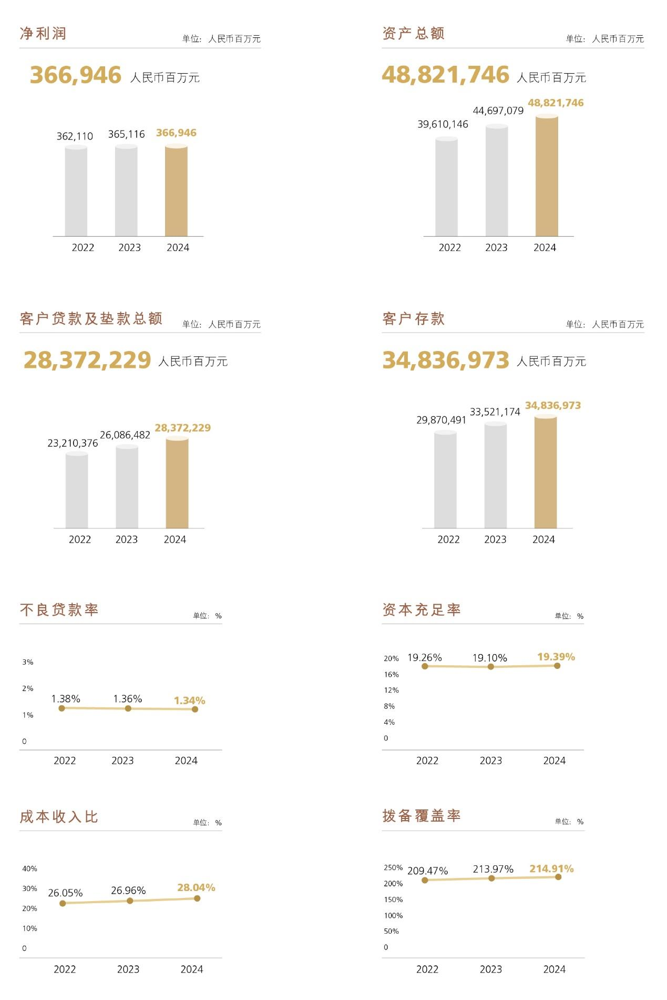
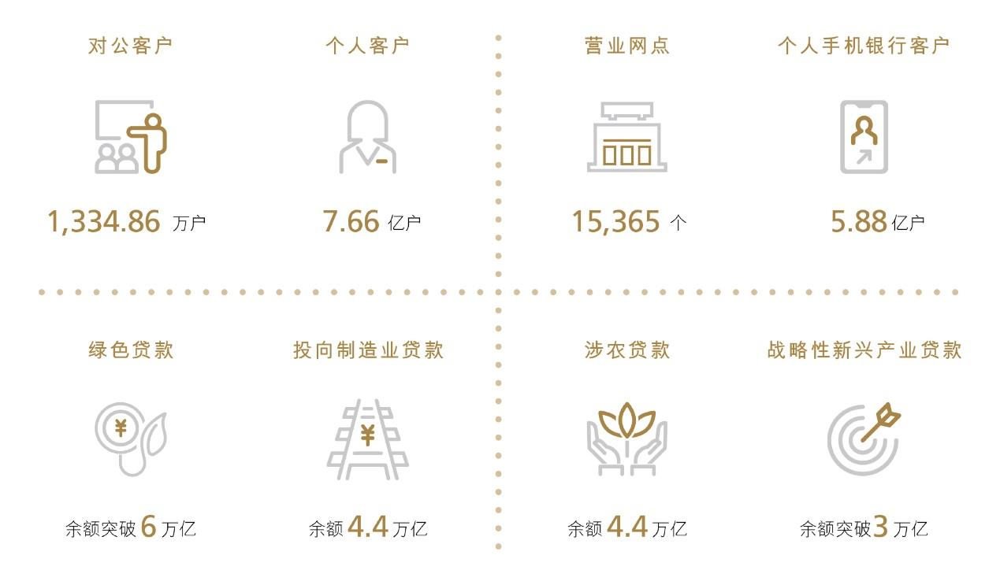

# 5 财务概要

> 来源：《中国工商银行股份有限公司2024年度报告（A股）》，印刷页 12–16
> 本文由 build_kb.py 自动生成

5. 财务概要



**图表数据（JSON 转写）**（由图片识别转写，数据以原图为准）：

```json
{
  "image": "assets/p012_1.jpeg",
  "note": "主要财务指标三年对比（2022-2024）",
  "charts": [
    {"type": "bar", "title": "净利润", "unit": "人民币百万元", "labels": ["2022", "2023", "2024"], "series": [{"name": "净利润", "data": [362110, 365116, 366946]}]},
    {"type": "bar", "title": "资产总额", "unit": "人民币百万元", "labels": ["2022", "2023", "2024"], "series": [{"name": "资产总额", "data": [39610146, 44697079, 48821746]}]},
    {"type": "bar", "title": "客户贷款及垫款总额", "unit": "人民币百万元", "labels": ["2022", "2023", "2024"], "series": [{"name": "客户贷款及垫款总额", "data": [23210376, 26086482, 28372229]}]},
    {"type": "bar", "title": "客户存款", "unit": "人民币百万元", "labels": ["2022", "2023", "2024"], "series": [{"name": "客户存款", "data": [29870491, 33521174, 34836973]}]},
    {"type": "line", "title": "不良贷款率", "unit": "%", "labels": ["2022", "2023", "2024"], "series": [{"name": "不良贷款率", "data": [1.38, 1.36, 1.34]}]},
    {"type": "line", "title": "资本充足率", "unit": "%", "labels": ["2022", "2023", "2024"], "series": [{"name": "资本充足率", "data": [19.26, 19.10, 19.39]}]},
    {"type": "line", "title": "成本收入比", "unit": "%", "labels": ["2022", "2023", "2024"], "series": [{"name": "成本收入比", "data": [26.05, 26.96, 28.04]}]},
    {"type": "line", "title": "拨备覆盖率", "unit": "%", "labels": ["2022", "2023", "2024"], "series": [{"name": "拨备覆盖率", "data": [209.47, 213.97, 214.91]}]}
  ]
}
```

本年度报告所载财务数据及指标按照中国会计准则编制，除特别说明外，为
本行及本行所属子公司合并数据，以人民币列示。
财务数据

2024
2023
2022
全年经营成果（人民币百万元）

利息净收入
637,405
655,013
691,985
手续费及佣金净收入
109,397
119,357
129,325
营业收入
821,803
843,070
875,734
业务及管理费
230,460
227,266
228,085
资产减值损失
（2）
126,663
150,816
182,677
营业利润
420,885
420,760
422,533
税前利润
421,827
421,966
424,720
净利润
366,946
365,116
362,110
归属于母公司股东的净利润
365,863
363,993
361,132
扣除非经常性损益后归属于母公司股东的净利润
（3）
364,277
361,411
358,558
经营活动产生的现金流量净额
579,194
1,417,002
1,404,657
于报告期末（人民币百万元）

资产总额
48,821,746
44,697,079
39,610,146
客户贷款及垫款总额
28,372,229
26,086,482
23,210,376
  公司类贷款
17,482,223
16,145,204
13,826,966
  个人贷款
8,957,720
8,653,621
8,234,625
  票据贴现
1,932,286
1,287,657
1,148,785
贷款减值准备
（4）
815,497
756,391
672,762
投资
14,153,576
11,849,668
10,533,702



**图表数据（JSON 转写）**（由图片识别转写，数据以原图为准）：

```json
{
  "image": "assets/p013_1.jpeg",
  "type": "kpi",
  "title": "经营概况指标卡",
  "items": [
    {"label": "对公客户", "value": 1334.86, "unit": "万户"},
    {"label": "个人客户", "value": 7.66, "unit": "亿户"},
    {"label": "营业网点", "value": 15365, "unit": "个"},
    {"label": "个人手机银行客户", "value": 5.88, "unit": "亿户"},
    {"label": "绿色贷款", "value": 6, "unit": "万亿元", "qualifier": "余额突破"},
    {"label": "投向制造业贷款", "value": 4.4, "unit": "万亿元", "qualifier": "余额"},
    {"label": "涉农贷款", "value": 4.4, "unit": "万亿元", "qualifier": "余额"},
    {"label": "战略性新兴产业贷款", "value": 3, "unit": "万亿元", "qualifier": "余额突破"}
  ]
}
```
负债总额
44,834,480
40,920,491
36,094,727
客户存款
34,836,973
33,521,174
29,870,491
公司存款
15,507,405
16,209,928
14,671,154
个人存款
18,541,510
16,565,568
14,545,306
其他存款
228,721
210,185
199,465
应计利息
559,337
535,493
454,566
同业及其他金融机构存放款项
4,020,537
2,841,385
2,664,901
拆入资金
570,428
528,473
522,811
归属于母公司股东的权益
3,969,841
3,756,887
3,496,109
股本
356,407
356,407
356,407
核心一级资本净额
（5）
3,624,342
3,381,941
3,121,080
一级资本净额
（5）
3,949,453
3,736,919
3,475,995
总资本净额
（5）
4,986,531
4,707,100
4,281,079
风险加权资产
（5）
25,710,855
24,641,631
22,225,272
每股计（人民币元）

每股净资产
（6）
10.23
9.55
8.82
基本每股收益
（7）
0.98
0.98
0.97
稀释每股收益
（7）
0.98
0.98
0.97
扣除非经常性损益后的基本每股收益
（7）
0.98
0.97
0.96

2024
2023
2022
信用评级

标普(S&P)
（8）
A
A
A
穆迪(Moody’s)
（8）
A1
A1
A1
注：（1）自2023 年1 月1 日起，本集团执行《企业会计准则第25 号——保险合同》。根据准则要求，本
集团追溯调整了2022 年比较期的相关数据及指标。根据人民银行《黄金租借业务管理暂行办法》
中的核算要求，本集团自2023 年起将同业黄金租借业务进行列报调整，并相应调整2022 年比较
期的相关数据。
（2）为信用减值损失和其他资产减值损失之和。
（3）有关报告期内非经常性损益的项目及金额请参见“财务报表补充资料－1.非经常性损益明细表”。
（4）为以摊余成本计量的客户贷款及垫款和以公允价值计量且其变动计入其他综合收益的客户贷款及
垫款的减值准备之和。
（5）2024 年根据《资本办法》计算。2023 年、2022 年比较期根据《资本办法（试行）》计算。
（6）为期末扣除其他权益工具后的归属于母公司股东的权益除以期末普通股股本总数。
（7）根据中国证监会《公开发行证券的公司信息披露编报规则第9 号－净资产收益率和每股收益的计
算及披露》(2010 年修订)的规定计算。
（8）评级结果为长期外币存款评级。

财务指标

2024
2023
2022
盈利能力指标（%）

平均总资产回报率
（1）
0.78
0.87
0.97
加权平均净资产收益率
（2）
9.88
10.66
11.45
扣除非经常性损益后加权平均净资产收益率
（2）
9.83
10.58
11.36
净利息差
（3）
1.23
1.41
1.72
净利息收益率
（4）
1.42
1.61
1.92
风险加权资产收益率
（5）
1.46
1.56
1.65
手续费及佣金净收入比营业收入
13.31
14.16
14.77
成本收入比
（6）
28.04
26.96
26.05
资产质量指标（%）

不良贷款率
（7）
1.34
1.36
1.38
拨备覆盖率
（8）
214.91
213.97
209.47
贷款拨备率
（9）
2.87
2.90
2.90
资本充足率指标（%）

核心一级资本充足率
（10）
14.10
13.72
14.04
一级资本充足率
（10）
15.36
15.17
15.64
资本充足率
（10）
19.39
19.10
19.26
总权益对总资产比率
8.17
8.45
8.88
风险加权资产占总资产比率
52.66
55.13
56.11
注：（1）净利润除以期初和期末总资产余额的平均数。
（2）根据中国证监会《公开发行证券的公司信息披露编报规则第9 号－净资产收益率和每股收益的
计算及披露》(2010 年修订)的规定计算。
（3）平均生息资产收益率减平均计息负债付息率。
（4）利息净收入除以平均生息资产。
（5）净利润除以期初及期末风险加权资产的平均数。
（6）业务及管理费除以营业收入。
（7）不良贷款余额除以客户贷款及垫款总额。
（8）贷款减值准备余额除以不良贷款余额。
（9）贷款减值准备余额除以客户贷款及垫款总额。
（10）2024 年根据《资本办法》计算。2023 年、2022 年比较期根据《资本办法（试行）》计算。

分季度财务数据

2024

一季度
二季度
三季度
四季度
（人民币百万元）

营业收入
219,843
200,656
205,923
195,381
归属于母公司股东的净利润
87,653
82,814
98,558
96,838
扣除非经常性损益后归属于母公司股
东的净利润
87,084
82,131
98,402
96,660
经营活动产生的现金流量净额
1,367,252
(1,340,269)
1,050,265
(498,054)

2023

一季度
二季度
三季度
四季度
（人民币百万元）

营业收入
227,596
219,898
203,774
191,802
归属于母公司股东的净利润
90,164
83,580
94,929
95,320
扣除非经常性损益后归属于母公司股
东的净利润
89,266
83,070
94,537
94,538
经营活动产生的现金流量净额
1,105,614
191,655
611,850
(492,117)
