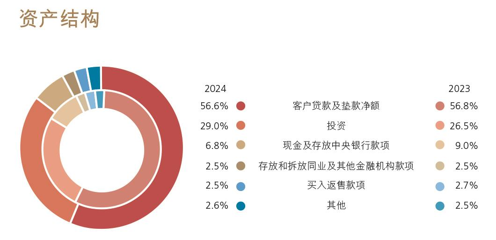
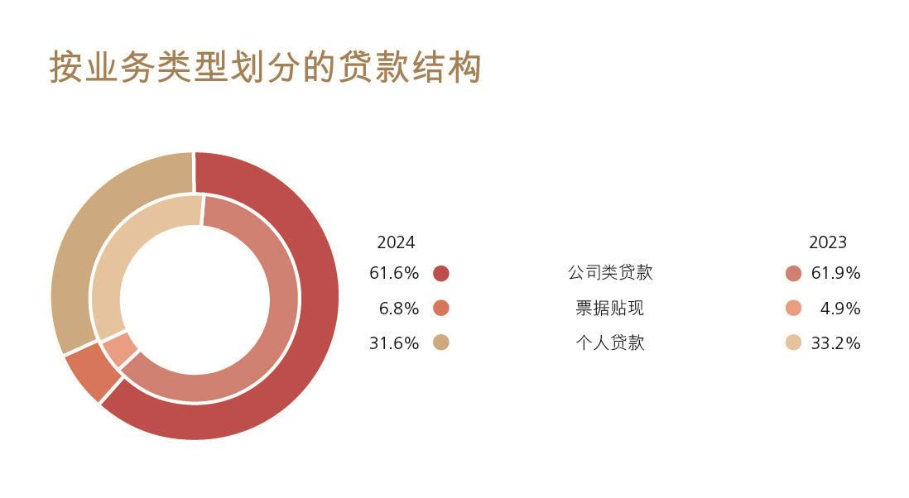
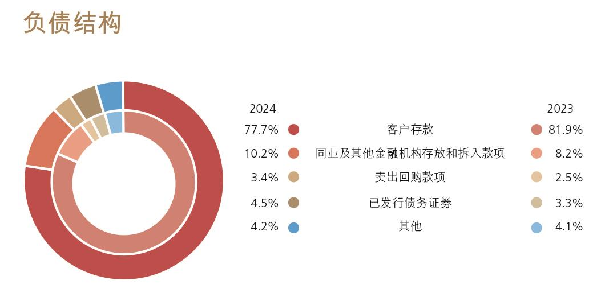
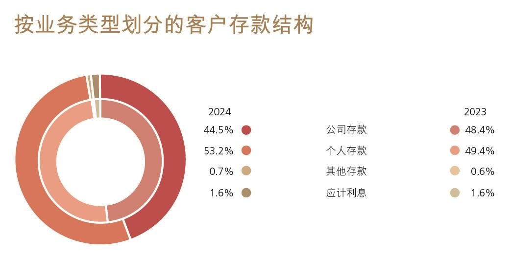

# 8.2 财务报表分析

> 来源：《中国工商银行股份有限公司2024年度报告（A股）》，印刷页 25–41
> 本文由 build_kb.py 自动生成

8.2 财务报表分析
8.2.1
利润表项目分析
2024 年，本行紧紧围绕服务中国式现代化，坚持稳中求进、以进促稳，在服
务经济社会高质量发展中推进自身高质量发展。年度实现净利润3,669.46 亿元，
比上年增加18.30 亿元，增长0.5%，平均总资产回报率0.78%，加权平均净资产
收益率9.88%。营业收入8,218.03 亿元，下降2.5%。其中，利息净收入6,374.05
亿元，下降2.7%；非利息收入1,843.98 亿元，下降1.9%。营业支出4,009.18 亿
元，下降5.1%。其中，业务及管理费2,304.60 亿元，增长1.4%，成本收入比
28.04%；计提资产减值损失1,266.63 亿元，下降16.0%。所得税费用548.81 亿
元，下降3.5%。

利润表主要项目变动
人民币百万元，百分比除外
项目
2024 年
2023 年
增减额
增长率(%)
利息净收入
637,405
655,013
(17,608)
(2.7)
非利息收入
184,398
188,057
(3,659)
(1.9)
营业收入
821,803
843,070
(21,267)
(2.5)
减：营业支出
400,918
422,310
(21,392)
(5.1)
其中：税金及附加
10,765
10,662
103
1.0
业务及管理费
230,460
227,266
3,194
1.4
信用减值损失
125,739
148,808
(23,069)
(15.5)
其他资产减值损失
924
2,008
(1,084)
(54.0)
其他业务成本
33,030
33,566
(536)
(1.6)
营业利润
420,885
420,760
125
0.0
加：营业外收支净额
942
1,206
(264)
(21.9)
税前利润
421,827
421,966
(139)
(0.0)
减：所得税费用
54,881
56,850
(1,969)
(3.5)
净利润
366,946
365,116
1,830
0.5
归属于：母公司股东
365,863
363,993
1,870
0.5
少数股东
1,083
1,123
(40)
(3.6)

利息净收入
2024 年，利息净收入6,374.05 亿元，比上年减少176.08 亿元，下降2.7%，
占营业收入的77.6%。利息收入14,279.48 亿元，增加229.09 亿元，增长1.6%；
利息支出7,905.43 亿元，增加405.17 亿元，增长5.4%。受贷款市场报价利率
（LPR）下调、存量房贷利率调整、存款期限结构变动等因素影响，净利息差和
净利息收益率分别为1.23%和1.42%，比上年分别下降18 个基点和19 个基点。
生息资产平均收益率和计息负债平均付息率
人民币百万元，百分比除外
项目
2024 年
2023 年
平均余额
利息收入
/支出
平均收益
率/付息率
(%)
平均余额
利息收入
/支出
平均收益
率/付息率
(%)
资产

客户贷款及垫款
27,599,928
937,938
3.40
25,006,605
951,845
3.81
投资
11,723,126
365,208
3.12
10,266,019
338,267
3.30
存放中央银行款项(2)
3,161,419
54,174
1.71
3,230,841
53,815
1.67
存放和拆放同业及其他
金融机构款项(3)
2,496,488
70,628
2.83
2,172,554
61,112
2.81
总生息资产
44,980,961
1,427,948
3.17
40,676,019
1,405,039
3.45
非生息资产
2,757,010

2,510,696

资产减值准备
(853,348)

(776,831)

总资产
46,884,623

42,409,884

负债

存款
32,745,057
564,039
1.72
31,141,446
589,688
1.89
同业及其他金融机构存
放和拆入款项(3)
5,937,956
156,622
2.64
4,058,487
103,529
2.55
已发行债务证券和存款
证
2,070,321
69,882
3.38
1,508,148
56,809
3.77
总计息负债
40,753,334
790,543
1.94
36,708,081
750,026
2.04
非计息负债
2,168,164

2,065,143

总负债
42,921,498

38,773,224

利息净收入

637,405

655,013

净利息差

1.23

1.41
净利息收益率

1.42

1.61
注：（1）生息资产和计息负债的平均余额为每日余额的平均数，非生息资产、非计息负债及资产减值准备的
平均余额为年初和年末余额的平均数。
（2）存放中央银行款项主要包括法定存款准备金和超额存款准备金。
（3）存放和拆放同业及其他金融机构款项包含买入返售款项；同业及其他金融机构存放和拆入款项包含
卖出回购款项。

利息收入和支出变动分析
人民币百万元
项目
2024 年与2023 年对比
增／（减）原因
净增／（减）
规模
利率
资产

客户贷款及垫款
88,620
(102,527)
(13,907)
投资
45,420
(18,479)
26,941
存放中央银行款项
(933)
1,292
359
存放和拆放同业及其他金融机
构款项
9,081
435
9,516
利息收入变化
142,188
(119,279)
22,909
负债

存款
27,291
(52,940)
(25,649)
同业及其他金融机构存放和拆
入款项
49,440
3,653
53,093
已发行债务证券和存款证
18,955
(5,882)
13,073
利息支出变化
95,686
(55,169)
40,517
利息净收入变化
46,502
(64,110)
(17,608)
注：规模的变化根据平均余额的变化衡量，利率的变化根据平均利率的变化衡量。由规模和利率共同引
起的变化分配在规模变化中。

利息收入

客户贷款及垫款利息收入
客户贷款及垫款利息收入9,379.38 亿元，比上年减少139.07 亿元，下降1.5%，
主要是客户贷款及垫款平均收益率下降41 个基点所致，平均余额增长10.4%部
分抵消了收益率下降的影响。
按期限结构划分的客户贷款及垫款平均收益分析
人民币百万元，百分比除外
项目
2024 年
2023 年
平均余额
利息收入
平均收益
率（%）
平均余额
利息收入
平均收益
率（%）
短期贷款
6,553,251
178,067
2.72
5,655,318
175,442
3.10
中长期贷款
21,046,677
759,871
3.61
19,351,287
776,403
4.01
客户贷款及垫款总额
27,599,928
937,938
3.40
25,006,605
951,845
3.81

按业务类型划分的客户贷款及垫款平均收益分析
人民币百万元，百分比除外
项目
2024 年
2023 年
平均余额
利息收入
平均收益
率（%）
平均余额
利息收入
平均收益
率（%）
公司类贷款
16,213,330
528,356
3.26
14,300,597
510,998
3.57
票据贴现
1,516,543
18,516
1.22
1,179,865
17,341
1.47
个人贷款
8,597,971
314,074
3.65
8,225,400
348,029
4.23
境外业务
1,272,084
76,992
6.05
1,300,743
75,477
5.80
客户贷款及垫款总额
27,599,928
937,938
3.40
25,006,605
951,845
3.81


投资利息收入
投资利息收入3,652.08 亿元，比上年增加269.41 亿元，增长8.0%，主要是
投资平均余额增长14.2%所致，平均收益率下降18 个基点部分抵消了规模增长
的影响。


存放中央银行款项利息收入
存放中央银行款项利息收入541.74 亿元，比上年增加3.59 亿元，增长0.7%。


存放和拆放同业及其他金融机构款项利息收入
存放和拆放同业及其他金融机构款项利息收入706.28 亿元，比上年增加
95.16 亿元，增长15.6%，主要是同业融出资金规模增加所致。
利息支出

存款利息支出
存款利息支出5,640.39 亿元，比上年减少256.49 亿元，下降4.3%。主要是
存款平均付息率下降17 个基点所致。本行落实存款利率市场化调整机制，引导
优化存款结构，推动新吸收定期存款利率下行，压降存款付息成本。

按产品类型划分的存款平均成本分析
人民币百万元，百分比除外
项目
2024 年
2023 年
平均余额
利息支出
平均付息
率（%）
平均余额
利息支出
平均付息
率（%）
公司存款

定期
7,836,374
181,905
2.32
7,503,647
199,149
2.65
活期
6,762,187
60,071
0.89
7,228,582
73,564
1.02
小计
14,598,561
241,976
1.66
14,732,229
272,713
1.85
个人存款

定期
10,994,438
261,960
2.38
9,535,044
254,834
2.67
活期
6,004,057
10,333
0.17
5,807,411
15,135
0.26
小计
16,998,495
272,293
1.60
15,342,455
269,969
1.76
境外业务
1,148,001
49,770
4.34
1,066,762
47,006
4.41
存款总额
32,745,057
564,039
1.72
31,141,446
589,688
1.89


同业及其他金融机构存放和拆入款项利息支出
同业及其他金融机构存放和拆入款项利息支出1,566.22 亿元，比上年增加
530.93 亿元，增长51.3%，主要是合理安排融入资金，多元化拓宽负债来源所致。


已发行债务证券和存款证利息支出
已发行债务证券和存款证利息支出698.82 亿元，比上年增加130.73 亿元，
增长23.0%，主要是同业存单发行规模增加所致。

非利息收入
2024 年实现非利息收入1,843.98 亿元，比上年减少36.59 亿元，下降1.9%，
占营业收入的比重为22.4%。其中，手续费及佣金净收入1,093.97 亿元，减少
99.60 亿元，下降8.3%；其他非利息收益750.01 亿元，增加63.01 亿元，增长
9.2%。

手续费及佣金净收入
人民币百万元，百分比除外
项目
2024 年
2023 年
增减额
增长率(%)
结算、清算及现金管理
42,755
45,418
(2,663)
(5.9)
投资银行
19,724
20,060
(336)
(1.7)
个人理财及私人银行
17,880
22,582
(4,702)
(20.8)
银行卡
17,853
17,906
(53)
(0.3)
对公理财
10,850
11,770
(920)
(7.8)
资产托管
8,045
7,994
51
0.6
担保及承诺
4,185
7,296
(3,111)
(42.6)
代理收付及委托
2,019
1,950
69
3.5
其他
2,866
2,915
(49)
(1.7)
手续费及佣金收入
126,177
137,891
(11,714)
(8.5)
减：手续费及佣金支出
16,780
18,534
(1,754)
(9.5)
手续费及佣金净收入
109,397
119,357
(9,960)
(8.3)

手续费及佣金净收入1,093.97 亿元，比上年减少99.60 亿元，下降8.3%。资
产托管、代理收付持续加大业务拓展，相关收入有所增长。同时，受落实保险“报
行合一”政策、公募基金费率改革等因素影响，个人理财及私人银行、对公理财
收入有所减少；担保及承诺业务费率下降，相关收入有所减少。

其他非利息收益
人民币百万元，百分比除外
项目
2024 年
2023 年
增减额
增长率(%)
投资收益
40,930
45,876
(4,946)
(10.8)
公允价值变动净收益
12,220
2,711
9,509
350.8
汇兑及汇率产品净损失
(6,911)
(7,785)
874
不适用
其他业务收入
28,762
27,898
864
3.1
合计
75,001
68,700
6,301
9.2

其他非利息收益750.01 亿元，比上年增加63.01 亿元，增长9.2%。其中，
投资收益减少主要是权益类投资已实现收益减少所致，公允价值变动净收益增加
主要是权益类和基金类工具未实现收益增加所致，汇兑及汇率产品净损失主要是
受汇率波动影响所致，其他业务收入增加主要是保险服务收入和经营租赁业务收
入增加所致。

营业支出

业务及管理费
人民币百万元，百分比除外
项目
2024 年
2023 年
增减额
增长率(%)
职工费用
144,554
141,405
3,149
2.2
固定资产折旧
14,472
15,168
(696)
(4.6)
资产摊销
5,934
5,256
678
12.9
业务费用
65,500
65,437
63
0.1
合计
230,460
227,266
3,194
1.4


减值损失
计提信用减值损失1,257.39 亿元，比上年减少230.69 亿元，下降15.5%。其
中，贷款减值损失1,224.79 亿元，减少209.43 亿元，下降14.6%。其他资产减值
损失9.24 亿元，减少10.84 亿元，下降54.0%。请参见“财务报表附注四、38.信
用减值损失；13.资产减值准备”。


其他业务成本
其他业务成本330.30 亿元，比上年减少5.36 亿元，下降1.6%。

所得税费用
所得税费用548.81 亿元，比上年减少19.69 亿元，下降3.5%。实际税率
13.01%，低于25%的法定税率，主要是由于持有的中国国债、地方政府债利息收
入按税法规定为免税收益。

地理区域信息概要
人民币百万元，百分比除外
项目
2024 年
2023 年
金额
占比（%）
金额
占比（%）
营业收入
821,803
100.0
843,070
100.0
总行
23,999
2.9
23,108
2.8
长江三角洲
152,225
18.5
157,370
18.7
珠江三角洲
106,723
13.0
116,542
13.8
环渤海地区
164,580
20.0
163,910
19.4
中部地区
111,994
13.7
118,533
14.1
西部地区
125,967
15.4
133,848
15.9
东北地区
29,801
3.6
30,546
3.6
境外及其他
107,848
13.1
100,726
11.9
抵销
(1,334)
(0.2)
(1,513)
(0.2)
税前利润
421,827
100.0
421,966
100.0
总行
32,139
7.6
(16,378)
(3.9)
长江三角洲
80,715
19.1
95,935
22.7
珠江三角洲
43,876
10.4
60,159
14.3
环渤海地区
102,730
24.4
104,324
24.7
中部地区
49,374
11.7
57,560
13.6
西部地区
55,680
13.2
70,825
16.8
东北地区
11,054
2.6
11,207
2.7
境外及其他
46,259
11.0
38,334
9.1
抵销
-
-
-
-
注：请参见“财务报表附注五、分部信息”。
8.2.2
资产负债表项目分析
2024 年，本行认真落实宏观经济金融政策和监管要求，通过动态优化资产
负债总量和结构摆布策略，致力于打造干净、健康的资产负债表，努力实现价值
创造、市场地位、风险管控和资本约束的动态平衡。
坚持投融资一体化发展策略，围绕布局现代化，助力经济高质量发展，靠前
落实稳经济一揽子增量政策，将更多资源配置到“五篇大文章”“两重”“两
新”“三大工程”
1等重点领域和薄弱环节，助力加快发展新质生产力。提升负债
多元化发展能力，持续推进GBC+基础性工程，构建“大中小微个”相协调的客

1“两重”指国家重大战略实施和重点领域安全能力建设；“两新”指设备更新和消费品以旧换新；“三
大工程”指保障性住房建设、城中村改造和“平急两用”公共基础设施建设。

户结构，推动存款保持高质量增长态势。顺应市场形势变化，不断完善金融债、
同业存单等多渠道的资金来源机制，推动资金来源与资金运用相匹配。
资产运用
2024年末，总资产488,217.46亿元，比上年末增加41,246.67亿元，增长9.2%。
其中，客户贷款及垫款总额（简称“各项贷款”）283,722.29亿元，增加22,857.47
亿元，增长8.8%；投资141,535.76亿元，增加23,039.08亿元，增长19.4%；现金及
存放中央银行款项33,229.11亿元，减少7,193.82亿元，下降17.8%。

    人民币百万元，百分比除外
项目
2024 年12 月31 日
2023 年12 月31 日
金额
占比(%)
金额
占比(%)
客户贷款及垫款总额
28,372,229
—
26,086,482
—
加：应计利息
56,624
—
56,452
—
减：以摊余成本计量的客户贷
款及垫款的减值准备
815,072
—
756,001
—
客户贷款及垫款净额(1)
27,613,781
56.6
25,386,933
56.8
投资
14,153,576
29.0
11,849,668
26.5
现金及存放中央银行款项
3,322,911
6.8
4,042,293
9.0
存放和拆放同业及其他金融
机构款项
1,219,876
2.5
1,116,717
2.5
买入返售款项
1,210,217
2.5
1,224,257
2.7
其他
1,301,385
2.6
1,077,211
2.5
资产合计
48,821,746
100.0
44,697,079
100.0
注：（1）请参见“财务报表附注四、6.客户贷款及垫款”。



**图表数据（JSON 转写）**（由图片识别转写，数据以原图为准）：

```json
{
  "image": "../assets/p033_1.jpeg",
  "type": "pie",
  "title": "资产结构",
  "unit": "%",
  "labels": ["客户贷款及垫款净额", "投资", "现金及存放中央银行款项", "存放和拆放同业及其他金融机构款项", "买入返售款项", "其他"],
  "series": [
    {"name": "2024", "data": [56.6, 29.0, 6.8, 2.5, 2.5, 2.6]},
    {"name": "2023", "data": [56.8, 26.5, 9.0, 2.5, 2.7, 2.5]}
  ]
}
```

贷款
本行深入贯彻国家重大战略，着力提高信贷资源配置与资金使用效率，持续
优化贷款投向与结构，精准做好重点领域信贷投放，全力服务区域协调发展战略，
积极赋能新质生产力发展；大力推动个人贷款结构转型，突出个人贷款业务在稳
房市、促消费、支持市场主体发展中的功能性。2024年末，各项贷款283,722.29
亿元，比上年末增加22,857.47亿元，增长8.8%。其中，境内分行人民币贷款
266,955.81亿元，增加23,040.56亿元，增长9.4%。

按业务类型划分的贷款结构
人民币百万元，百分比除外
项目
2024 年12 月31 日
2023 年12 月31 日
金额
占比(%)
金额
占比(%)
公司类贷款
17,482,223
61.6
16,145,204
61.9
短期公司类贷款
 3,819,683
13.5
 3,681,064
14.1
中长期公司类贷款
 13,662,540
48.1
  12,464,140
47.8
票据贴现
1,932,286
6.8
 1,287,657
4.9
个人贷款
8,957,720
31.6
 8,653,621
33.2
个人住房贷款
6,083,180
21.5
 6,288,468
24.1
个人消费贷款
421,195
1.5
 328,286
1.3
个人经营性贷款
1,677,981
5.9
 1,347,136
5.2
信用卡透支
775,364
2.7
 689,731
2.6
合计
28,372,229
100.0
26,086,482
100.0

持续加大“五篇大文章”“两重”“两新”等领域信贷支持力度，制造业、科
技创新、绿色金融、普惠金融、涉农等重点领域贷款实现较快增长。公司类贷款
比上年末增加13,370.19亿元，增长8.3%。其中，短期贷款增加1,386.19亿元，中



**图表数据（JSON 转写）**（由图片识别转写，数据以原图为准）：

```json
{
  "image": "../assets/p034_1.jpeg",
  "type": "pie",
  "title": "按业务类型划分的贷款结构",
  "unit": "%",
  "labels": ["公司类贷款", "票据贴现", "个人贷款"],
  "series": [
    {"name": "2024", "data": [61.6, 6.8, 31.6]},
    {"name": "2023", "data": [61.9, 4.9, 33.2]}
  ]
}
```
长期贷款增加11,984.00亿元。
落实房贷新政，顺利完成存量房贷利率批量调整工作，大力推进个人二手房
贷款转型发展，更好满足人民群众合理住房需求。创新推出个人房产抵押消费与
经营组合贷款的续贷业务，全方位满足客户的经营和消费融资需求。加大汽车、
家装家居、家电等以旧换新金融支持力度，强化个人贷款和信用卡分期付款场景
赋能。个人贷款比上年末增加3,040.99亿元，增长3.5%。其中，个人消费贷款增
加929.09亿元，增长28.3%；个人经营性贷款增加3,308.45亿元，增长24.6%。

有关本行贷款和贷款质量的进一步分析，请参见“讨论与分析—风险管理”。


投资
2024 年，本行积极支持国家发展战略实施，加大债券投资力度，统筹债券投
资价值和利率风险防控，合理摆布债券品种和期限结构。2024 年末，投资
141,535.76 亿元，比上年末增加23,039.08 亿元，增长19.4%。其中，债券136,449.22
亿元，增加22,871.95 亿元，增长20.1%。

人民币百万元，百分比除外
项目
2024 年12 月31 日
2023 年12 月31 日
金额
占比(%)
金额
占比(%)
债券
13,644,922
96.4
11,357,727
95.9
权益工具
 196,993
1.4
187,835
1.6
基金及其他
 178,941
1.3
183,391
1.5
应计利息
132,720
0.9
120,715
1.0
合计
14,153,576
100.0
11,849,668
100.0

按发行主体划分的债券结构
人民币百万元，百分比除外
项目
2024 年12 月31 日
2023 年12 月31 日
金额
占比(%)
金额
占比(%)
政府及中央银行债券
 10,422,907
76.4
8,759,237
77.1
政策性银行债券
 1,097,125
8.0
811,946
7.1
银行同业及其他金融机构债券
 1,398,606
10.3
1,065,147
9.4
企业债券
 726,284
5.3
721,397
6.4
合计
13,644,922
100.0
11,357,727
100.0

从发行主体结构上看，政府及中央银行债券比上年末增加16,636.70 亿元，
增长19.0%；政策性银行债券增加2,851.79 亿元，增长35.1%；银行同业及其他
金融机构债券增加3,334.59 亿元，增长31.3%；企业债券增加48.87 亿元，增长
0.7%。

按剩余期限划分的债券结构
人民币百万元，百分比除外
剩余期限
2024 年12 月31 日
2023 年12 月31 日
金额
占比(%)
金额
占比(%)
无期限
（1）
 83
0.0
117
0.0
3 个月以内
 750,923
5.5
690,280
6.0
3 至12 个月
 2,337,828
17.1
1,495,238
13.2
1 至5 年
4,992,268
36.6
4,219,958
37.2
5 年以上
5,563,820
40.8
4,952,134
43.6
合计
13,644,922
100.0
11,357,727
100.0
注：（1）为已逾期部分。

按币种划分的债券结构
人民币百万元，百分比除外
项目
2024 年12 月31 日
2023 年12 月31 日
金额
占比(%)
金额
占比(%)
人民币债券
12,703,351
93.1
10,497,153
92.4
美元债券
619,013
4.5
554,737
4.9
其他外币债券
322,558
2.4
305,837
2.7
合计
13,644,922
100.0
11,357,727
100.0

从币种结构上看，人民币债券比上年末增加22,061.98 亿元，增长21.0%；
美元债券折合人民币增加642.76 亿元，增长11.6%；其他外币债券折合人民币增
加167.21 亿元，增长5.5%。报告期内本行综合考虑债券流动性、安全性、收益
性，结合各币种利率变动及外币资金头寸情况，合理摆布债券币种结构。

按计量方式划分的投资结构
人民币百万元，百分比除外
项目
2024 年12 月31 日
2023 年12 月31 日
金额
占比(%)
金额
占比(%)
以公允价值计量且其变动计入
当期损益的金融投资
 1,010,439
7.1
811,957
6.9
以公允价值计量且其变动计入
其他综合收益的金融投资
 3,291,152
23.3
2,230,862
18.8
以摊余成本计量的金融投资
9,851,985
69.6
8,806,849
74.3
合计
14,153,576
100.0
11,849,668
100.0

2024 年末，本集团持有金融债券124,054.22 亿元，包括政策性银行债券
10,971.25 亿元和同业及非银行金融机构债券13,082.97 亿元，分别占45.6%和
54.4%。
本行持有的最大十只金融债券
人民币百万元，百分比除外
债券名称
面值
年利率(%)
到期日
减值准备
（1）
2024 年政策性银行债券
30,527
1.85
2029 年7 月24 日
-
2015 年政策性银行债券
22,439
4.21
2025 年4 月13 日
-
2024 年政策性银行债券
21,480
1.80
2027 年7 月23 日
-
2020 年政策性银行债券
19,571
3.23
2030 年3 月23 日
-
2024 年政策性银行债券
19,550
1.80
2027 年9 月2 日
-
2022 年政策性银行债券
19,521
2.77
2032 年10 月24 日
-
2020 年政策性银行债券
18,804
2.96
2030 年4 月17 日
-
2022 年政策性银行债券
18,287
2.90
2032 年8 月19 日
-
2019 年政策性银行债券
17,482
3.45
2029 年9 月20 日
-
2024 年政策性银行债券
17,260
1.66
2026 年9 月4 日
-
注：（1）未包含按预期信用损失模型要求计提的第一阶段减值准备。
负债
本行注重提升负债多元化发展能力，建立与负债规模和复杂程度相适应的负
债质量管理体系，明确与经营战略、风险偏好和总体业务特征相适应的负债质量
管理策略及政策，负债业务保持稳健发展。2024 年末，总负债448,344.80 亿元，
比上年末增加39,139.89 亿元，增长9.6%。

1金融债券指金融机构法人在债券市场发行的有价债券，包括政策性银行发行的债券、同业及非银行金融
机构发行的债券，但不包括重组债券及中央银行债券。

人民币百万元，百分比除外
项目
2024 年12 月31 日
2023 年12 月31 日
金额
占比(%)
金额
占比(%)
客户存款
34,836,973
77.7
33,521,174
81.9
同业及其他金融机构存放和拆
入款项
4,590,965
10.2
3,369,858
8.2
卖出回购款项
1,523,555
3.4
1,018,106
2.5
已发行债务证券
2,028,722
4.5
1,369,777
3.3
其他
1,854,265
4.2
1,641,576
4.1
负债合计
44,834,480
100.0
40,920,491
100.0


客户存款
客户存款是本行资金的主要来源。2024 年末，客户存款348,369.73 亿元，
比上年末增加13,157.99亿元，增长3.9%。从客户结构上看，公司存款减少7,025.23
亿元，下降4.3%；个人存款增加19,759.42 亿元，增长11.9%。从期限结构上看，
定期存款增加11,018.11 亿元，增长5.7%；活期存款增加1,716.08 亿元，增长
1.3%。从币种结构上看，人民币存款331,464.29 亿元，增加13,085.94 亿元，增
长4.1%；外币存款折合人民币16,905.44 亿元，增加72.05 亿元，增长0.4%。



**图表数据（JSON 转写）**（由图片识别转写，数据以原图为准）：

```json
{
  "image": "../assets/p038_1.jpeg",
  "type": "pie",
  "title": "负债结构",
  "unit": "%",
  "labels": ["客户存款", "同业及其他金融机构存放和拆入款项", "卖出回购款项", "已发行债务证券", "其他"],
  "series": [
    {"name": "2024", "data": [77.7, 10.2, 3.4, 4.5, 4.2]},
    {"name": "2023", "data": [81.9, 8.2, 2.5, 3.3, 4.1]}
  ]
}
```

按业务类型划分的客户存款结构
人民币百万元，百分比除外
项目
2024 年12 月31 日
2023 年12 月31 日
金额
占比(%)
金额
占比(%)
公司存款

定期
8,349,110
24.0
8,843,237
26.4
活期
7,158,295
20.5
7,366,691
22.0
小计
15,507,405
44.5
16,209,928
48.4
个人存款

定期
12,077,665
34.7
10,481,727
31.3
活期
6,463,845
18.5
6,083,841
18.1
小计
18,541,510
53.2
16,565,568
49.4
其他存款
（1）
228,721
0.7
210,185
0.6
应计利息
559,337
1.6
535,493
1.6
合计
34,836,973
100.0
33,521,174
100.0
注：（1）包含汇出汇款和应解汇款。

按地域划分的客户存款结构
人民币百万元，百分比除外
项目
2024 年12 月31 日
2023 年12 月31 日
金额
占比(%)
金额
占比(%)
总行
31,864
0.1
32,408
0.1
长江三角洲
6,661,782
19.1
7,120,750
21.2
珠江三角洲
4,472,710
12.8
4,618,362
13.8
环渤海地区
9,496,212
27.3
8,811,355
26.3
中部地区
5,159,595
14.8
4,855,178
14.5
西部地区
5,430,660
15.6
5,219,348
15.6
东北地区
1,953,728
5.6
1,768,620
5.3
境外及其他
1,630,422
4.7
1,095,153
3.2
合计
34,836,973
100.0
33,521,174
100.0



**图表数据（JSON 转写）**（由图片识别转写，数据以原图为准）：

```json
{
  "image": "../assets/p039_1.jpeg",
  "type": "pie",
  "title": "按业务类型划分的客户存款结构",
  "unit": "%",
  "labels": ["公司存款", "个人存款", "其他存款", "应计利息"],
  "series": [
    {"name": "2024", "data": [44.5, 53.2, 0.7, 1.6]},
    {"name": "2023", "data": [48.4, 49.4, 0.6, 1.6]}
  ]
}
```

同业及其他金融机构存放和拆入款项
同业及其他金融机构存放和拆入款项45,909.65 亿元，比上年末增加
12,211.07 亿元，增长36.2%，主要是本行结合市场形势变化，加强同业存款营销。


卖出回购款项
卖出回购款项15,235.55 亿元，比上年末增加5,054.49 亿元，增长49.6%，
主要是本行根据流动性管理和货币政策操作需要，增加融入资金规模。


已发行债务证券
已发行债务证券20,287.22 亿元，比上年末增加6,589.45 亿元，增长48.1%，
主要是本行发行同业存单规模增加所致。
股东权益
2024 年末，股东权益合计39,872.66 亿元，比上年末增加2,106.78 亿元，增
长5.6%。归属于母公司股东的权益39,698.41 亿元，增加2,129.54 亿元，增长
5.7%。请参见“合并股东权益变动表”。
表外项目
本行资产负债表表外项目主要包括衍生金融工具、或有事项及承诺。衍生金
融工具的名义金额及公允价值请参见“财务报表附注四、4.衍生金融工具”。或有
事项及承诺请参见“财务报表附注六、或有事项、承诺及主要表外事项”。
8.2.3
现金流量表项目分析
经营活动产生的现金净流入5,791.94 亿元，比上年减少8,378.08 亿元，主要
是客户存款净增额减少所致。其中，现金流入43,787.21 亿元，减少12,600.49 亿
元；现金流出37,995.27 亿元，减少4,222.41 亿元。
投资活动产生的现金净流出14,714.68 亿元。其中，现金流入50,791.15 亿
元，比上年增加12,545.70 亿元，主要是收回金融投资所收到的现金增加；现金

流出65,505.83 亿元，增加18,341.86 亿元，主要是金融投资所支付的现金增加。
筹资活动产生的现金净流入4,156.83 亿元。其中，现金流入21,434.60 亿元，
比上年增加7,211.52 亿元，主要是发行债务证券所收到的现金增加；现金流出
17,277.77 亿元，增加5,909.13 亿元，主要是偿还债务证券所支付的现金增加。
8.2.4
主要会计政策变更
报告期内主要会计政策变更，请参见“财务报表附注三、38.会计政策变更”。
8.2.5
重要会计估计说明
报告期内重要会计估计说明，请参见“财务报表附注三、37.重大会计判断和
会计估计”。
8.2.6
按境内外会计准则编制的财务报表差异说明
本行按中国会计准则和按国际财务报告准则编制的财务报表中，截至2024
年12 月31 日止报告期归属于母公司股东的净利润和报告期末归属于母公司股
东的权益并无差异。
