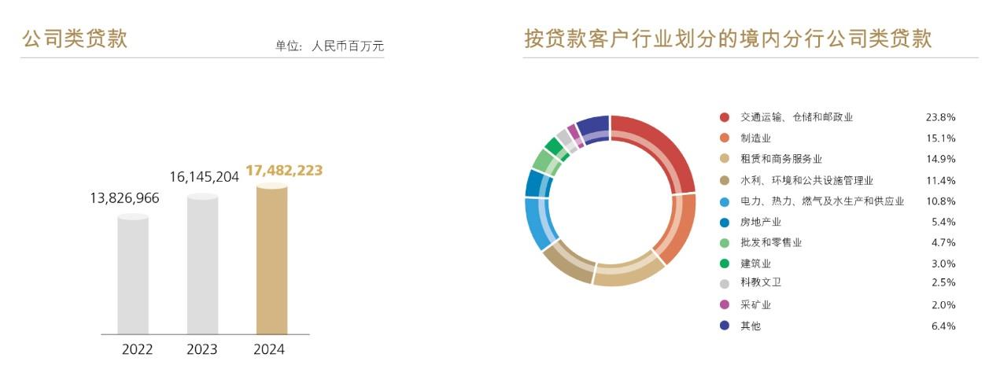

# 8.3.1 公司金融业务

> 来源：《中国工商银行股份有限公司2024年度报告（A股）》，印刷页 43–48
> 本文由 build_kb.py 自动生成

经营分部信息概要
人民币百万元，百分比除外
项目
2024 年
2023 年
金额
占比（%）
金额
占比（%）
营业收入
821,803
100.0
843,070
100.0
公司金融业务
393,953
47.9
393,033
46.6
个人金融业务
324,882
39.5
332,964
39.5
资金业务
95,967
11.7
108,571
12.9
其他
7,001
0.9
8,502
1.0
税前利润
421,827
100.0
421,966
100.0
公司金融业务
244,892
58.1
186,946
44.3
个人金融业务
98,710
23.4
150,474
35.7
资金业务
75,270
17.8
77,165
18.3
其他
 2,955
0.7
7,381
1.7
注：请参见“财务报表附注五、分部信息”。
8.3.1
公司金融业务
本行聚焦“国家所需、金融所能、工行所长、客户所盼”，加大优质公司信
贷投放力度，优化现代公司信贷布局，开展粮食安全、电影、文旅等大型营销活
动，加强对重大战略、重点领域和薄弱环节的公司金融服务，创新打造公司金融
项目库（CBPL），不断提升公司金融服务的适应性、竞争力、普惠性，展现服务
实体经济的主力军担当。2024年末，公司类贷款174,822.23亿元，比上年末增加
13,370.19亿元，增长8.3%；公司存款155,074.05亿元，减少7,025.23亿元，下降4.3%。
本行蝉联《环球金融》“中国最佳企业银行”，获评《欧洲货币》“中国最佳企业
银行”，连续四年获评《财资》“中国最佳项目融资银行”和《环球金融》“最佳
一带一路银行”。
 服务培育新质生产力。深化科技金融“五专”服务体系，设立高级管理
层科技金融委员会，在科技资源富集地区成立22家分行科技金融中心、
160家科技支行，增强“总分支网”四级动能。强化“股贷债保”联动，
开展“春苗”“秋实”行动，做好对专精特新“小巨人”等重点客群服务，
打造“工银科创”品牌。2024年末，战略性新兴产业贷款余额突破3万亿
元。

 助力构建现代化产业体系。加大制造业贷款投放力度，助力制造业高端
化、智能化、绿色化发展。以“两新”为切入点，实施“工助升级 贷动
更新”专项行动，做好项目清单全覆盖对接。深化对先进制造业产业集
群发展的金融专项支持。2024年末，投向制造业贷款余额4.4万亿元，其
中投向制造业中长期贷款余额2.1万亿元。
 助力房地产止跌回稳。主动适应房地产供求关系发生重大变化的新形势，
一视同仁满足不同所有制房企合理融资需求，保持房地产开发贷款稳健
增长。落实一揽子增量政策要求，积极对接城市房地产融资协调机制“白
名单”项目，投放金额超1,300亿元。靠前服务“三大工程”，助力“市场
+保障”住房供应体系建设，支持构建房地产发展新模式。
 绿色金融和能源安全方面。坚持绿色发展理念，认真落实国家战略导向，
支持产业绿色低碳转型，助力长江经济带高质量发展。深入开展“能源
保供”行动，助力能源强国建设。2024年末，绿色贷款余额（金融监管
总局口径）突破6万亿元。
 助力民营经济高质量发展。坚持两个“毫不动摇”，深化服务民营企业“新
八融”服务，向优质民营企业给予专项政策支持，助力民营企业提振信
心。
 客户基础不断夯实。坚持以客户为中心，提升公司客户服务的体系化、
专业化、数字化、生态化水平，实施公司客户维护体系，推动加快形成
“大中小微个”相协调的客户结构。举办中非经贸投资论坛、中国-奥地
利企业对接交流会等重大活动，跨境联动开展助企“全球行•全球盈”营
销活动。探索全球主客户经理机制，建立全球客户经理服务团队，不断
提升全球服务质效。2024年末，对公客户1,334.86万户，比上年末增加
128.99万户，中型有贷户增长11.6%。

普惠金融
持续提升普惠金融服务的覆盖面、可得性和满意度，更好满足小微企业、涉
农经营主体及重点帮扶群体多样化的金融需求，全力打造普惠金融标杆银行。
2024年末，普惠型小微企业贷款28,933.15亿元，比年初增加6,655.63亿元，增长
29.9%；普惠型小微企业贷款客户208.34万户，增加61.66万户；全年新发放普惠
型小微企业贷款平均利率3.30%。
 优化产品体系。搭建标准化普惠金融产品体系，打造经营快贷、网贷通、
数字供应链三大产品线，提升制造业、农户、商户、专精特新“小巨人”
等细分领域服务能力；鼓励特色化产品创新，因地制宜拓展服务场景，
灵活支持地区产业发展，提升普惠信贷服务适配性、针对性。焕新升级
经营快贷，推出面向制造业小微企业的数字普惠信用贷款产品“制造e贷”，
进一步丰富小额化、信用类产品供给。打造“e扩快贷”网贷通产品，支
持小微企业扩大再生产过程中的中长期资金需求。数字供应链产品方面，
积极为重点行业提供融资解决方案，引金融活水滴灌产业链供应链上下
游小微企业。
 深化渠道建设。依托自有机构，打造普惠金融特色网点。建设手机银行
普惠专版，为小微客户提供“一站式”专属服务。开展“普惠金融推进
月”“一笔一画做普惠”等活动，加强与政府部门、担保机构的合作。探
索开放银行模式，延伸服务触角，构建良好生态。
 强化风险管理。发挥科技风控效能，整合内外部数据信息，完善“1（客
户）+N（产品）”风控体系，打造“数据驱动、智能预警、动态管理、持



**图表数据（JSON 转写）**（由图片识别转写，数据以原图为准）：

```json
{
  "image": "../../assets/p045_1.jpeg",
  "charts": [
    {
      "type": "bar",
      "title": "公司类贷款",
      "unit": "人民币百万元",
      "labels": ["2022", "2023", "2024"],
      "series": [{"name": "公司类贷款", "data": [13826966, 16145204, 17482223]}]
    },
    {
      "type": "pie",
      "title": "按贷款客户行业划分的境内分行公司类贷款（2024）",
      "unit": "%",
      "labels": ["交通运输、仓储和邮政业", "制造业", "租赁和商务服务业", "水利、环境和公共设施管理业", "电力、热力、燃气及水生产和供应业", "房地产业", "批发和零售业", "建筑业", "科教文卫", "采矿业", "其他"],
      "series": [{"name": "2024", "data": [23.8, 15.1, 14.9, 11.4, 10.8, 5.4, 4.7, 3.0, 2.5, 2.0, 6.4]}]
    }
  ]
}
```
续运营”为特征的全流程风险管理。注重“活情况”“实信息”搜集，强
化线上线下交叉验证、专家经验与模型数据方法互补，提高风险防范的
有效性和针对性。
 完善综合服务。融资、融智、融商相结合，从提供融资服务向帮助小微
客户解决经营问题转型。围绕小微企业全生命周期，丰富账户、结算、
财务顾问等服务。推进“环球撮合荟”平台迭代升级，提供产品推介、
供需对接、融资支持一站式服务，打造小微企业综合金融服务“标杆平
台”。
机构金融业务
 银政合作彰显大行担当。扎实服务代理财政资金流转，全年代理国库集
中支付业务量和业务金额占比稳居市场首位，中标国库集中支付代理银
行资格，连续六年在财政部中央财政国库集中支付代理银行考评中获评
直接支付和授权支付“双优”评级。延伸拓展社银服务范围，同业首批
上线医保电子钱包，业内首家完成医保账户跨省共济支付。“工银e 社
保”平台应用推广至全国各省区市社保部门，同业首家设立“社银一体
化网点”，累计建成“社银一体化网点”4,087 家。创新民生金融服务，
持续推广“工银云医”“智慧住建”“智慧教育”“数字乡村”等服务平
台，稳步推动“双减”、乡村振兴、资金监管等配套金融服务落地。
 丰富金融合作生态内涵。优化金融基础设施综合服务，发布银行业首份
《金融基础设施服务方案》，打造服务金融基础设施的“工行样板”。
积极开展中小金融机构金融科技工具输出，赋能同业风控能力提升。加
强保险机构合作，开展对公保险场景化营销，完善“十大行业风险管理
输出方案”，助力企业防范风险。扎实服务资本市场，积极响应监管部
门增强资本市场内在稳定性长效机制建设的政策导向，巩固提升第三方
存管、结算交收业务合作优势。

结算与现金管理业务
 建设“主结算银行”新标杆。聚焦基本户、新开户、代发户三大重点，
提升账户对新注册市场主体的覆盖面，强化场景融合联动拓户，推进数
智化账户流失预警模型应用，分类施策做好存量账户维护管理。积极响
应各类企业财务数智化转型、深化管理会计应用等相关要求，进一步做
好工银司库服务的扩展升级，打造支付结算、财资管理、数智转型三大
支柱，涵盖“五通、四集、三云”12 类产品服务，不断提升客户体验，
打造金融服务新门户。全面拓展结算金融场景生态，加强重点产品API
开放服务建设，聚合金融服务资源，输出金融服务能力，推广结算金融
顾问AI 大模型应用，推出电子营业执照身份认证和数字签名，投产对公
积点权益管理功能。
 通过全球财资管理优势产品服务，重点服务“走出去”“引进来”等跨
境客群，在亚太、中东、拉美、非洲、欧洲等重点区域持续拓展结算金
融基础设施，累计为1.2 万家跨国企业提供全球财资管理服务，赋能企
业全球经营发展。针对资金“管”“融”需求，聚焦企业收款对账场景，
通过到账伴侣、银账通、业绩管理与工银e 企付、工银e 缴费等产品相
结合，解决客户收款对账难、资金清分难、回单保管难等痛点。
 发挥供应链金融服务的数字化动能，针对企业供应链在供、产、销、存
环节中收、付、管、融四大核心需求，充分利用“工银聚”定制化、模
块化特点，深化“标准+集成”综合金融结算服务应用能力，形成数字供
应链场景服务体系。
 2024 年末，对公结算账户1,505.9 万户，现金管理客户204.3 万户，全球
现金管理客户12,747 户。
投资银行业务
 聚焦战略新兴、科技创新、绿色产业发展，通过“并购+”全流程服务积
极支持国家重点战略。拓展重组顾问模式，服务企业脱困转型、债务风
险化解。本行牵头完成的并购交易数量继续位列路孚特“中国参与交易

财务顾问榜单”中国区首位及“中国参与出境并购交易财务顾问榜单”
首位，蝉联《环球金融》“中国最佳并购银行”。
 优化产业投资基金全流程服务，支持创业投资高质量发展，优化多元化
股权投融资服务，推出科技型企业商投联动信贷融资创新方案，丰富“贷
款+外部直投”业务模式，完善股权估值服务优化“一级市场+二级市场”
“融资+融智”的多维度、多层次的权益性业务体系，深化企业全生命周
期金融服务。
 助力盘活存量资产，精准对接需求，为扩大有效投资、降低债务风险提
供全方位金融服务。持续拓展资产证券化及公募REITs 基金全场景服务，
助力企业降杠杆、稳投资、补短板。
 发挥集团行业研究、风险控制和金融科技等优势，创设“ESG 顾问服务”，
形成包含管理咨询、交易顾问、财务与风控顾问、信息服务的顾问咨询
体系，赋能实体经济高质量发展。
 债券承销业务持续巩固规模领先优势，全年境内主承销债券项目2,675
个，主承销规模合计1.92 万亿元。发挥业务优势，助推绿色发展、乡村
振兴等重大战略实施，境内主承销绿色债券和社会责任债券等各类ESG
债券153 只，承销规模1,669.26 亿元。落实重大区域战略，积极支持上
海国际金融中心建设与粤港澳大湾区高质量发展，主承销五大重点区域
金融及非金融信用债584 只，承销规模6,515.95 亿元。服务高水平对外
开放，全年共为22 家境外客户主承销熊猫债39 只，牵头主承销全市场
单笔最大发行规模熊猫债、承销首只在新加坡交易所挂牌的金融机构熊
猫债以及南美地区首只熊猫债。
票据业务
 围绕“五篇大文章”和服务新质生产力，推出“专精特享贴”“科技创
享贴”“康养票据”“兴农贴·一点通”“工银i 绿贴Pro”等创新服务。
 聚焦创新赋能，加快票据业务数字化转型。成功对接人民银行票据业务
基础设施建设，启用新一代票据业务系统。推广应用票据业务数智系统
体系，为近70 万电票客户提供不间断服务。全面建成提升票据业务效率
