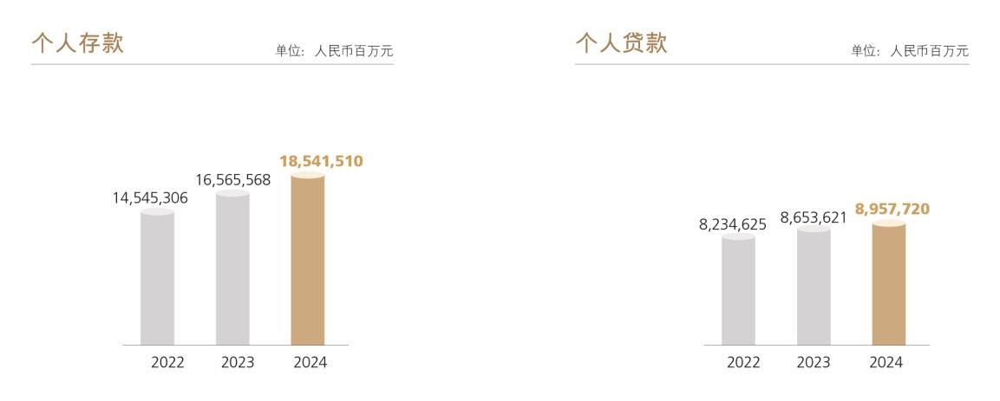

# 8.3.2 个人金融业务

> 来源：《中国工商银行股份有限公司2024年度报告（A股）》，印刷页 49–51
> 本文由 build_kb.py 自动生成

和转型能力的BETA1.0 体系，赋能新媒体运营、线上营销获客、e 票据
移动服务、新技术创新应用等领域。
 2024 年，票据贴现业务量37,002.50 亿元，比上年增长36.2%，继续保持
市场首位。连续四年获评上海票据交易所“优秀综合业务机构”“优秀
贴现机构”“优秀交易机构”等多个奖项。
8.3.2
个人金融业务
2024年，本行积极应对外部市场、政策、监管等环境变化，坚持以客户为中
心的经营理念，强化市场导向和价值创造，围绕集团“五化”转型路径，全面建
设人民满意银行，推进高质量发展、高品质服务、高水平安全与高效能改革齐头
并进。
 围绕核心业务，推进高质量发展。存款方面，强化GBC 协同，加强代发、
商户、社保等源头客群拓展，提高存款增长稳定性；加快储蓄存款产品
创新，推出“智存宝、零存宝”等产品，更好满足重点客群需求。贷款
方面，积极推动个贷结构转型，在稳房市、促消费、支持市场主体发展
中展现个贷业务的功能性。落实个人住房贷款新政，完成存量房贷利率
批量调整工作，确保个人住房贷款利率定价新机制及时平稳落地，大力
发展二手房贷款业务，更好地保障人民群众合理住房需求；加快消费品
以旧换新政策落地，持续加大汽车、家装家居、家电等以旧换新金融支
持力度；围绕民营企业出资人、法定代表人等经营客群，满足客户的经
营和消费融资需求，重点推广“安心长贷”“随心还”等新服务，稳步推
动续贷政策落地。财富管理方面，打造工银财富金融平台，推动行内外
系统集成互通及数据共享；推出7×24 快赎、“智享还”“理财夜市”等
理财服务，升级“天天盈”T+0 基金服务，为广大客户提供更多便利选
择；全新升级线上财富金融服务，为客户提供看市场、挑产品、配资产、
学知识全方位服务，推出线上公益性投教基地“财富学苑”；升级智能资
产配置服务，重构底层模型，灵活满足个人客户存量财富管理和未来财
富规划的需求，提升服务对客价值创造能力。支付结算方面，打造“自
有+三方+数字货币”相协调的服务体系，以“灵通账户”品牌为统领打

造个人账户服务标杆，推出特色卡新品，满足客户个性化需求。
 围绕风控强基，构建高水平安全。初步形成新一代反洗钱尽调体系，反
洗钱履职能力稳步提升。不断完善代销产品风控机制，建立代销产品准
入专家评审制和产品风险后评价机制。持续提升反诈精准度和解控便捷
性，主动对1,917.2 万名疑似受害人实施保护性止付，拦截老年人大额代
办疑似风险交易，挽回损失超68.6 亿元。
 围绕客户需求，做优高品质服务。围绕客户“备投、备付、备还”等场
景，持续吸引沉淀低成本活期资金。针对县域客户金融需求，围绕振兴
卡打造幸福“1+4”产品服务体系，针对年轻客群扩展“工银i 小宇”品
牌服务，培育经营发展潜力。围绕拓客重点方向和场景，组织获客专项
活动，探索新客维护模式。构建分层分群全量客户服务体系，推动从“做
业务”向“做客户”转变，抢抓代发、金融社保卡、个人养老金等新市
场、新机遇，打造专属产品，提供专属服务，培育专属品牌。
 围绕数智赋能，深化高效能改革。完善数字化客户经营顶层设计，推进
个人客户全视角感知、全维度画像、全产品供给、全渠道展业、全策略
适配的数智流程建设。推进财富顾问创新工程，打造集财富管理新流程、
财富金融新平台、投研投顾新机制、队伍建设新动能、合规风控新模式、
科技赋能新支撑于一体的财富服务新体系。围绕要素标准化建设、智慧
大脑2.0 升级等任务，完善客户、产品、渠道、经理人一体化运作机制。
 获评《环球金融》“中国最佳消费者信贷银行”“财富管理之星”，《财资》
“中国最佳数字财富管理体验”“中国最佳风险管理项目”，《零售银行》
“最佳养老金融大奖”等奖项。2024年末，个人客户7.66亿户。个人金融
资产总额22.84万亿元，其中，个人存款185,415.10亿元，增加19,759.42亿
元，增长11.9%。个人贷款89,577.20亿元，增加3,040.99亿元，增长3.5%。
代理销售基金6,541亿元，代理销售国债557亿元，代理销售个人保险787
亿元。

私人银行业务
 支持实体经济，全力打造“企业家伙伴银行”，服务企业家综合成效显著。
提升科创企业家综合金融服务能力，推出科创企业股权激励贷。“企业家
加油站”突破2,000 家，推进“兴企万里行”企业家综合服务工作，焕新
升级“工银e 企+”企业家智慧服务平台。形成科学家客群综合服务体系，
不断创新科学家客群服务模式。推动家业业务创新落地，联合工银瑞信
在业内首推家族信托综合顾问的基金投顾方案，推出家庭服务信托综合
顾问业务。
 助力共同富裕，构建慈善公益服务生态圈。积极推广慈善信托综合顾问
业务，举办“君子伙伴 善行致远”慈善主题论坛，将公益慈善与家风建
设有机结合，联手合作机构在上海落地区域型慈善信托。
 获评《专业财富管理》《财资》“中国最佳私人银行”、《亚洲银行家》“中
国最佳企业家服务私人银行”、
《专业财富管理》
“亚洲最佳数字私人银行”、
《中国证券报》
“私人银行金牛奖”、
《财富管理》
“最佳公益慈善服务奖”。
 2024 年末，私人银行客户28.9 万户，比上年末增加2.6 万户，增长9.9%；
管理资产3.47 万亿元，增加4,043 亿元，增长13.2%。
银行卡业务
 助力扩内需、促消费。聚焦文旅、出行、商超、购物等高频刚需场景，
联合头部商户开展爱购系列促销活动。提升惠民服务，积极落实以旧换



**图表数据（JSON 转写）**（由图片识别转写，数据以原图为准）：

```json
{
  "image": "../../assets/p051_1.jpeg",
  "charts": [
    {
      "type": "bar",
      "title": "个人存款",
      "unit": "人民币百万元",
      "labels": ["2022", "2023", "2024"],
      "series": [{"name": "个人存款", "data": [14545306, 16565568, 18541510]}]
    },
    {
      "type": "bar",
      "title": "个人贷款",
      "unit": "人民币百万元",
      "labels": ["2022", "2023", "2024"],
      "series": [{"name": "个人贷款", "data": [8234625, 8653621, 8957720]}]
    }
  ]
}
```
