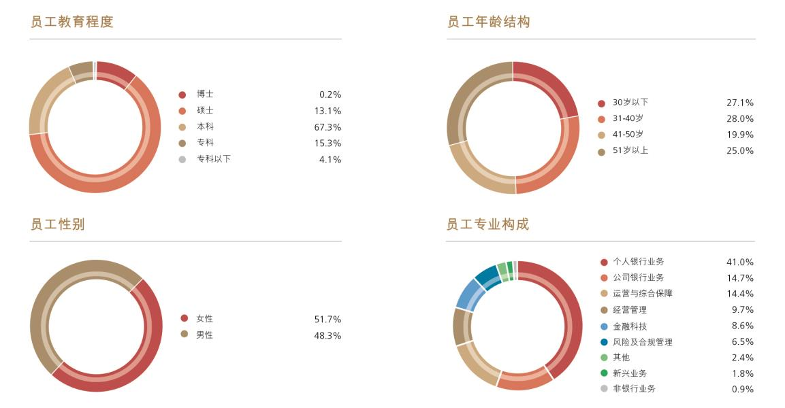

# 8.3.9 国际化经营

> 来源：《中国工商银行股份有限公司2024年度报告（A股）》，印刷页 67–70
> 本文由 build_kb.py 自动生成

 2024 年末，本行机构总数16,383 个，比上年末增加86 个。其中，境内
机构15,975 个，境外机构408 个。境内机构包括总行、36 个一级分行
及直属分行、460 个省会城市行及二级分行、15,107 个基层分支机构，
21 个总行直属机构及其分支机构，以及350 个控股子公司及其分支。

2024 年末资产、分支机构和员工的地区分布情况
项目
资产
（人民币
百万元）
资产占比
(%)
机构
（个）
机构
占比
(%)
员工
（人）
员工
占比
(%)
总行
7,841,046
16.1
22
0.1
21,590
5.2
长江三角洲
12,434,709
25.5
2,501
15.3
60,310
14.5
珠江三角洲
7,718,129
15.8
1,940
11.8
47,198
11.4
环渤海地区
7,246,667
14.8
2,619
16.0
64,218
15.5
中部地区
5,406,280
11.1
3,375
20.6
75,767
18.2
西部地区
6,270,179
12.8
3,582
21.9
83,025
20.0
东北地区
1,696,003
3.5
1,586
9.7
36,760
8.9
境外及其他
5,753,936
11.8
758
4.6
26,291
6.3
抵销及未分配资产
(5,545,203)
(11.4)

合计
48,821,746
100.0
16,383
100.0
415,159
100.0
注：境外及其他资产包含对联营及合营公司的投资。

8.3.9
国际化经营
坚持“国际视野，全球经营”，完善境内外、本外币一体化经营体系，充分



> 注：原 PDF 印刷页 67 为同页混排——上半页属 8.3.8 人力资源管理与员工机构情况（下图即员工构成），下半页起为 8.3.9 国际化经营。按页面归属规则，图片保留在本文。

**图表数据（JSON 转写）**（由图片识别转写，数据以原图为准）：

```json
{
  "image": "../../assets/p067_1.jpeg",
  "charts": [
    {
      "type": "pie", "title": "员工教育程度", "unit": "%",
      "labels": ["博士", "硕士", "本科", "专科", "专科以下"],
      "series": [{"name": "员工教育程度", "data": [0.2, 13.1, 67.3, 15.3, 4.1]}]
    },
    {
      "type": "pie", "title": "员工年龄结构", "unit": "%",
      "labels": ["30岁以下", "31-40岁", "41-50岁", "51岁以上"],
      "series": [{"name": "员工年龄结构", "data": [27.1, 28.0, 19.9, 25.0]}]
    },
    {
      "type": "pie", "title": "员工性别", "unit": "%",
      "labels": ["女性", "男性"],
      "series": [{"name": "员工性别", "data": [51.7, 48.3]}]
    },
    {
      "type": "pie", "title": "员工专业构成", "unit": "%",
      "labels": ["个人银行业务", "公司银行业务", "运营与综合保障", "经营管理", "金融科技", "风险及合规管理", "其他", "新兴业务", "非银行业务"],
      "series": [{"name": "员工专业构成", "data": [41.0, 14.7, 14.4, 9.7, 8.6, 6.5, 2.4, 1.8, 0.9]}]
    }
  ]
}
```
发挥全球经营优势，着力提升跨境金融服务水平，助力高质量共建“一带一路”，
服务国家高水平对外开放大局。
 深入服务国家高水平对外开放。服务贸易强国建设，扎实履行“春融行
动2024”服务承诺，全力支持内外贸一体化发展，累计为境内重点外贸
外资企业发放表内外融资4.8 万亿元。优化跨境电商综合金融服务，为
支付机构、跨境电商等新业态办理业务2,731.74 亿元，比上年增长33.8%，
服务超10 万家中小微商户。持续推广海关“单一窗口”金融服务，促进
贸易便利化，2024 年办理跨境汇款64.87 亿美元。全面服务外汇客户跨
境金融综合服务需求，推动外资外贸客户结构多元化，做好外商投资企
业全资金链条、全金融场景、全球化联动的综合服务，助力吸引更多长
期资本来华展业兴业。深入构建国际业务风险管理联防联控机制，全面
做好产品客户风险对位管理，有效推动外汇业务高质量发展与高水平安
全。
 稳慎扎实推进人民币国际化。持续推进“春煦行动”，积极支持全球市
场主体跨境结算、投融资、风险管理等领域跨境人民币业务需求。充分
发挥清算行培育离岸人民币市场的积极作用，持续加强清算基础设施建
设，提升清算服务能力，支持、引领离岸人民币市场健康发展。率先在
上海成立自由贸易账户分账核算单元总部，作为首批试点银行成功上线
多功能自由贸易账户业务，积极支持上海国际金融中心、粤港澳大湾区、
海南自贸港等重点区域跨境人民币业务创新发展。创新服务跨国公司贸
易结算、资金管理等业务需求，助力更大力度吸引和利用外资。搭建中
小企业跨境人民币应用场景，支持中小微企业发展。2024 年跨境人民币
业务量9.8 万亿元。
 持续深化国际合作。高质量履行金砖国家工商理事会中方主席单位职责，
服务金砖国家多边合作。依托中欧企业联盟，助力中欧经贸关系提质升
级。完善“一带一路”银行间常态化合作机制（BRBR），助力高质量共
建“一带一路”。积极服务中国国际进口博览会、中国进出口商品交易
会、中国国际服务贸易交易会、中国国际供应链促进博览会等国际展会，
助力高水平对外开放。

 完善全球网络布局，持续健全跨境金融服务体系。2024 年末，本行已在
49 个国家和地区建立了408 家境外机构，通过参股标准银行集团间接覆
盖非洲20 个国家，在“一带一路”共建国中的31 个国家设立254 家分
支机构。与143 个国家和地区的1,461 家外资银行建立了业务关系，服
务网络覆盖六大洲和全球重要国际金融中心。
 境外机构稳妥应对复杂挑战，保持稳中有进经营态势。持续提升公司投
行、全球现金管理、零售金融、网络金融、专项融资、金融市场、资产
管理、资产托管等全球金融服务能力，构建个人客户全球金融服务体系。
打造境内外一体化营销体系，推动大湾区业务建设和跨境金融服务提升，
做好外国人来华支付服务，增强跨境联动水平，提升“工银全球付”场
景支撑能力，持续打造“工银全球行”服务品牌。

境外机构主要指标
项目
资产(百万美元)
税前利润（百万美元）
机构（个）
2024 年末
2023 年末
2024 年
2023 年
2024 年末
2023 年末
港澳地区
206,670
201,941
1,126
551
96
95
亚太地区（除港澳）
144,381
136,959
1,700
1,522
88
90
欧洲
87,152
87,215
771
786
70
74
美洲
40,157
41,367
349
386
153
153
非洲代表处
-
-
-
-
1
1
抵销调整
(44,509)
(50,847)

小计
433,851
416,635
3,946
3,245
408
413
对标准银行投资
（1）
3,692
3,573
456
454

合计
437,543
420,208
4,402
3,699
408
413
注：（1）列示资产为本行对标准银行的投资余额，税前利润为本行报告期对其确认的投资收益。

 2024 年末，本行境外机构（含境外分行、境外子公司及对标准银行投资）
总资产4,375.43 亿美元，占集团总资产的6.5%。其中，各项贷款1,721.40
亿美元，客户存款1,642.55 亿美元。报告期税前利润44.02 亿美元，占
集团税前利润的7.6%。


**境外机构分布（JSON 转写）**（由图片识别转写，数据以原图为准）：

```json
{
  "image": "../../assets/p070_1.png",
  "type": "list",
  "title": "境外机构分布情况",
  "groups": [
    {
      "region": "港澳地区",
      "items": ["香港分行（中国香港）", "工银亚洲（中国香港）", "工银国际（中国香港）", "工银澳门（中国澳门）", "澳门分行（中国澳门）"]
    },
    {
      "region": "亚太地区（除港澳地区）",
      "items": ["东京分行（日本）", "首尔分行（韩国）", "釜山分行（韩国）", "蒙古代表处（蒙古）", "新加坡分行（新加坡）", "工银印尼（印度尼西亚）", "工银马来西亚（马来西亚）", "马尼拉分行（菲律宾）", "工银泰国（泰国）", "河内分行（越南）", "胡志明市代表处（越南）", "万象分行（老挝）", "金边分行（柬埔寨）", "仰光分行（缅甸）", "工银阿拉木图（哈萨克斯坦）", "卡拉奇分行（巴基斯坦）", "孟买分行（印度）", "迪拜国际金融中心分行（阿联酋）", "阿布扎比分行（阿联酋）", "多哈分行（卡塔尔）", "利雅得分行（沙特阿拉伯）", "科威特分行（科威特）", "悉尼分行（澳大利亚）", "工银新西兰（新西兰）", "奥克兰分行（新西兰）"]
    },
    {
      "region": "欧洲",
      "items": ["法兰克福分行（德国）", "卢森堡分行（卢森堡）", "工银欧洲（卢森堡）", "巴黎分行（法国）", "阿姆斯特丹分行（荷兰）", "布鲁塞尔分行（比利时）", "米兰分行（意大利）", "马德里分行（西班牙）", "华沙分行（波兰）", "希腊代表处（希腊）", "工银澳门里斯本代表处（葡萄牙）", "工银伦敦（英国）", "伦敦分行（英国）", "工银标准（英国）", "工银莫斯科（俄罗斯）", "工银土耳其（土耳其）", "布拉格分行（捷克）", "苏黎世分行（瑞士）", "工银奥地利（奥地利）"]
    },
    {
      "region": "美洲",
      "items": ["纽约分行（美国）", "工银美国（美国）", "工银金融（美国）", "工银加拿大（加拿大）", "工银墨西哥（墨西哥）", "工银巴西（巴西）", "工银秘鲁（秘鲁）", "工银阿根廷（阿根廷）", "ICBC Investments Argentina（阿根廷）", "Inversora Diagonal（阿根廷）", "巴拿马分行（巴拿马）"]
    },
    {
      "region": "非洲",
      "items": ["参股标准银行（南非）", "非洲代表处（南非）"]
    }
  ]
}
```
