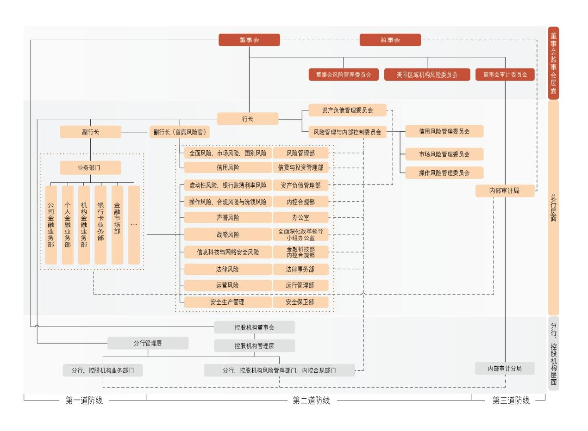

# 8.4 风险管理

> 来源：《中国工商银行股份有限公司2024年度报告（A股）》，印刷页 78–97
> 本文由 build_kb.py 自动生成

8.4 风险管理
8.4.1
全面风险管理体系
全面风险管理是指通过建立有效制衡的风险治理架构，培育稳健审慎的风险
文化，制定统一的风险管理策略和风险偏好，执行风险限额和风险管理政策，有
效识别、评估、计量、监测、控制或缓释、报告各类风险，为实现集团经营和战
略目标提供保证。本行在全面风险管理中遵循的原则包括全覆盖、匹配性、独立
性、前瞻性、有效性原则等。
董事会及其专门委员会、监事会、高级管理层及其专业委员会、风险管理部
门和内部审计部门等构成本行风险管理的组织架构。本行风险管理组织架构如下：

2024 年，本行坚持管住人、管住钱、管好防线、管好底线“四管齐下”，按
照“主动防、智能控、全面管”路径，深化落实“五个一本账”要求，统筹强化
“9+X”各类风险管理，持续推进全面风险管理体系迭代升级。着力完善风险管
理与内部控制委员会、风险官工作机制，持续强化三道防线建设，进一步提升集
团风控统筹管理水平。强化跨境、跨市场风险联防联控，持续开展风险隐患排查，



**风险管理组织架构（mermaid 转写）**（由图片识别转写，汇报路线细节以原图为准）：

```mermaid
flowchart TD
    B[董事会] --> B1[董事会风险管理委员会]
    B --> B2[美国区域机构风险委员会]
    B --> B3[董事会审计委员会]
    J[监事会]
    B --> P[行长]
    P --> P1[资产负债管理委员会]
    P --> P2[风险管理与内部控制委员会]
    P2 --> P21[信用风险管理委员会]
    P2 --> P22[市场风险管理委员会]
    P2 --> P23[操作风险管理委员会]
    P --> VP[副行长]
    VP --> BIZ[业务部门<br/>公司金融业务部 / 个人金融业务部 / 机构金融业务部 / 银行卡业务部 / 金融市场部 …]
    P --> CRO["副行长（首席风险官）"]
    CRO --> R1["全面风险、市场风险、国别风险"]
    R1 --> D1[风险管理部]
    CRO --> R2[信用风险]
    R2 --> D2[信贷与投资管理部]
    CRO --> R3["流动性风险、银行账簿利率风险"]
    R3 --> D3[资产负债管理部]
    CRO --> R4["操作风险、合规风险与洗钱风险"]
    R4 --> D4[内控合规部]
    CRO --> R5[声誉风险]
    R5 --> D5[办公室]
    CRO --> R6[战略风险]
    R6 --> D6[全面深化改革领导小组办公室]
    CRO --> R7[信息科技与网络安全风险]
    R7 --> D7[金融科技部 / 内控合规部]
    CRO --> R8[法律风险]
    R8 --> D8[法律事务部]
    CRO --> R9[运营风险]
    R9 --> D9[运行管理部]
    CRO --> R10[安全生产管理]
    R10 --> D10[安全保卫部]
    AUD[内部审计局] --> AUD2[内部审计分局]
    subgraph 分行、控股机构层面
        BR[分行管理层]
        SUB1[控股机构董事会] --> SUB2[控股机构管理层]
        BRB[分行、控股机构业务部门]
        BRR[分行、控股机构风险管理部门、内控合规部门]
    end
```

> 注：原图右侧标注层级为“董事会监事会层面 / 总行层面 / 分行、控股机构层面”，图例为第一汇报路线（实线）、第二汇报路线（虚线）；三道防线划分：业务部门为第一道防线，风险管理部门为第二道防线，内部审计为第三道防线。
完善风险应对预案和管理措施，稳妥应对全球市场波动和外部冲击影响。加快风
控智能化转型，企业级智能风控平台主体功能投产，持续提升风险前瞻预警和底
线管控能力。强化新兴领域风险管控，完善投融资业务合作机构风险管理机制，
积极探索开展气候风险管理，提升新型风险管理应对能力。
8.4.2
信用风险
信用风险管理
信用风险是指因借款人或交易对手未按照约定履行义务从而使银行业务发
生损失的风险。本行信用风险主要来源包括：贷款、资金业务（含存放同业、拆
放同业、买入返售、企业债券和金融债券投资等）、应收款项、表外信用业务（含
担保、承诺、金融衍生品交易等）。
本行严格遵循信用风险管理相关监管要求，在董事会和高级管理层的领导下，
贯彻执行既定的战略目标，实行独立、集中、垂直的信用风险管理模式。董事会
对信用风险管理有效性承担最终责任。高级管理层负责执行董事会批准的信用风
险管理战略、总体政策及体系。高级管理层下设的信用风险管理委员会是本行信
用风险管理的审议决策机构，负责审议信用风险管理的重大、重要事项，并按照
信用风险管理委员会章程开展工作。各级信贷与投资管理部门负责本级的信用风
险牵头管理工作，各业务部门按照职能分工执行本业务领域的信用风险管理政策
和标准。
按照贷款风险分类的监管要求，本行实行贷款质量五级分类管理，根据预计
贷款本息收回的可能性把贷款划分为正常、关注、次级、可疑和损失五类。为实
行信贷资产质量精细化管理，提高风险管理水平，本行对公司类贷款实施十二级
内部分类体系。本行对个人信贷资产质量实施五级分类管理，综合考虑借款人的
违约月数、预期损失率、信用状况、担保情况等定性和定量因素，确定贷款质量
分类结果。
持续加强信用风险管理体系建设。高标准运行“三道口、七彩池”智能信贷
风控体系，
“入口关”持续优化信用风险业务授权管理体系，动态调整行业政策，
不断完善区域政策，创新实施产业链政策，完善授信审批体制机制建设；“闸口

关”加强重点领域、场景、产品等风险监控，构建跨境、跨市场、跨业务的风险
监测预警体系；“出口关”规范风险资产全流程经营管理，实施风险资产再生计
划，优化不良资产证券化管理机制。
准确把握投融资业务布局和方向，强化公司信贷业务信用风险管理。积极服
务国家重大战略，靠前对接国家一揽子增量政策，引导全行优化信贷结构。积极
支持战略性新兴产业、高新技术领域、先进制造业、节能环保等重点领域，健全
科技金融全生命周期服务体系；深入挖掘和培育绿色信贷市场，加大绿色交通、
清洁能源、节能环保等绿色产业投融资支持，提升绿色金融综合服务能力；加大
小微客群融资支持力度，围绕城乡融合、重点县域基础设施补短板强弱项、涉农
产业链、农业现代化等领域加强金融支持，推动普惠金融发展；支持“十四五”
在建重大工程及补短板项目，围绕交通、水利、新型城镇化等重点领域加大信贷
投放；贯彻落实房地产宏观调控政策，加大对“市场+保障”的住房供应体系金
融支持力度，推动加快构建房地产发展新模式。深入贯彻区域协调发展战略，围
绕服务京津冀协同发展、粤港澳大湾区建设、长三角一体化、中部地区崛起、东
北全面振兴、西部大开发等重大部署，聚焦区域优势产业、特色产业，持续完善
差异化的区域信贷政策；坚持审慎稳健的境外信贷资产布局策略，围绕服务共建
“一带一路”和高水平对外开放，做好优质中资“走出去”和外资“引进来”企
业金融服务。
围绕房地产、地方债务和中小金融机构等重点领域，前瞻研判、主动施策，
做好信用风险管理。房地产领域，认真贯彻落实宏观调控政策及金融监管要求，
统筹做好新增融资投放和存量风险化解，推动金融与房地产良性循环；坚持区域、
客户、项目“三位一体”的资产选择标准，满足房地产项目合理融资需求，持续
优化投融资结构布局；积极稳妥做好保交房金融支持，依法保障住房金融消费者
合法权益。地方债务领域，严格执行国家各项法规和监管政策规定，落实国家一
揽子化债方案，按照市场化、法治化原则做好金融支持化债工作，稳妥配合地方
政府压降债务规模，做好风险防范化解。中小金融机构领域，持续强化机构准入
和限额管理，加强风险联防联控，提高数字化风控能力，防范风险交叉传染。
加强全面风险管理体系建设，推进不良资产处置化解，做好个人贷款资产质
量管控。密切关注房地产交易市场变化，加强与优质大型房地产企业及头部中介

平台公司的合作，从源头把控个人住房贷款信用风险；针对多头融资、抵押物套
现、骗贷等新型风险，持续推动房抵组合贷款全流程风险模型系统建设，丰富贷
前、贷中风险识别策略集；持续加强零售客户前端准入和审查审批管理，引入公
共服务数据查询功能，加强数据真实性交叉核验；实现信用卡额度自动化、常态
化动态管理，建立专项分期常态化贷后检查机制，加强风险客户、合作机构和经
销商预警核查；加强个人贷款全周期智能风险监测管理，完善个人贷款催收一体
化建设，持续推进不良资产处置工作。
深入推进信用风险管理数字化转型。迭代升级“五个一本账”投融资运营平
台，建设落地法人大户存续期管理平台、跨境跨市场风险传导预警体系等数字化
项目，落地总行级法人信贷不动产抵押统一登记平台。夯实“智贷通”等智慧赋
能底座，完善“信贷棱镜”数据服务平台，增强投融资管理数字化动能。加强人
工智能、大模型等新技术在风险监控预警中的场景化应用，提升智能化风控水平。
“融安e 防”信用风险监控系统获评《亚洲银行家》“亚太区最佳信用风险技术
实施”。
信用风险分析
2024 年末，本行不考虑任何担保物及其他信用增级措施的最大信用风险敞
口508,803.38 亿元，比上年末增加42,760.82 亿元，请参见“财务报表附注七、
1.1 不考虑任何担保物及其他信用增级措施的最大信用风险敞口”。

贷款五级分类分布情况
人民币百万元，百分比除外
项目
2024 年12 月31 日
2023 年12 月31 日
金额
占比(%)
金额
占比(%)
正常
27,418,600
96.64
25,250,275
96.79
关注
574,171
2.02
482,705
1.85
不良贷款
379,458
1.34
353,502
1.36
    次级
85,881
0.31
98,527
0.38
    可疑
103,049
0.36
116,527
0.45
    损失
190,528
0.67
138,448
0.53
合计
28,372,229
100.00
26,086,482
100.00

按照五级分类，2024 年末正常贷款274,186.00 亿元，比上年末增加21,683.25
亿元，占各项贷款的96.64%；关注贷款5,741.71 亿元，增加914.66 亿元，占比
2.02%，上升0.17 个百分点；不良贷款3,794.58 亿元，增加259.56 亿元，不良贷
款率1.34%，下降0.02 个百分点。

贷款和不良贷款结构
人民币百万元，百分比除外
项目
2024 年12 月31 日
2023 年12 月31 日
贷款
占比
(%)
不良
贷款
不良
贷款率
(%)
贷款
占比
(%)
不良
贷款
不良
贷款率
(%)
公司类贷款
17,482,223
61.6
276,631
1.58
16,145,204
61.9
292,745
1.81
短期公司类贷款
3,819,683
13.5
90,949
2.38
3,681,064
14.1
91,426
2.48
中长期公司类贷款
13,662,540
48.1
185,682
1.36
12,464,140
47.8
201,319
1.62
票据贴现
1,932,286
6.8
-
-
1,287,657
4.9
-
-
个人贷款
8,957,720
31.6
102,827
1.15
8,653,621
33.2
60,757
0.70
个人住房贷款
6,083,180
21.5
44,317
0.73
6,288,468
24.1
27,827
0.44
个人消费贷款
421,195
1.5
10,057
2.39
328,286
1.3
4,390
1.34
个人经营性贷款
1,677,981
5.9
21,280
1.27
1,347,136
5.2
11,639
0.86
信用卡透支
775,364
2.7
27,173
3.50
689,731
2.6
16,901
2.45
合计
28,372,229
100.0
379,458
1.34
26,086,482
100.0
353,502
1.36

2024 年末，公司类不良贷款2,766.31 亿元，比上年末减少161.14 亿元，不
良贷款率1.58%，下降0.23 个百分点。个人不良贷款1,028.27 亿元，增加420.70
亿元，不良贷款率1.15%，上升0.45 个百分点。

按贷款客户行业划分的境内分行公司类贷款和不良贷款结构
人民币百万元，百分比除外
项目
2024 年12 月31 日
2023 年12 月31 日
贷款
占比
(%)
不良
贷款
不良
贷款率
(%)
贷款
占比
(%)
不良
贷款
不良
贷款率
(%)
交通运输、仓储和邮政
业
3,859,790
23.8
14,286
0.37
3,583,967
24.1
17,530
0.49
制造业
2,454,489
15.1
45,932
1.87
2,351,044
15.8
55,359
2.35
租赁和商务服务业
2,417,060
14.9
36,844
1.52
2,295,720
15.5
43,958
1.91
水利、环境和公共设施
管理业
1,839,421
11.4
16,725
0.91
1,722,981
11.6
20,493
1.19
电力、热力、燃气及水
1,756,221
10.8
7,479
0.43
1,594,025
10.7
12,537
0.79

生产和供应业
房地产业
880,986
5.4
43,964
4.99
762,226
5.1
40,957
5.37
批发和零售业
768,713
4.7
37,403
4.87
679,049
4.6
29,886
4.40
建筑业
483,623
3.0
14,417
2.98
432,570
2.9
14,078
3.25
科教文卫
400,666
2.5
8,453
2.11
383,799
2.6
8,882
2.31
采矿业
328,337
2.0
1,723
0.52
295,219
2.0
2,619
0.89
其他
1,015,627
6.4
16,615
1.64
761,866
5.1
16,474
2.16
合计
16,204,933
100.0
243,841
1.50
14,862,466
100.0
262,773
1.77

本行持续推进行业信贷结构优化调整，加大实体经济发展支持力度。交通运
输、仓储和邮政业贷款比上年末增加2,758.23 亿元，增长7.7%，主要支持高速
公路、铁路、港口等领域重点项目建设，以及满足优质投资主体流动资金需求；
电力、热力、燃气及水生产和供应业贷款增加1,621.96 亿元，增长10.2%，主要
是投向重点电力集团总部、上市公司、电力产业板块等核心企业，以及清洁能源、
特高压配套煤电、缺电地区自用煤电等项目建设；租赁和商务服务业贷款增加
1,213.40 亿元，增长5.3%，主要是投资与资产管理、企业总部、园区及商业综合
体管理服务等领域客户融资需求增加；房地产业贷款增加1,187.60 亿元，增长
15.6%，主要是各类租赁住房贷款、城市房地产融资协调机制“白名单”项目贷
款以及经营性物业贷款等增长所致；水利、环境和公共设施管理业贷款增加
1,164.40 亿元，增长6.8%，主要是投向新型城镇化、水利设施等领域重大工程，
以及城市公共事业、环境整治等民生领域；制造业贷款增加1,034.45 亿元，增长
4.4%，主要是投向新一代信息技术、新能源汽车、大型炼化等高端制造业龙头骨
干企业和重点项目。
本行持续强化各行业融资风险管理，提升不良资产处置质效，做好重点领域
风险防范化解，贷款质量总体稳定。

按地域划分的贷款和不良贷款结构
人民币百万元，百分比除外
项目
2024 年12 月31 日
2023 年12 月31 日
贷款
占比
(%)
不良
贷款
不良
贷款率
(%)
贷款
占比
(%)
不良
贷款
不良
贷款率
(%)
总行
874,284
3.1
38,358
4.39
754,746
2.9
29,793
3.95
长江三角洲
6,182,636
21.8
47,345
0.77
5,616,187
21.5
36,930
0.66
珠江三角洲
4,348,121
15.3
66,187
1.52
4,055,692
15.5
57,869
1.43

环渤海地区
4,677,575
16.5
56,810
1.21
4,285,481
16.4
63,835
1.49
中部地区
4,416,409
15.6
49,717
1.13
4,064,415
15.6
43,192
1.06
西部地区
5,233,652
18.4
68,406
1.31
4,766,575
18.3
68,298
1.43
东北地区
1,158,000
4.1
17,480
1.51
1,082,666
4.2
22,301
2.06
境外及其他
1,481,552
5.2
35,155
2.37
1,460,720
5.6
31,284
2.14
合计
28,372,229
100.0
379,458
1.34
26,086,482
100.0
353,502
1.36

贷款减值准备变动情况
人民币百万元
项目
以摊余成本计量的客户贷款及垫款的
减值准备
以公允价值计量且其变动计入其他综合收益
的客户贷款及垫款的减值准备
第一阶段
第二阶段
第三阶段
合计
第一阶段
第二阶段
第三阶段
合计
年初余额
342,730
156,240
257,031
756,001
361
-
29
390
转移：

  至第一阶段
20,221
(16,982)
(3,239)
-
-
-
-
-
  至第二阶段
(11,518)
15,804
(4,286)
-
(4)
4
-
-
至第三阶段
(5,101)
(24,282)
29,383
-
-
-
-
-
本期计提/（回拨）
6,808
21,323
94,312
122,443
(1)
46
(9)
36
本期核销及转出
-
-
(85,127)
(85,127)
-
-
-
-
收回已核销贷款
-
-
13,856
13,856
-
-
-
-
其他变动
943
4,399
2,557
7,899
(3)
1
1
(1)
年末余额
354,083
156,502
304,487
815,072
353
51
21
425
注：请参见“财务报表附注四、6.客户贷款及垫款”。

2024 年末，贷款减值准备余额8,154.97 亿元，其中以摊余成本计量的贷款
减值准备8,150.72 亿元，以公允价值计量且其变动计入其他综合收益的贷款减值
准备4.25 亿元。拨备覆盖率214.91%，比上年末上升0.94 个百分点；贷款拨备
率2.87%，下降0.03 个百分点。

按担保类型划分的贷款结构
人民币百万元，百分比除外
项目
2024 年12 月31 日
2023 年12 月31 日
金额
占比(%)
金额
占比(%)
抵押贷款
10,787,880
38.0
10,444,304
40.1
质押贷款
3,797,121
13.4
2,979,342
11.4
保证贷款
2,708,808
9.5
2,715,345
10.4
信用贷款
11,078,420
39.1
9,947,491
38.1
合计
 28,372,229
100.0
 26,086,482
100.0

逾期贷款
人民币百万元，百分比除外
逾期期限
2024 年12 月31 日
2023 年12 月31 日
金额
占各项贷款
的比重(%)
金额
占各项贷款
的比重(%)
3 个月以内
122,360
0.43
107,236
0.42
3 个月至1 年
120,579
0.42
101,889
0.39
1 年至3 年
124,646
0.44
87,118
0.33
3 年以上
39,154
0.14
34,181
0.13
合计
406,739
1.43
330,424
1.27
注：当客户贷款及垫款的本金或利息逾期时，被认定为逾期。对于可以分期付款偿还的客户贷款及垫款，
如果部分分期付款已逾期，该等贷款的全部金额均被分类为逾期。

逾期贷款4,067.39 亿元，比上年末增加763.15 亿元。其中逾期3 个月以上
贷款2,843.79 亿元，增加611.91 亿元。

重组贷款
根据《商业银行金融资产风险分类办法》要求计量的重组贷款和垫款
1,390.86 亿元，比上年末增加563.63 亿元，其中逾期3 个月以上的重组贷款和垫
款233.78 亿元，增加148.03 亿元。

贷款迁徙率
百分比
项目
2024 年
12 月31 日
2023 年
12 月31 日
2022 年
12 月31 日
正常
1.09
1.05
1.12
关注
17.44
18.61
21.03
次级
59.86
61.74
36.62
可疑
53.45
77.49
42.55
注：根据原中国银保监会2022 年发布的《关于修订银行业非现场监管基础指标定义及计算公式的通知》
规定计算，为集团口径数据。

大额风险暴露管理
本行严格按照监管规定有序开展大额风险暴露管理各项工作，进一步健全大
额风险暴露管理体系，完善大额风险暴露管理系统建设，加强大额风险暴露限额
管理，不断提升大额风险暴露管理水平。

借款人集中度
2024 年末，本行对最大单一客户的贷款总额占资本净额的4.4%，对最大十
家单一客户的贷款总额占资本净额的21.6%；最大十家单一客户贷款总额
10,761.23 亿元，占各项贷款的3.8%。

项目
2024 年
12 月31 日
2023 年
12 月31 日
2022 年
12 月31 日
最大单一客户贷款比例（%）
4.4
4.5
3.8
最大十家客户贷款比例（%）
21.6
23.5
16.0

下表列示了2024 年末十大单一借款人贷款情况。
人民币百万元，百分比除外
借款人
行业
金额
占各项贷款的
比重（%）
借款人A
交通运输、仓储和邮政业
221,765
0.8
借款人B
金融业
184,888
0.7
借款人C
电力、热力、燃气及水生产和供应业
184,000
0.7
借款人D
交通运输、仓储和邮政业
86,828
0.3
借款人E
金融业
82,342
0.3
借款人F
金融业
66,600
0.2
借款人G
交通运输、仓储和邮政业
64,845
0.2
借款人H
电力、热力、燃气及水生产和供应业
64,100
0.2
借款人I
电力、热力、燃气及水生产和供应业
61,664
0.2
借款人J
交通运输、仓储和邮政业
59,091
0.2
合计

1,076,123
3.8

关于信用风险资本计量情况，请参见本行发布的《中国工商银行股份有限公
司2024 年资本管理第三支柱信息披露报告》的相关内容。
8.4.3
市场风险
市场风险是指因市场价格（利率、汇率、股票价格和商品价格）的不利变动
而使银行表内和表外业务发生损失的风险。本行面临的市场风险主要包括利率风
险、汇率风险和商品风险（以黄金为主）。市场风险管理是指识别、计量、监测、
控制和报告市场风险的全过程，市场风险管理的目标是根据全行风险偏好将市场
风险控制在可承受范围之内，实现经风险调整的收益最大化。

本行严格遵循市场风险管理相关监管要求，实行独立、集中、统筹的市场风
险管理模式，形成了金融市场业务前、中、后台相分离的管理组织架构。董事会
承担对市场风险管理实施监控的最终责任；高级管理层应对市场风险管理体系实
施有效监控；高级管理层下设的市场风险管理委员会承担市场风险管理的审议与
决策职能，负责审议市场风险领域的重大事项等工作。前台业务部门是市场风险
管理第一道防线，承担市场风险管理直接责任；风险管理部门和内控合规部门是
风险管理第二道防线，独立监测、评估、报告市场风险状况；内部审计部门是市
场风险管理第三道防线，对市场风险管理的有效性进行独立客观的审计、评价和
报告。三道防线高效配合、主动防控市场风险。
2024 年，本行持续深化集团市场风险管理。结合《资本办法》和最新管理实
践，持续优化市场风险管理制度体系，实施市场风险资本计量标准法，稳步推进
内部模型法建设；有效传导集团风险偏好，应用资本新规计量成果，持续完善市
场风险限额管理体系；深化市场风险管理系统应用，建立健全模型库及管理机制，
持续提升市场风险智能化管控水平。
交易账簿市场风险管理
本行持续加强交易账簿市场风险管理和产品控制工作，采用风险价值（VaR）、
压力测试、敏感度分析、敞口分析、损益分析、价格监测等多种方法对交易账簿
产品进行计量管理。
有关交易账簿风险价值（VaR）情况，请参见“财务报表附注七、3.1 风险价
值（VaR）”。
汇率风险管理
汇率风险是指外汇资产与外汇负债之间币种结构不平衡产生的外汇敞口因
汇率的不利变动使银行发生损失的风险。汇率风险管理目标是将汇率变动对本行
财务状况和股东权益的影响控制在可承受的范围内。本行主要通过限额管理和风
险对冲等方式管理汇率风险。本行按季度进行汇率风险敏感性分析和压力测试，
高级管理层和市场风险管理委员会按季度审阅汇率风险报告。

2024 年，本行积极应对环境变化和市场波动，坚持汇率风险中性原则，通过
货币兑换、套期保值等方式主动调整外汇敞口规模和币种结构，提升集团外汇资
产负债币种匹配度，加强资本金保值管理，将集团汇率风险控制在合理水平。
外汇敞口
人民币（美元）百万元
项目
2024 年12 月31 日
2023 年12 月31 日
人民币
等值美元
人民币
等值美元
表内外汇敞口净额
703,934
96,438
453,471
63,797
表外外汇敞口净额
(510,365)
(69,919)
(310,686)
(43,709)
外汇敞口净额合计
193,569
26,519
142,785
20,088

有关汇率敏感性分析，请参见“财务报表附注七、3.2 汇率风险”。

关于市场风险资本计量情况，请参见本行发布的《中国工商银行股份有限公
司2024 年资本管理第三支柱信息披露报告》的相关内容。
8.4.4
银行账簿利率风险
银行账簿利率风险指利率水平、期限结构等不利变动导致银行账簿经济价值
和整体收益遭受损失的风险。
银行账簿利率风险管理
本行建立了与系统重要性、风险状况和业务复杂程度相符合的银行账簿利率
风险管理体系，并与本行总体发展战略、全面风险管理体系保持一致。本行银行
账簿利率管理体系主要包括以下基本要素：健全的风险制度体系；有效的风险治
理架构；完备的风险管理策略、政策和流程；全面的风险识别、计量、监测、控
制和缓释；健全的内控内审机制；完备的风险管理系统；充分的信息披露与报告。
本行严格遵循银行账簿利率风险管理相关监管要求，在法人和并表层面实施银行
账簿利率风险管理，建立了权责明确、层次分明、框架完备的银行账簿利率风险
治理架构。董事会承担银行账簿利率风险管理的最终责任；高级管理层承担银行
账簿利率风险管理的实施责任；总行资产负债管理部负责银行账簿利率风险的牵

头管理，其他各部门和各机构按职能分工执行银行账簿利率风险管理政策和标准；
内部审计局、总行内控合规部等部门承担银行账簿利率风险管理的审查和评估职
责。
银行账簿利率风险管理的目标是根据本行的风险管理水平和风险偏好，在可
承受的利率风险限度内，实现经风险调整后的净利息收益最大化。本行基于风险
偏好、风险状况、宏观经济和市场变化等因素制定银行账簿利率风险管理策略，
并明确管理目标和管理模式。基于利率走势预判和整体收益、经济价值变动的计
量结果，制定并实施相应管理政策，统筹运用利率风险管理调控工具开展风险缓
释与控制，确保本行实际承担的利率风险水平与风险承受能力、意愿相一致。本
行基于管理策略和目标制定银行账簿利率风险管理政策，明确管理方式和管理工
具。通过制定或调整表内调节与表外对冲的利率风险管理方式，灵活运用资产负
债数量工具、价格工具以及衍生工具进行管理调控，以及综合运用限额管理体系、
经营计划、绩效考评和资本评估等方式开展利率风险管控评估等，实现对各业务
条线、分支机构、附属机构以及利率风险影响显著的产品与组合层面利率风险水
平的有效控制。
本行银行账簿利率风险压力测试遵循全面性、审慎性和前瞻性原则，采用利
率风险敞口计量法和标准久期法，计量不同压力情景下利率敞口变化对整体收益
和经济价值的影响。本行结合境内外监管要求、全行资产负债业务结构、经营管
理情况以及风险偏好，考虑当前利率水平及历史变化趋势、资产负债总量和期限
特征、业务发展战略及客户行为等因素设置银行账簿利率风险压力测试情景，按
季度定期实施压力测试。
2024 年，本行坚持稳健审慎的利率风险偏好，持续优化资产负债结构布局，
打造与国内外利率走势更加匹配的利率敞口与久期结构，平衡集团利息收支与价
值变化；全面贯彻落实新发展理念，持续提升利率风险数字化管理水平，巩固当
期收益与长期价值平衡、协调、可持续的高质量经营成效。
银行账簿利率风险分析

利率敏感性分析
假设市场整体利率发生平行变化，并且不考虑管理层为降低利率风险而可能

采取的风险管理活动，2024 年末本行按主要币种划分的利率敏感性分析如下表：

人民币百万元
币种
利率上升100 个基点
利率下降100 个基点
对利息净收入
的影响
对权益
的影响
对利息净收入
的影响
对权益
的影响
人民币
(26,560)
(102,939)
26,560
121,349
美元
1,109
(8,228)
(1,109)
9,259
港币
129
(172)
(129)
177
其他
1,101
(3,274)
(1,101)
3,497
合计
(24,221)
(114,613)
24,221
134,282
注：请参见“财务报表附注七、4.银行账簿利率风险”。


利率缺口分析
2024 年末，一年以内利率敏感性累计正缺口22,267.63 亿元，比上年末减少
11,271.84 亿元，主要是一年以内重定价或到期的客户存款增加所致；一年以上利
率敏感性累计正缺口16,227.16 亿元，增加13,403.08 亿元，主要是一年以上重定
价或到期的债券投资增加所致。

利率风险缺口
人民币百万元

3 个月内
3 个月至1 年
1 至5 年
5 年以上
2024 年12 月31 日
(6,245,678)
8,472,441
(3,405,999)
5,028,715
2023 年12 月31 日
(5,622,895)
8,976,842
(4,169,555)
4,451,963
注：请参见“财务报表附注七、4.银行账簿利率风险”。
8.4.5
流动性风险
流动性风险是指本行无法以合理成本及时获得充足资金，用于偿付到期债务、
履行其他支付义务和满足正常业务开展的其他资金需求的风险。引起流动性风险
的事件或因素包括：市场流动性重大不利变化、存款客户支取存款、贷款客户提
款、债务人延期支付、资产负债结构不匹配、资产变现困难、经营损失和附属机
构相关风险等。

流动性风险管理
本行流动性风险管理体系与本行总体发展战略和整体风险管理体系相一致，
并与本行的业务规模、业务性质和复杂程度等相适应，由以下基本要素构成：有
效的流动性风险管理治理结构；完善的流动性风险管理策略、政策和程序；有效
的流动性风险识别、计量、监测和控制；完备的管理信息系统。本行流动性风险
管理的治理结构包括：由董事会及其专门委员会、高级管理层资产负债管理委员
会和风险管理与内部控制委员会组成的决策体系，由监事会、内部审计局和总行
内控合规部组成的监督体系，由总行资产负债管理部、各表内外业务牵头管理部
门、信息科技部门、运行管理部门及分支机构相关部门组成的执行体系。上述体
系按职能分工分别履行流动性风险管理的决策、监督和执行职能。
流动性风险管理的目标是：通过建立健全流动性风险管理体系，实现对集团
和法人层面、各附属机构、各分支机构、各业务条线的流动性风险进行有效识别、
计量、监测和控制，确保在正常经营条件及压力状态下，流动性需求能够及时以
合理成本得到满足。本行流动性风险管理策略、政策根据流动性风险偏好制定，
涵盖表内外各项业务以及境内外所有可能对流动性风险产生重大影响的业务部
门、分支机构和附属机构，并包括正常和压力情景下的流动性风险管理。流动性
风险管理策略明确流动性风险管理的总体目标和管理模式，并列明主要政策和程
序。流动性风险管理政策具体结合本行外部宏观经营环境和业务发展情况制定，
有效均衡安全性、流动性和收益性。本行充分考虑可能影响本行流动性状况的各
种宏微观因素，结合外部经营环境变化、监管要求、本行业务特点和复杂程度，
定期按季度或专题实施压力测试。
2024 年，本行坚持稳健审慎的流动性管理策略，加大资金监测力度，保持合
理充裕的流动性储备，集团流动性平稳运行。不断升级流动性风险管理机制和系
统，流动性风险监测、计量、管控的自动化和智能化水平持续提升。加强境内外、
表内外、本外币流动性风险管理，优化多层级、多维度的流动性监测和预警体系，
提升集团流动性风险防范和应急能力。

流动性风险分析
本行综合运用流动性指标分析、流动性缺口分析等多种方法和工具评估流动
性风险状况。
2024 年末，人民币流动性比例58.4%，外币流动性比例110.0%，均满足监
管要求。贷存款比例80.5%。

项目
监管标准
2024 年
12 月31 日
2023 年
12 月31 日
2022 年
12 月31 日
流动性比例（%）
人民币
>=25.0
58.4
54.5
42.3
外币
>=25.0
110.0
88.8
106.1
贷存款比例（%）
本外币合计

80.5
76.7
76.7

净稳定资金比例旨在确保商业银行具有充足的稳定资金来源，以满足各类资
产和表外风险敞口对稳定资金的需求。净稳定资金比例为可用的稳定资金与所需
的稳定资金之比。2024 年四季度末，净稳定资金比例128.16%，比上季度末下降
1.50 个百分点，主要是所需的稳定资金有所增长。
2024 年第四季度流动性覆盖率日均值140.25%，比上季度上升2.05 个百分
点，主要是未来30 天净现金流出有所减少。合格优质流动性资产主要包括现金、
压力条件下可动用的央行准备金以及符合监管规定的可纳入流动性覆盖率计算
的一级和二级债券资产。
根据《资本办法》规定披露的净稳定资金比例和流动性覆盖率定量信息请参
见本行发布的《中国工商银行股份有限公司2024 年资本管理第三支柱信息披露
报告》的相关内容。
2024 年末，1 个月内的流动性正缺口减小，主要是相应期限到期的同业及其
他金融机构存放款项及拆入资金增加所致；1 至3 个月、3 个月至1 年的流动性
负缺口有所扩大，主要是相应期限到期的客户存款增加所致；1 至5 年的流动性
正缺口扩大，主要是相应期限到期的债券投资增加所致；5 年以上的流动性正缺
口有所扩大，主要是相应期限到期的客户贷款及垫款和债券投资增加所致。2024
年本行资金平稳充裕，资产负债保持均衡稳健发展，各期限现金流合理适度，流
动性运行安全平稳。

流动性缺口分析
人民币百万元

逾期/
即时偿还
1 个月内
1 至3 个月
3 个月
至1 年
1 至5 年
5 年以上
无期限
总额
2024 年12 月31 日 (15,207,017)
75,047
(1,376,512)
(2,257,940)
964,184
18,346,104
3,443,400
3,987,266
2023 年12 月31 日 (14,661,992)
517,820
(1,065,013)
(1,961,803)
299,076
17,033,573
3,614,927
3,776,588
注：请参见“财务报表附注七、2.流动性风险”。
8.4.6
操作风险
操作风险管理
操作风险是指由于内部程序、员工和信息科技系统存在问题以及外部事件所
造成损失的可能性，包括法律风险，但不包括策略风险和声誉风险。本行可能面
临的操作风险损失类别包括七大类：内部欺诈，外部欺诈，就业制度和工作场所
安全，客户、产品和业务活动，实物资产的损坏，IT 系统，执行、交割和流程管
理。其中，客户、产品和业务活动，外部欺诈是报告期内本行操作风险损失的主
要来源。
本行严格遵循操作风险管理相关监管要求。董事会、监事会、高级管理层及
其操作风险管理委员会分别承担操作风险管理决策、监督、执行事项，各相关部
门按照其管理职能分别承担操作风险管理“三道防线”职责，形成紧密衔接、相
互制衡的操作风险管理体系。各机构、各部门履行第一道防线职能，承担本机构、
本专业的操作风险管理的直接责任；内控合规部门，法律事务、安全保卫、金融
科技、数据管理、财务会计、运行管理、人力资源等分类管理部门，信贷与投资
管理、风险管理等跨风险管理部门，以及风险管理、资产负债管理等操作风险资
本计量部门共同履行第二道防线职能，承担管理责任，分别负责操作风险牵头管
理、某类操作风险分类管理，跨信用和市场风险的操作风险管理，以及操作风险
资本计量，指导、监督第一道防线的操作风险管理工作；内部审计部门履行第三
道防线职能，承担监督责任，负责操作风险管理有效性的监督。
2024 年，本行认真贯彻落实监管操作风险计量和管理新规要求，围绕当前
操作风险形势和管控重点，修订完善本行操作风险管理基本政策，优化操作风险
损失数据采集标准和流程，持续夯实操作风险损失数据质量，升级操作风险管理

系统，提升操作风险管控水平。落实监管案防新规，健全案防长效机制，持续深
化重点领域案件风险治理，深入开展案件警示教育，强化员工异常行为网格化智
能化管控机制，压实排查管控主体责任。报告期内，本行操作风险管控体系运行
平稳，操作风险整体可控。

关于操作风险资本计量情况，请参见本行发布的《中国工商银行股份有限公
司2024 年资本管理第三支柱信息披露报告》的相关内容。
法律风险
法律风险是指由于银行经营管理行为不符合有关法律法规、行政规章、监管
规定及其他相关规则的要求，提供的产品、服务、信息或从事的交易以及签署的
合同协议等文件存在不利的法律缺陷，与客户、交易对手及利益相关方发生法律
纠纷（诉讼或仲裁），有关法律法规、行政规章、监管规定及其他相关法律规则
发生重要变化，以及由于内部和外部发生其他有关法律事件而可能导致法律制裁、
监管处罚、财务损失或声誉损失等不利后果的风险。
本行基于保障依法合规经营管理的目标，始终重视建立健全法律风险管理体
系，构建事前、事中和事后法律风险全程防控机制，支持和保障业务发展创新与
市场竞争，防范和化解各种潜在或现实的法律风险。董事会负责审定法律风险管
理相关战略和政策，承担法律风险管理的最终责任。高级管理层负责执行法律风
险管理战略和政策，审批有关重要事项。总行法律事务部是负责集团法律风险管
理的职能部门，有关业务部门对法律风险防控工作提供相关支持和协助，各附属
机构和境内外分行分别承担本机构法律风险管理职责。
2024年，本行持续加强法律风险管理，提升法律风险管理水平和防控能力，
保障集团依法合规经营和业务健康发展，整体运行平稳有序。贯彻落实新法新规，
推动完善业务制度、协议文本及系统建设。顺应金融监管新要求，深入推动重点
领域和关键环节法律风险防控化解。常态化监测法律风险，不断健全总、分行纵
向联动和横向协调机制，将法律风险防控有机融入业务谈判、产品设计、合同签
订等各环节，进一步提高风险防控的前瞻性、主动性和针对性。优化法律工作跨
境协调与管理机制，强化境外机构法律风险管理，加强涉外法律人才培养，持续

妥善应对国际化经营发展中的跨境法律问题。完善电子签约系统功能设计与管理
机制，进一步提升电子签约系统风险控制能力与易用性，有效防控违规用印造成
的操作风险、法律风险和声誉风险。持续加强授权管理、关联方管理和商标管理
工作，不断提高风险管控制度化、系统建设精细化水平。着力强化诉讼案件应对
处理，依法维护本行权益，避免和减少风险损失。积极做好协助执行网络查控工
作，为有权机关提高执法办案效率、构建社会诚信体系等发挥积极作用。创新投
产法律服务智慧共享平台，集中全行法律服务资源，为基层和前台送服务、送工
具上门，切实提升基层和前台业务法律服务的可获得性。广泛开展法律培训和普
法活动，提升集团员工依法合规意识。
洗钱风险
洗钱风险是指银行在开展业务和经营管理过程中提供的产品和服务被用于
洗钱、恐怖融资、扩散融资及其他洗钱上游犯罪活动，进而导致银行遭受损失的
可能性。任何洗钱风险事件或案件的发生都可能带来严重的声誉风险和法律风险，
并导致客户流失、业务损失和财务损失。
本行严格遵循中国及境外机构驻在国（地区）反洗钱法律法规，认真履行反
洗钱法定义务和社会责任。践行“风险为本”理念，突出“联防共治”主线，围
绕持续提升反洗钱工作有效性，推动反洗钱三道防线协同履职，深化反洗钱培训
和队伍建设。进一步优化客户尽职调查工作机制，加强洗钱风险评估与管控。提
高反洗钱系统数智化水平，强化可疑交易监测管理体系。持续推进境外反洗钱长
效机制建设，集团洗钱风险管理质效进一步提升。
8.4.7
声誉风险
声誉风险是指由银行行为、从业人员行为或外部事件等，导致利益相关方、
社会公众、媒体等对银行形成负面评价，从而损害品牌价值，不利正常经营，甚
至影响到市场稳定和社会稳定的风险。声誉风险可能产生于银行经营管理的任何
环节，通常与信用风险、市场风险、操作风险和流动性风险等交叉存在，相互作
用。良好的声誉对商业银行经营管理至关重要。本行高度重视自身声誉，将声誉

风险管理纳入公司治理及全面风险管理体系，防范声誉风险。
本行董事会审议确定与本行战略目标一致且适用于全行的声誉风险管理政
策，建立全行声誉风险管理体系，监控全行声誉风险管理的总体状况和有效性，
承担声誉风险管理的最终责任。高级管理层负责领导全行的声誉风险管理工作，
执行董事会制定的声誉风险管理战略和政策，审定声誉风险管理的有关制度、办
法、操作规程，制定重大事项的声誉风险应对预案和处置方案，确保声誉风险管
理体系正常、有效运行。本行建立了专门的声誉风险管理团队，负责声誉风险的
日常管理。
2024 年，本行深入落实集团声誉风险管理制度要求，持续完善全集团、全流
程声誉风险管理体系，不断优化声誉风险工作机制，提升声誉风险管理质效。加
强声誉风险管理常态化建设，持续深化风险源头防控，不断完善和提升声誉风险
应对处置水平。组织推进具有影响力的传播活动，提升本行品牌形象，品牌价值
和网络影响力处于市场领先地位。报告期内，本行声誉风险处于平稳可控范围。

8.4.8
国别风险
国别风险是指由于某一国家或地区政治、经济、社会变化及事件，导致该国
家或地区债务人没有能力或者拒绝偿付银行债务，或使银行在该国家或地区的商
业存在遭受损失，或使银行遭受其他损失的风险。国别风险可能由一国或地区经
济状况恶化、政治和社会动荡、资产被国有化或被征用、政府拒付对外债务、外
汇管制或货币贬值等情况引发。
本行严格遵循国别风险管理相关监管要求，董事会承担监控国别风险管理有
效性的最终责任，高级管理层负责执行董事会批准的国别风险管理政策，高级管
理层风险管理与内部控制委员会负责国别风险管理相关事项集体审议。本行通过
一系列管理工具来管理和控制国别风险，包括国别风险评估与评级、国别风险限
额、国别风险敞口监测以及压力测试等。国别风险评级和限额每年至少复审一次。
2024 年，面对更趋复杂严峻的外部环境，本行严格按照监管要求，结合业务
发展需要，持续加强国别风险管理。落实监管最新要求，并根据管理实践，对本
行相关制度办法进行了修订；密切监测国别风险敞口变化，持续跟踪、监测和报

告国别风险；及时更新和调整国别风险评级与限额；不断强化国别风险预警机制，
积极开展国别风险压力测试，在稳健推进国际化发展的同时有效控制国别风险。
8.4.9
信息科技与网络安全风险
信息科技与网络安全风险是指在各项信息科技活动中，由于自然因素、人为
因素、技术漏洞和管理缺陷产生的操作、法律和声誉等风险，主要涉及科技治理、
网络与信息安全、创新研发、生产运营、业务连续性、科技外包等领域。本行将
信息科技与网络安全风险纳入全面风险管理体系，建立并持续强化三道防线联防
联控的长效工作机制。
2024 年，本行统筹发展与安全，坚持把防控信息科技与网络安全风险作为
金融科技工作的重要主题。修订发布信息科技与网络安全相关管理制度，强化集
团穿透式管理。升级集团一体化内网纵深防御体系，建立专班机制统筹推进集团
网络安全防护能力提升。加强信息系统生产运行保障，在筑牢安全生产运行基础
的同时，聚焦生产运维核心领域开展运维转型。报告期内，整体风险处于可控范
围。
