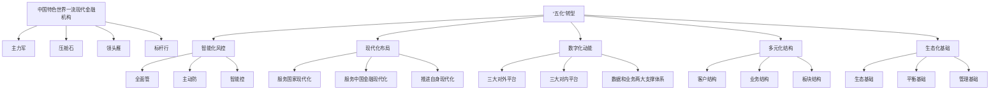

# 8.7 资本市场关注热点问题

> 来源：《中国工商银行股份有限公司2024年度报告（A股）》，印刷页 104–111
> 本文由 build_kb.py 自动生成

8.7 资本市场关注热点问题
热点问题一：工商银行四十年再出发，扎实推进“五化”
转型
2024 年，本行立足四十年再出发，因应时代发展新形势、市场和客户新需
求，锚定中国特色世界一流现代金融机构目标，坚守主力军、压舱石、领头雁、
标杆行定位，扎实推进智能化风控、现代化布局、数字化动能、多元化结构、生
态化基础等“五化”转型，奋力开创高质量发展和高水平安全新局面。

图：中国工商银行高质量发展及转型变革重点

推进智能化风控，提升应对风险挑战的能力水平。本行将风险防控摆在突出
位置，按照“主动防、智能控、全面管”的路径，持续提升风险治理效能。“主
动防”持续增强，总行各“一道防线”部门均设立风险内控处，全面落地授信审
批新规，强化内控和审计监督，不断增强“三道防线”耦合力。“智能控”加快
建设，加快企业级智能风控平台（“4E”平台）建设，形成风险视图中心（EVC）、
计量中心（EMC）、监测预警中心（EAC）、决策中心（ESC），推动对各类风
险的提前感知、精准识别、及时预警和高效处置。“全面管”更成体系，总行和
境内分行、综合化子公司整合设立风险管理与内部控制委员会，境内一二级分行、
综合化子公司全面配备风险官，完善风控体制机制、加强统筹管理。

**“五化”转型战略框架（mermaid 转写）**（由图片识别转写，以原图为准）：

构建现代化布局，更好服务和推进高质量发展。聚焦国家所需和金融所能，
推动金融资源、业务布局、发展模式与现代化建设高效适配。服务国家现代化更
加有力，持续加大对“两重一薄”领域的支持力度，因地制宜服务新质生产力，
2024 年，本行新增贷款投放、债券投资余额均为可比同业第一，制造业、战略性
新兴产业等重点领域贷款规模保持市场首位。服务金融现代化成效彰显，建立健
全服务“五篇大文章”工作机制，做精做细“五篇大文章”，绿色贷款保持同业
第一，普惠贷款增量、增速排名可比同业前列，“专精特新”贷款较年初增长超
54%。推进自身现代化步伐加快，发布银行业首份金融基础设施服务方案，工银
全球付直通国家（地区）拓展至28 个，“扬长补短固本强基”战略布局持续深
化。
培育数字化动能，加快打造工行新质生产力。发挥金融科技优势，加快建设
“数字工行”，为客户服务、产品管理和集团经营发展注入强大动能。做强三大
对外平台，手机银行客户数增至5.88 亿户，规模和活跃度可比同业第一；开放银
行全年交易额突破375 万亿元；“工银e 生活”月活客户总量、增量可比同业第
一。做优三大对内平台，“柜面通”完成网点30 类痛点难点业务场景化流程重
构，对公开户业务办理耗时压降近60%；“营销通”打造管户系统化、维护精细
化、产出可量化的一体化营销管理机制；“智慧办公”平台日活超过30 万人，
员工办公效能进一步提升。持续提升技术支撑能力，成功发布ECOS 2.0 数字技
术生态体系，建成千亿级金融大模型技术体系“工银智涌”，算力、算法、数据
等核心要素领先业界，荣获人民银行金融科技发展奖一等奖。
完善多元化结构，不断打开新的增长空间。主动应对利率下行、净息差收窄
等形势变化，通过优化结构打造多点支撑、高效协同的发展新格局。完善客户结
构，加快构建“大中小微个”相协调的客户结构，微型客户占比由2024 年初的
76.8%提升至年末的78.6%。拓展业务结构，优化资产布局，“零售+普惠”贷款
增量占比持续提升。在稳住利息收入的同时，做大做优手佣、交易等非息收入，
NIM 降幅较上年收窄12BP。做强板块结构，统筹总行、境内分行、境外机构、综
合化子公司“四大经营板块”，不断完善国际化、综合化的经营管理体系。
筑牢生态化基础，进一步增强经营发展韧性。注重打基础、固根本，完善经
营质态和内部管理，提升高质量发展水平。夯实生态基础，聚焦客户需求变化，
沿着资金链做实客户链，优化服务链，提升价值链，纵深推进GBC+基础性工程，

搭建各类场景全套解决方案，实现G 端拓户4.9 万户，B 端拓户32.6 万户，C 端触
达客户1.7 亿人。统筹平衡基础，围绕打造干净健康资产负债表、平衡协调可持续
利润表，提高资产负债管理的主动性、科学性、前瞻性，资产、资本、资金，存
款、贷款、收入，强优大协同特征更加彰显，价值创造、市场地位、风险防控、
资本约束实现较好平衡，关键经营指标更趋稳健。注重管理基础，优化个贷、消
保、风险资产经营等管理职能，持续完善公司治理、战略管理、人才队伍、系统
建设等管理基础。
下一步，本行将坚持稳中求进、以进促稳，守正创新、先立后破，系统集成、
协同配合，以领军银行姿态推进再出发、再平衡、再攻坚，扎实推进“五化”转
型，为中国式现代化和金融强国建设作出新的更大贡献。
热点问题二：打造财务收支新平衡
2024 年，本行努力适应低利率、金融市场波动、风险管控挑战增多等内外部
环境，坚持党建引领，深入推进智能化风控、现代化布局、数字化动能、多元化
结构、生态化基础“五化”转型，不断提升经营发展质效，做好加减法、构建新
平衡，集团实现净利润3,669 亿元，同比增长0.5%，为广大股东持续创造长期稳
定的价值回报。
一、做好加法，多元开源强增收
主动适应利率变化稳定利息收入。近年来在低利率环境下，商业银行普遍资
产收益率下行、负债成本率相对刚性，净息差持续收窄，利息净收入承压。2024
年，本行进一步健全利息净收入管理机制，在资产和负债两端发力，引导全行通
过精细管理和结构调整，努力稳定净息差和利差收入水平。贷款端，切实服务实
体经济，着力夯实信贷储备，坚持风险定价并不断强化差异化分层定价；存款端，
发挥综合化金融服务优势，打造“大中小微个”相协调的客户生态，积极响应利
率自律倡议，筑牢存款持续稳健增长基础；投资端，匹配市场发行节奏加大投资
力度，优化券种结构配置，平衡投资规模、利率水平与期限结构，保持合理的投
资组合收益水平。
多措并举拓宽非息收入来源。一是多元推动手续费及佣金净收入新发展。稳
住支付结算收入基本盘，狠抓客户挖潜和产品渗透，信用卡手佣净收入同比增长

1.8%，新开对公结算账户数同比增长6%，人民币对公结算收入同比增长3.2%，
保持同业领先；积极提升财富管理新体验，贵金属手佣净收入同比增长33%，第
三方存管收入实现正增长，代理基金销售额同比增长56%；加力推动项目服务取
得新成效，ESG 类债券、科创类债券承销额同业领先，银团安排承销与管理、投
行顾问咨询相关收入保持同业领先。全年集团手续费及佣金净收入1,094 亿元，
继续保持总量同业领先。二是培育其他非息收入增长新动能。加强市场研判，抢
抓波动机会捕捉价差收益，在收益率整体震荡下行期，精准把握相对高点与低点
开展交易，实现人民币债券交易收入同比增长115%。实施稳健、科学、多元的
交易策略，深入开展盯市分析，积极把握外汇市场机遇，实现汇兑损益同比增加
8.74 亿元。
二、做好减法，精准管控稳节支
管好资产质量，提升利润贡献。一是优化信贷结构，资产质量管理更加有效。
精准把握重点领域贷款投放，提升资产布局能力，紧抓全口径全周期信用风险管
理，持续加强风控体系建设，完善逾期不良贷款催收体系。二是健全管理机制，
提高处置质效。创建直营直管机制，推进大额风险资产集约化、专业化经营，深
挖自主清收潜力，发挥资源配置经营导向作用，全年账销案存资产清收额处于较
好水平，核销资源与处置撬动比保持同业领先。三是推进智能化风控，提升风险
精准管控能力。持续推进企业级智能风控平台建设，发挥预警系统实战应用能力，
前瞻管控各类风险。完善智能信贷风控体系，精准助力防逾期、控劣变、强处置，
有效降低财务资源占用。
管控财务费用，优化资源投入。坚持“过紧日子”，以收定支、量入为出，
加强收入和支出的统筹平衡，着力挖潜增效，提升费用效能。2024 年集团成本收
入比继续保持同业较优水平。坚持分类施策、精细管理，从严从紧管控日常运营
费用，集团差旅费、会议费、车船使用费等行政费用同比下降约8.3%；优化业务
发展类费用投入，强化“以收定支”，推动形成资源投入与价值创造良性循环，
单位营销费用撬动收入的比例同比提升2.8%，费用效能进一步提升。
三、增收节支，持续打造平衡协调可持续的利润表
当前的低利率环境预计未来还将持续很长一段时期，在对商业银行直接形成
减收压力的同时，也为减轻企业和居民债务负担、激发经营活力、提振消费，促
进商业银行资产质量稳定向好态势创造了有利条件。本行主动融入低利率环境新

生态，积极培育新动能，合理统筹利息收入与非息收入、收益与风险、投入与产
出，着力构建财务收支新的平衡关系。通过稳定营业收入形成更加多元稳固的收
入结构，通过向风险资产要效益实现新列支信贷成本稳中有降，通过高效使用财
务资源确保“好钢用在刀刃上”，既做好加法、也做好减法，开源与节流、挖潜
与增效等举措同向发力，努力打造更加协调可持续的财务收支新平衡。
热点问题三：高水平服务新质生产力
本行聚焦战略性新兴产业发展、未来产业培育和传统产业转型升级，打造专
属产品，提供多元化接力式金融服务，以科技金融助推新质生产力高质量发展。
服务科技创新方面，突出专业性。持续迭代科技金融“五专”体系。2024 年
初在同业率先成立总行级科技金融中心，打造总-分-支-网点四级科技金融专业
机构，开展科技金融“春苗”“秋实”专项行动，打造科技金融“股贷债保”全
生命周期专属产品，优化科技金融专门风控体系，强化科技金融专属保障措施，
以“工银科创金融”服务品牌提供“一揽子”金融服务方案。不断丰富科技金融
产品组合。坚持产品客户对位，加快构建综合化金融服务体系，以全量产品服务
全量客户。积极承销科创票据，截至2024 年末，累计承销科创票据601 亿元，
保持同业领先。聚焦战略性新兴产业、“专精特新”企业等重点客群加大信贷投
放力度，截至2024 年末，战略性新兴产业贷款余额率先突破3.1 万亿，科技型
企业贷款余额近2 万亿，均位列同业首位。用好科技创新再贷款政策工具，多家
分行实现科技创新再贷款同业首笔投放，累计投放金额位居同业第一。加快在股
权融资服务上的创新突破，推出基于外部投资机构信用及企业自身估值的科股贷、
基信贷、基投贷三款商投联动产品，积极参与金融资产投资公司（AIC）股权投
资试点工作，已在上海、北京、苏州、杭州、长沙、广州、厦门、天津、重庆等
城市完成股权投资试点基金设立，实现首批项目投放落地，并完成全国18 个试
点城市合作意向全覆盖，意向基金规模超千亿元。
服务现代化产业体系方面，突出全面性。传统产业升级方面，作为独家金融
机构与工信部共同启动《金融支持先进制造业集群发展专项计划》，先后与长春、
青岛、潍坊、成都、德阳、株洲等地多个重点先进制造业集群链主企业或促进组
织签订战略合作协议；创新开发先进制造业集群资金链探查与客户服务专属数据

模型；试点应用集群审贷模式创新，积极推动集群企业批量准入和主动授信服务。
通过实施制造业金融服务专项行动，加快推进新型工业化建设，助力提升产业链
供应链韧性和安全水平。新兴产业培育方面，围绕培育壮大新兴产业，布局建设
未来产业，充分发挥金融杠杆作用，持续加强电动汽车、锂电池、光伏“新三样”
的金融供给。
服务绿色发展方面，突出引领性。本行是绿色金融的坚定实践者，在2007
年就将绿色金融作为全行发展战略，搭建了全产品、多渠道、综合化的绿色金融
服务框架，2024 年末，本行绿色贷款（金融监管总局口径）余额突破6 万亿元人
民币，是全球最大绿色信贷银行。本行也是绿色金融的坚定倡导者，作为联合国
《负责任银行原则》的创始签署行，本行高度重视绿色金融的体制机制建设，在
绿色产品创新、绿色标准制定、ESG 管理体系建设等方面持续贡献工行智慧。
热点问题四：高质量服务区域协调发展
2024 年，本行坚决贯彻国家促进区域协调战略部署，主动融入区域经济发
展总体布局，与做好金融“五篇大文章”，推进自身转型变革和高质量发展同谋
划、同部署、同落实，积极发挥“主力军”和“压舱石”作用。
聚焦协同联动，建立体系化服务格局。坚持高位统筹，成立服务区域协调发
展和国际金融中心建设领导小组，行领导分工联系各个区域，专题研究跨条线、
跨地区、跨机构重难点问题，促进形成一体化、高效能服务区域发展的战略合力。
深化机制建设，区域内各机构加强常态化交流会商、信息共享和业务联动，总行
完善信贷授权、考核分润、监测评价、人员交流等配套政策，进一步提升金融服
务区域协调发展的适应性、竞争力和普惠性。突出市场导向，以客户多元化金融
需求为牵引，分区域确定重点服务客群、重点生态场景和联动工作任务，体系化、
项目化、清单化推进工作落地，做到区域与客户、产品对位。
聚焦区域定位，提升服务实体效能。立足不同区域功能定位，支持发挥比较
优势，更好助力构建全国统一大市场。深化京津冀区域协同服务，建立京津冀重
点项目储备库，累计审批协同发展项目近2,000 个，金额超2.25 万亿元；组建雄
安疏解承接办公室，“一户一策”制定重点疏解客户综合金融服务方案。2024 年
末，本行在京津冀地区人民币各项贷款余额4.8 万亿元，同比增幅9.43%，余额、

增量均保持同业领先。推动长三角现代产业体系建设，积极参与AIC 股权投资多
城市试点，实现多地、多笔首单落地，完善科创企业全生命周期金融服务，支持
因地制宜培育新质生产力。2024 年末，本行在长三角区域制造业贷款余额1.47
万亿元，同比增幅11.5%；战略新兴产业贷款余额9,200 亿元，同比增幅17.6%，
市场领先优势进一步巩固。强化粤港澳大湾区跨境一体化服务，加强“跨境理财
通”联动推广，升级“工银琴澳通2.0”产品体系，满足琴澳企业和居民多样化
金融需求。成功在海南、广东首批上线多功能自由贸易账户（EF）体系，完成跨
境综合金融服务平台建设。
聚焦高水平开放，服务上海、香港两大国际金融中心建设。统筹服务强大国
际金融中心建设和自身打造强大金融机构，分别制定支持上海、香港“20 条”
措施，成立服务上海、香港国际金融中心建设委员会，支持增强上海国际金融中
心竞争力和影响力，巩固提升香港国际金融中心地位。上海方面，发布银行业首
份金融基础设施建设服务方案，同业首家在沪设立自贸账户总部，全年在沪跨境
人民币贷款增长42%，跨境托管规模增长41%，离岸人民币交易量增长53%。
香港方面，促进金融市场双向“互联互通”，高质量服务“走出去”“引进来”，
助力巩固离岸人民币中心地位，全年在港人民币清算量增长91%，离岸人民币外
汇交易量增长67%。
热点问题五：扎实推进智能化风控
2024 年，面对复杂多变的风险形势，本行牢固树立国家安全观，强化底线思
维、极限思维，坚持早识别、早预警、早暴露、早处置原则，实施“风控智能化”
转型战略，持续完善管住人、管住钱、管好防线、管好底线“四管齐下”措施，
强化“主动防、智能控、全面管”路径建设，以高质量风控助力集团发挥领军银
行作用。
推进平台系统建设，提升智能风控能力。建设企业级智能风控平台（“4E”
平台），以行内外金融、非金融数据为基础，融合应用机器学习、知识图谱、大
模型等技术，形成企业级风险视图中心（EVC）、计量中心（EMC）、监测预警中
心（EAC）、决策中心（ESC），具备风险体检、模型管理、风险筛查、跨市场跨
风险传染识别、舆情监测、底线风险拦截和风险官工作专区等功能，为全面风险

管理提供数字化工具。推进信贷风险管理领域数字化建设，通过产品组件化等方
式升级全球信贷与代理投资管理系统，夯实数字化能力底座，发挥数智服务效能；
依托融安e 防、投融资运行管理平台等系统，构建信贷经营“管理+服务”双轮
驱动的生态化运营模式，形成“感知-预警-决策-执行”系统闭环，实现前中后
台风控管理和投融资资产运营有机统一，以智慧化、生态化信用风险管理助力业
务发展。
深化系统工具应用，提升智能风控水平。在总分行试点应用“4E”平台，建
立“底线规则”库，对接资金交易、产品准入、渠道触点、对客营销等4 大类场
景，提供风险特征、规则、策略的灵活布控、快速上线、毫秒级实时计算和自动
化决策能力，对潜在风险进行动态揭示和提示，智能拦截高风险业务。加强数据
赋能，强化融安e 防应用，以用户为中心，打造零代码用数平台和数字化运营视
图，实现全自然语言交互“对话即分析”的数据分析新范式，降低用户用数门槛，
提升系统界面友好性、易用性及用户体验。完善智能管控，立足总量、增量、质
量、结构、效益“五位一体”视角，通过整合、萃取业务数据，提升覆盖机构、
区域、行业、产品、条线、重点领域、大户、处置、组合、履职等主题维度的投
融资运营管理系统功能，并针对不同用户提供差异化决策建议。强化智能服务，
推出数字员工功能，辅助用户提升风险识别、制度问答等工作质效，拓宽拓深系
统服务支持触点，充分发挥数智服务效能。
