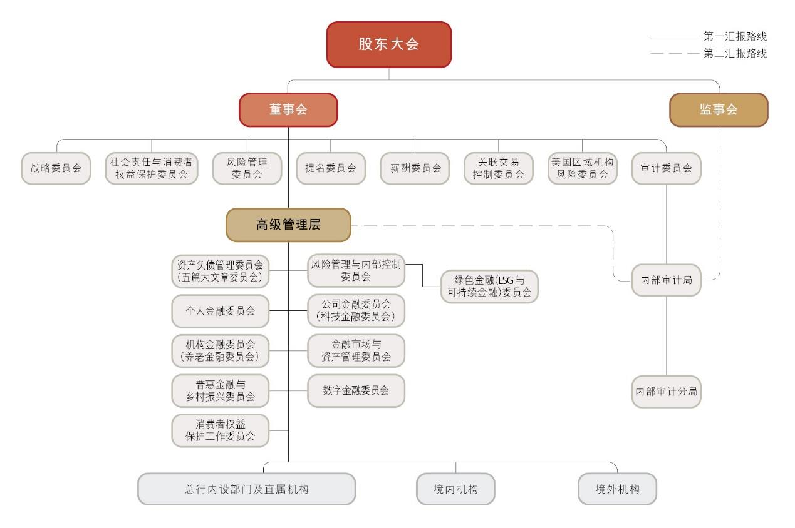
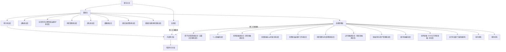
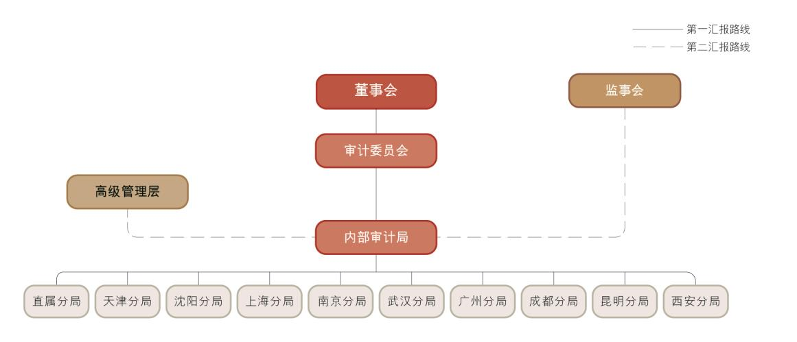
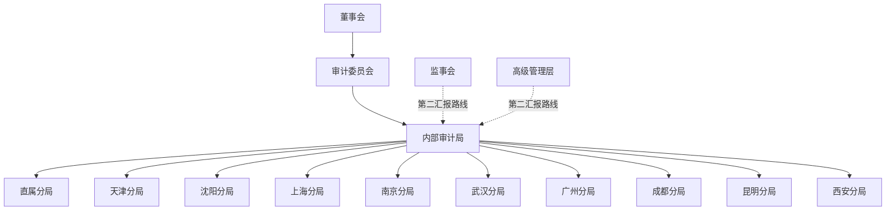

# 11 公司治理报告

> 来源：《中国工商银行股份有限公司2024年度报告（A股）》，印刷页 134–157
> 本文由 build_kb.py 自动生成

11. 公司治理报告
公司治理概述
报告期内，本行始终把完善中国特色现代金融企业公司治理作为新时期实现
高质量发展的基础工程，统筹做好公司治理制度、架构、机制完善，优化“党委
全面领导、董事会战略决策、监事会依法监督、管理层负责经营”的公司治理格
局。加强公司治理顶层设计，修订完善《独立董事工作制度（2024 年版）》
《董事、
监事及高级管理人员持有及变动本行股份管理办法（2024 年版）》等公司治理制
度，优化授权体系，进一步提升本行公司治理科学性、有效性。董事会以服务中
国式现代化、推动高质量发展为主线，全面践行金融工作的政治性、人民性，完
整、准确、全面贯彻新发展理念，深入推进“五化”转型，贯彻落实国家各项决
策部署和金融监管要求，不断提升金融服务适应性、竞争力、普惠性。扎实履行
战略决策和防控风险职责，促进完善风险管控、薪酬激励、社会责任等治理机制，
持续加强信息披露及透明度建设，保障股东权益，为各利益相关方创造更加卓越
的价值。监事会充分发挥监督作用，重点关注董事会和高级管理层贯彻落实党中
央和国务院重要决策部署、国家经济金融政策及监管要求等情况，扎实开展履职
尽责、财务活动、风险管理和内控合规等方面的监督工作，切实发挥监事会在公
司治理中的重要作用。本行公司治理的实际情况与法律、行政法规和中国证监会
关于上市公司治理的规定不存在重大差异。

公司治理架构

注：上图为截至2024 年末本行公司治理架构图。
本行不断完善由股东大会、董事会、监事会、高级管理层组成的“权责分明、
各司其职、相互协调、有效制衡”的公司治理制衡机制，优化权力机构、决策机
构、监督机构和执行机构之间“决策科学、监督有效、运行稳健”的公司治理运
作机制。
高级管理层下设委员会明确“五篇大文章”整体统筹职责，以及科技金融、
绿色金融、普惠金融、养老金融、数字金融对应委员会专门推进职责，建立起服
务“五篇大文章”一体化决策落实机制，形成“一二三道防线”有机协同、齐抓
共管的工作闭环。
企业管治守则
报告期内，除本报告所披露董事长曾代为履行行长职权事宜、公司秘书职务
变动事宜外，本行遵守香港《上市规则》附录C1《企业管治守则》所载的原则、
守则条文及建议最佳常规。

**公司治理架构（mermaid 转写）**（由图片识别转写，汇报路线细节以原图为准）：

公司章程修订
报告期内，本行公司章程无重大修订情况。
股东大会
股东大会的职责
股东大会是本行的权力机构，由全体股东组成。股东大会负责决定本行的经
营方针和重大投资计划，审议批准本行的年度财务预算、决算方案、利润分配方
案和弥补亏损方案，选举和更换董事、由股东代表出任的监事和外部监事，审议
批准董事会的工作报告和监事会的工作报告，对本行合并、分立、解散、清算、
变更公司形式、增加或者减少注册资本、发行公司债券或其他有价证券及上市的
方案、收购本行股份、发行优先股、修订公司章程等作出决议。
股东大会召开情况
报告期内，本行共召开1 次股东年会和3 次临时股东大会。本行于2024 年
2 月29 日召开2024 年第一次临时股东大会，2024 年6 月28 日召开2023 年度
股东年会，2024 年9 月20 日召开2024 年第二次临时股东大会，2024 年12 月2
日召开2024 年第三次临时股东大会。上述股东大会均按照有关法律法规及本行
公司章程召集、召开，本行已按照监管要求及时披露相关决议公告和法律意见书。
会议详情请参见本行在上交所网站、香港交易所“披露易”网站和本行网站发布
的日期为2024 年2 月29 日、6 月28 日、9 月20 日和12 月2 日的有关公告。
董事会及专门委员会
董事会的职责
董事会是本行的决策机构，向股东大会负责并报告工作。董事会负责召集股
东大会；执行股东大会的决议；决定本行的经营计划、投资方案，制定发展战略

并监督战略实施；制订本行的年度财务预算方案、决算方案；制订本行的利润分
配方案和弥补亏损方案；制订本行增加或者减少注册资本的方案、资本补充方案、
财务重组方案；制定本行风险容忍度、风险管理和内部控制等政策和基本管理制
度，并监督制度的执行情况，承担全面风险管理的最终责任；聘任或解聘本行行
长和董事会秘书，根据行长提名聘任或解聘副行长及法律规定应当由董事会聘任
或者解聘的其他高级管理人员（董事会秘书除外），并决定其报酬和奖惩事项；
审议本行在环境、社会与治理（ESG）等方面履行社会责任的政策目标及相关事
项；审议本行普惠金融业务的发展战略规划、基本管理制度、普惠金融业务年度
经营计划、考核评价办法等事项；确定本行消费者权益保护工作战略、政策和目
标，维护金融消费者和其他利益相关者合法权益；建立本行与股东特别是主要股
东之间利益冲突的识别、审查和管理机制；承担股东事务的管理责任；建立并执
行高级管理层履职问责制度，明确对失职和不当履职行为追究责任的具体方式等。
董事会对股东大会决议的执行情况
本行董事会认真、全面执行了报告期内股东大会审议通过的有关决议。
董事会的组成
本行形成了较为完善的董事遴选、提名及选举程序。本行董事会成员多元，
具有知识结构、专业素质、职业经验、地域及性别等多方面的互补性，保障了董
事会决策的科学性。截至业绩披露日，本行董事会共有董事15 名，包括：执行
董事3 名，分别是廖林先生、刘珺先生和王景武先生；非执行董事6 名，分别是
卢永真先生、冯卫东先生、曹利群女士、陈怡芳女士、董阳先生和钟蔓桃女士；
独立非执行董事6 名，分别是胡祖六先生、陈德霖先生、赫伯特•沃特先生、莫
里·洪恩先生、陈关亭先生和李伟平先生。董事会已检视本行董事会多元化政策
的实施情况及有效性，董事会成员中现已包括3 名女性董事，3 名女性董事均以
女性独有视角为董事会科学高效决策贡献力量。未来，本行将根据董事会多元化
的相关政策要求，在董事遴选工作中，充分考虑董事候选人的性别构成，以进一
步提升董事会成员性别多元化比例。

本行执行董事长期从事银行经营管理工作，具有丰富的银行专业知识和经营
管理经验，熟悉行内经营管理情况；非执行董事均在财政、经济、金融、治理等
领域工作多年，具有丰富的实践经验和较高的政策理论水平；独立非执行董事均
为境内外经济、金融监管、金融、审计、法律等领域的知名专家，熟悉境内外监
管规则，通晓公司治理、财务和银行经营管理。本行独立非执行董事人数在董事
会成员总数中占比超过1/3，符合有关监管要求。
董事长及行长
根据香港《上市规则》附录C1《企业管治守则》第C.2.1条及本行公司章程
规定，本行董事长和行长由两人分别担任，且董事长不由控股股东的法定代表
人或主要负责人兼任。本行行长由董事会聘任，对董事会负责，按照公司章程
的规定及本行董事会的授权履行职责。
截至报告期末，廖林先生为本行的法定代表人和董事长，负责组织董事会
研究确定本行的经营发展战略、风险管理和内部控制等重大事项；刘珺先生为
本行的行长，负责本行业务运作的日常管理事宜。
2024年2月1日，陈四清先生因年龄原因辞去本行董事长职务，董事会选举
廖林先生为董事长。因工作调整，廖林先生已于同日辞去本行行长职务。为确
保本行经营管理工作的正常运转，依据监管和公司章程规定，廖林先生代为履
行行长职权，其代为履行行长职权期限至新任行长正式履职之日止。2024年2月，
廖林先生的董事长任职资格获金融监管总局核准。2024年5月22日，刘珺先生就
任本行行长，自该日起，廖林先生不再代为履行行长职责。
董事会会议
报告期内，本行于2024 年2 月1 日、2 月29 日、3 月27 日、4 月29 日、5
月22 日、6 月13 日、6 月28 日、8 月7 日、8 月30 日、9 月24 日、10 月30
日、11 月25 日、12 月18 日共召开董事会会议13 次，审议93 项议案，听取25
项汇报。
董事会聚焦金融工作“五篇大文章”，积极落实存量政策和增量政策，着力

强化“两重一薄”金融服务，推动本行在巩固增强经济回升向好中有效发挥主力
军、压舱石作用。持续加强资本管理，深入推进集团转型发展，不断夯实本行服
务实体经济和自身稳健发展的基础。董事会审议了关于2024 年经营计划、2023
年度资本充足率管理及内部资本充足评估报告、调整总行养老金融业务部门职能、
组建总行数据管理部等议案，听取了年度、半年度、季度经营情况以及董事会
2024 年工作要点等汇报，督促管理层推动经营发展不断取得新成效。
董事会统筹发展与安全，不断完善全面风险管理体系。修订了《操作风险管
理规定》《国别风险管理办法》等制度，审议了2023 年度风险偏好评估情况和风
险管理报告、2024 年度流动性风险管理策略、2023 年度集团银行账簿利率风险
管理报告及2024 年度管理策略等议案，督导管理层强化“主动防、智能控、全
面管”，提高风险管理前瞻性和主动性，以高水平安全保障高质量发展。
董事会持续深化ESG 治理。审议了关于2023 社会责任（ESG）报告、普惠
金融业务2024 年度经营计划、近两年绿色金融实施情况报告、2023 年度利润分
配方案、2024 年度中期利润分配方案、消费者权益保护2023 年工作情况与2024
年工作计划、2024 年度对外捐赠额度等议案，推动本行采取有效措施切实维护
利益相关者权益，不断增进社会和环境福祉。
董事会审议的主要议案请参见本行在上交所网站、香港交易所“披露易”网
站和本行网站发布的公告。
本行董事在报告期内出席股东大会、董事会及董事会专门委员会会议的情况
如下：
亲自出席次数/应出席会议次数
董事
股东
大会
董事
会
董事会下设专门委员会
战略
委员
会
社会
责任
与消
费者
权益
保护
委员
会
审计
委员
会
风险
管理
委员
会
提名
委员
会
薪酬
委员
会
关联
交易
控制
委员
会
美国
区域
机构
风险
委员
会
执行董事
廖林
4/4
12/13
7/8
2/2
-
-
4/4
-
-
-
刘珺
2/2
7/7
5/5
1/1
-
-
4/4
-
-
-
王景武
4/4
12/13
-
-
-
4/7
-
-
2/5
3/4

非执行董事
卢永真
4/4
13/13
8/8
-
-
7/7
-
5/5
-
4/4
冯卫东
4/4
13/13
-
-
10/10
7/7
8/8
-
-
4/4
曹利群
4/4
12/13
-
3/3
10/10
7/7
-
-
-
3/4
陈怡芳
4/4
13/13
8/8
3/3
-
-
-
5/5
-
-
董阳
4/4
13/13
8/8
-
-
7/7
-
-
-
4/4
钟蔓桃
1/1
3/3
2/2
-
1/1
-
-
-
1/1
-
独立非执行董事
胡祖六
4/4
12/13
7/8
-
9/10
-
6/8
4/5
-
-
陈德霖
4/4
13/13
8/8
-
10/10
7/7
6/6
4/4
-
4/4
赫伯特•沃特
3/3
11/11
7/7
2/2
8/8
-
-
4/4
4/4
-
莫里•洪恩
2/2
5/5
4/4
-
-
2/2
3/3
2/2
2/2
2/2
陈关亭
1/1
1/1
-
-
-
-
-
-
1/1
1/1
李伟平
-
-
-
-
-
-
-
-
-
-
离任董事
陈四清
0/0
1/1
1/1
-
-
-
-
-
-
-
梁定邦
1/1
2/2
1/1
-
2/2
2/2
2/2
1/1
-
0/0
杨绍信
2/2
6/8
-
-
6/8
4/5
4/5
-
3/3
1/2
沈思
3/3
11/12
-
-
9/10
7/7
-
5/5
4/4
3/3
注：（1）会议“亲自出席次数”包括现场出席和通过电话、视频参加会议。
  （2）未能亲自出席董事会及专门委员会会议的董事，均已委托其他董事出席并代为行使表决权。
  （3）董事变动情况请参见“董事、监事及高级管理人员情况—新聘、解聘情况”。

董事会专门委员会

董事会专门委员会
本行董事会下设战略委员会、社会责任与消费者权益保护委员会、审计委员
会、风险管理委员会、提名委员会、薪酬委员会、关联交易控制委员会和美国区
域机构风险委员会共8 个专门委员会。除战略委员会和社会责任与消费者权益保
护委员会外，其余各专门委员会均由独立非执行董事担任主席。审计委员会、提
名委员会、薪酬委员会和关联交易控制委员会中，独立非执行董事占半数以上。
截至业绩披露日，本行董事会各专门委员会构成如下：

报告期内，本行董事会各专门委员会履职情况如下：

战略委员会
战略委员会主要职责  审议战略发展规划、重大全局性战略风险事项，年度
财务预算、决算，战略性资本配置以及资产负债管理目标，重大机构重组和调整
方案，重大投融资方案，兼并、收购方案，境内外分支机构战略发展规划，人力
资源战略发展规划，信息技术发展及其他专项战略发展规划，社会责任战略安排
和年度社会责任报告（ESG报告）等，向董事会提出建议。规划各类金融业务的
总体发展，审查和评估公司治理结构是否健全。
战略委员会履职情况  报告期内，战略委员会于2024年2月1日、3月27日、
4月29日、6月28日、8月30日、9月24日、10月30日、12月18日共召开8次会议，
审议28项议案，听取4项汇报。战略委员会关注战略性重大事项，审议了关于年
度固定资产投资预算、财务决算方案、资本充足率管理及内部资本充足评估报告、
利润分配方案、金融债券发行计划以及独立董事工作制度、组建总行数据管理部
等议案，推动本行高质量发展。

董事
董事会下设专门委员会
战略
委员会
社会责
任与消
费者权
益保护
委员会
审计
委员会
风险
管理
委员会
提名
委员会
薪酬
委员会
关联
交易
控制
委员会
美国区
域机构
风险委
员会
廖林
主席

刘珺
委员
主席

委员

王景武

委员

委员
委员
卢永真
委员

委员

委员

委员
冯卫东

委员
委员
委员

委员
曹利群

委员
委员
委员

委员
陈怡芳
委员
委员

委员

董阳
委员

委员

委员
钟蔓桃
委员
委员
委员

委员

胡祖六
委员

委员

主席
委员

陈德霖
委员

委员
主席
委员
委员

主席
赫伯特•沃特
委员
委员
委员

主席
委员

莫里•洪恩
委员

委员
委员
委员
主席
委员
陈关亭

主席
委员

委员
委员
李伟平
委员

委员

委员
委员
委员


社会责任与消费者权益保护委员会
社会责任与消费者权益保护委员会主要职责  听取并审议本行在环境、社会
与治理（ESG）以及服务乡村振兴、本行企业文化建设等方面履行社会责任的政
策目标及相关事项，了解本行社会责任执行情况。研究本行消费者权益保护重大
问题和重要政策，指导和督促消费者权益保护工作管理制度体系建立和完善，对
本行消费者权益保护工作战略、政策、目标执行情况和工作报告进行审议及督促
整改。审议本行绿色金融战略、气候风险管理、绿色银行建设等政策目标，以及
普惠金融业务的发展战略规划、基本管理制度、普惠金融业务年度经营计划、考
核评价办法等事项。
社会责任与消费者权益保护委员会履职情况  报告期内，社会责任与消费者
权益保护委员会于2024 年2 月1 日、4 月29 日、8 月30 日共召开3 次会议，审
议4 项议案，听取2 项汇报。社会责任与消费者权益保护委员会积极推动本行履
行社会责任，审议了年度对外捐赠额度等议案，持续助力慈善公益事业；关注绿
色金融和普惠金融业务发展，审议了普惠金融业务2024 年度经营计划、近两年
绿色金融实施情况报告等议案；关注消费者权益保护，审议了消费者权益保护
2023 年工作情况与2024 年工作计划的议案，听取了2024 年上半年消费者权益
保护工作情况等汇报。


审计委员会
审计委员会主要职责  持续监督本行内部控制体系，对财务信息和内部审计
等进行监督、检查和评价，提议聘请或更换外部审计师，审查外部审计师的报告，
协调内部审计部门与外部审计师之间的沟通，评估本行员工举报财务报告、内部
监控或其他不正当行为的机制，以及本行对举报事项作出独立公平调查并采取适
当行动的机制。
审计委员会履职情况  报告期内，审计委员会于2024 年1 月31 日、2 月29
日、3 月27 日、4 月29 日、5 月22 日、6 月13 日、6 月27 日、8 月7 日、8 月
29 日、10 月29 日共召开10 次会议，审议11 项议案，听取16 项汇报。审计委
员会督导本行不断完善内部控制体系，审议了关于年度内部控制评价报告的议案，
听取了关于年度内部控制审计结果的汇报，推动集团持续提升合规经营水平；督

导本行有序开展内外部审计工作，审议了关于定期报告、资本管理第三支柱信息
披露报告、聘请2024 年度会计师事务所、2024 年度内部审计项目计划等议案，
听取了关于年度内部审计工作、外部审计师履职情况评价等汇报，通过加强内审
外审监督合力，推动提升本行经营发展质效。
 审阅定期报告
审计委员会定期审阅本行的财务报告，对年度报告、半年度报告和季度报
告均进行审议并将审议意见向董事会报告；遵循相关监管要求，组织开展集团
年度内部控制评价工作，聘请外部审计师对本行财务报告内部控制的有效性进
行审计；加强与外部审计师的沟通交流以及对其工作的监督，听取外部审计师
审计结果、管理建议等多项汇报。
在2024年度财务报告编制及审计过程中，审计委员会与外部审计师协商确
定了审计工作时间和进度安排等事项，并适时以听取汇报、安排座谈等方式了
解外部审计开展情况，督促相关工作，对未经审计及经初审的年度财务报告分
别进行了审阅。审计委员会于2025年3月27日召开会议，认为2024年度财务报告
真实、准确、完整地反映了本行财务状况。
 审查内部控制体系
审计委员会负责持续监督并审查本行内部控制体系，至少每年审查一次本
行内部控制体系的有效性。审计委员会通过多种方式履行审查内部控制体系的
职责，包括审核本行的管理规章制度及其执行情况，检查和评估本行重大经营
活动的合规性和有效性等。
按照企业内部控制规范体系的规定，本行董事会负责建立健全和有效实施
内部控制，评价其有效性，并如实披露内部控制评价报告。本行内部控制的目
标是合理保证经营管理合法合规、资产安全、财务报告及相关信息真实完整，
提高经营效率和效果，促进实现发展战略。由于内部控制存在的固有局限性，
故仅能为实现上述目标提供合理保证。董事会及审计委员会已审议通过本行
2024年度内部控制评价报告，关于内部控制的详情请参见“公司治理报告—内
部控制”。
 内部审计功能的有效性
本行已设立向董事会负责并报告的垂直独立的内部审计管理体系。董事会

定期审议内部审计计划，听取涵盖内部审计活动、审计保障措施、内审队伍建
设等方面的内部审计工作报告，有效履行风险管理相关职责。审计委员会检查、
监督和评价本行内部审计工作，监督本行内部审计制度及其实施，对内部审计
部门的工作程序和工作效果进行评价。督促本行确保内部审计部门有足够资源
运作，并协调内部审计部门与外部审计师之间的沟通。内部审计部门向董事会
负责并报告工作，接受监事会的指导，接受审计委员会的检查、监督和评价。关
于内部审计的详情请参见“公司治理报告—内部审计”。


风险管理委员会
风险管理委员会主要职责  审核和修订本行风险战略、风险管理政策、风险
偏好、全面风险管理架构和内部控制流程，对其实施情况及效果进行监督和评价。
持续监督本行的风险管理体系，监督和评价风险管理部门的设置、组织方式、工
作程序和效果，监督和评价高级管理人员在战略、信用、市场、操作（案防）、
流动性、合规、声誉、信息科技、银行账簿利率、国别以及其他方面的风险控制
情况，提出完善本行风险管理和内部控制的意见；明确对风险数据和报告的要求，
确定风险报告与本行业务模式、风险状况和内部管理需要等相适应，当风险数据
和报告不能满足要求时对高级管理层提出改进要求。
风险管理委员会履职情况  报告期内，风险管理委员会于2024 年1 月31
日、2 月29 日、3 月26 日、4 月29 日、8 月7 日、8 月29 日、10 月29 日共召
开7 次会议，审议17 项议案，听取4 项汇报。风险管理委员会持续推动加强全
面风险管理，深入推进风险管理制度建设，审议了关于2023 年度风险偏好评估
情况和风险管理报告、2023 年度集团银行账簿利率风险管理报告及2024 年度管
理策略、2024 年度流动性风险管理策略、2023 年集团并表管理情况与2024 年工
作计划、2023 年度集团合规风险与反洗钱管理情况、修订操作风险管理规定和
国别风险管理办法等议案，支持管理层稳妥有序做好重点领域风险防范化解，不
断完善全面风险管理体系。
 审查风险管理体系
风险管理委员会负责持续监督并审查本行风险管理体系，至少每年审查一
次风险管理体系的有效性。在全面风险管理体系架构下，风险管理委员会通过
多种方式履行审查风险管理体系的职责，包括审核和修订风险战略、风险管理

政策、风险偏好、全面风险管理架构和内部控制流程，监督和评价风险管理部
门的设置、组织方式、工作程序和效果，对风险政策、风险偏好和全面风险管理
状况进行定期评估，监督和评价高级管理人员在信用、市场、操作（案防）、流
动性、合规、声誉、信息科技、银行账簿利率、国别以及气候风险、模型风险、
其他新型风险控制情况。关于风险管理的详情请参见“讨论与分析－风险管理”。


提名委员会
提名委员会主要职责  就董事候选人、高级管理人员的人选向董事会提出建
议，提名董事会下设各专门委员会主席和委员人选，拟订董事和高级管理人员的
选任标准和审核程序，听取高级管理人员及关键后备人才的培养计划，结合本行
发展战略，评估董事会的架构、人数及组成，向董事会提出建议。

本行公司章程规定了董事提名的程序和方式，详情请参阅公司章程第一百一
十八条等相关内容。报告期内，本行严格执行公司章程的相关规定聘任或续聘本
行董事。提名委员会在审查董事候选人资格时，主要审查其是否符合法律、行政
法规、规章及本行公司章程相关要求。本行重视董事来源和背景等方面的多元化，
持续提升董事会的专业性，为董事会的高效运作和科学决策奠定基础。根据本行
《推荐与提名董事候选人规则》关于董事会多元化的政策要求，提名委员会还关
注董事候选人在知识结构、专业素质及经验、文化及教育背景、性别等方面的互
补性，以确保董事会成员具备适当的才能、经验及多样的视角和观点。提名委员
会每年评估董事会架构、人数及组成时，根据具体情况讨论及设定可计量的目标，
评估董事会多元化改善情况，以执行多元化政策。截至业绩披露日，本行董事会
共有独立非执行董事6 名，在董事会成员总数中占比超过1/3。

提名委员会履职情况  报告期内，提名委员会于2024 年2 月1 日、2 月29
日、4 月29 日、5 月22 日、8 月7 日、8 月30 日、10 月30 日、12 月18 日共召
开8 次会议，审议了关于提名董事长、建议选举副董事长、建议提名董事候选人、
建议聘任行长、建议聘任副行长、建议聘任董事会秘书、建议调整部分董事会专
门委员会主席及委员等21 项议案，根据治理需要有序推进董事换届和高级管理

人员聘任工作，及时调整董事会专门委员会人员构成。


薪酬委员会
薪酬委员会主要职责  拟订董事会对董事履职评价规则，拟订董事的薪酬方
案，组织董事会对董事的履职评价，提出对董事薪酬分配的建议，拟订和审查本
行高级管理人员的考核办法、薪酬方案，并对高级管理人员的业绩和行为进行评
估。
薪酬委员会履职情况  报告期内，薪酬委员会于2024 年1 月31 日、6 月27
日、8 月7 日、8 月29 日、10 月29 日共召开5 次会议，审议了关于2023 年度
董事和高级管理人员薪酬清算方案、2024 年度高级管理人员业绩考核方案、2024-
2025 年度董事监事及高级管理人员责任险投保方案等6 项议案，听取了2023 年
度董事会对董事履职评价报告。薪酬委员会结合监管要求，拟订董事、高级管理
人员薪酬方案，进一步优化高级管理人员业绩考核指标，不断健全本行激励约束
机制。


关联交易控制委员会
关联交易控制委员会主要职责  制订关联交易管理基本制度，确认本行关联
方；在董事会授权范围内，审批关联交易及与关联交易有关的其他事项，接受关
联交易统计信息的备案；对应当由董事会或股东大会批准的关联交易进行审核；
就关联交易管理制度的执行情况以及关联交易情况向董事会进行汇报。
关联交易控制委员会履职情况  报告期内，关联交易控制委员会于2024 年
1 月31 日、3 月26 日、4 月29 日、8 月29 日、12 月18 日共召开5 次会议，审
议通过了关于确认本行关联方等4项议案，听取了2023年度关联交易专项报告。
关联交易控制委员会督促本行强化关联方和关联交易管理，协助董事会确保关联
方和关联交易管理工作依法合规开展。


美国区域机构风险委员会
美国区域机构风险委员会主要职责  按照美国联邦储备委员会《对银行控股
公司和外国银行机构的强化审慎标准》的相关要求，本行设立美国区域机构风险

委员会监督美国业务的风险管理框架及相关政策的实施。
美国区域机构风险委员会履职情况  报告期内，美国区域机构风险委员会于
2024 年3 月26 日、6 月27 日、8 月29 日、12 月18 日共召开4 次会议，审议3
项议案，听取11 项汇报。美国区域机构风险委员会重视和强化境外机构风险与
合规管理，审议了关于美国区域风险管理框架、风险偏好修订及风险管理情况，
美国区域流动性压力测试、资金应急计划、重要业务线和产品流动性风险情况等
议案，听取了关于美国区域风险管理情况、流动性风险管理情况等汇报，协助董
事会不断强化境外机构风险管理，推动本行在国际化经营过程中持续加强合规建
设、做好风险防控。
董事的任期
根据本行公司章程，董事由股东大会选举产生，任期3年，任职资格自金融
监管总局核准之日起或按照金融监管总局的要求履行相关程序后生效。董事任期
届满后可接受股东大会重新选举，连选可以连任。
董事就财务报表所承担的责任
本行董事承认其对本行财务报表的编制承担责任。报告期内，本行严格遵循
有关规定，按时发布2023年度报告、2024年第一季度报告、2024半年度报告和2024
年第三季度报告。
董事的调研和培训情况
报告期内，本行董事积极开展调研，调研访问机构包括本行内设部门、分支
机构及附属机构；调研主题包括金融助力科技创新的实践与探索、建设国际一流
金融机构需要解决的重大问题、做好数字金融大文章的意义与实践、加强国有大
型商业银行市值管理、实施结构性货币政策工具的成效、助力西部大开发和黄河
流域生态保护、国际化经营发展与风险防控、服务国家高水平对外开放、高质量
共建“一带一路”，以及本行分支机构及附属机构经营管理等。调研以调研报告
的形式提出建设性意见和建议。

报告期内，本行统筹推进董事培训工作，持续加大董事培训投入力度，积极
拓展董事参训渠道和形式，协助董事不断提高履职能力。本行董事均根据工作需
要参加了有关培训。报告期内，本行董事参加的主要培训如下：
行外培训
北京上市公司协会：
投资者保护与投资者关系专题培训
新质生产力与高质量发展专题培训
“新‘国九条’和‘1+N’政策体系”专题培训
信息披露专题培训
财务造假专题培训
诚信建设专题培训
市值管理专题培训
北京证监局：
独立董事制度改革专题培训
上海证券交易所：
2024 年第4 期上市公司独立董事后续专题培训
上市公司独立董事反舞弊履职要点及建议专题培训
行内培训
反洗钱专题培训
国际化经营管理能力提升等业务条线专题培训
董事会秘书的培训情况
本行董事会秘书于报告期内参加了相关专业培训，培训时间超过15个学时，
符合有关监管要求。
独立非执行董事的独立性及履职情况
本行严格按照有关监管制度、本行公司章程等规定，开展独立非执行董事选
聘工作。本行独立非执行董事的资格、人数和比例符合监管机构的规定。
独立非执行董事在本行及本行子公司不拥有任何业务或财务利益，也不担任
本行的任何管理职务。本行已收到每名独立非执行董事就其独立性所作的年度确
认函，并对他们的独立性表示认同。
报告期内，本行独立非执行董事认真参加董事会及各专门委员会会议，对审
议事项发表独立意见，就做好金融“五篇大文章”、加强风险防控和合规管理、
深化“数字工行”建设、提升国际化经营能力等事项提出意见建议。根据香港《上

市规则》附录C1《企业管治守则》，独立非执行董事与董事长举行了没有其他董
事参加的专题座谈，围绕当前经济金融形势、本行“十四五”时期发展战略规划
实施情况以及未来银行业发展趋势等事项进行了深入交流。同时，积极参加行内
各类会议、座谈、调研、培训等活动，深入了解本行金融科技风险管理、国际业
务风险管理、境外机构经营发展战略、中间业务转型发展、境内外分支机构经营
管理等情况。独立非执行董事在各项履职活动中提出一系列宝贵建议，得到本行
高度重视并结合实际落实。
报告期内，本行独立非执行董事未对董事会和董事会各专门委员会议案提出
异议。
关于报告期内本行独立非执行董事的履职情况，请参见本行于2025年3月28
日发布的《2024年度独立董事述职报告》。
监事会
监事会的职责
监事会是本行的监督机构，向股东大会负责并报告工作。监事会负责监督董
事会确立稳健的经营理念、价值准则和制定符合本行情况的发展战略；对本行发
展战略的科学性、合理性和稳健性进行评估，形成评估报告；制订董事会、高级
管理层及其成员、监事的履职评价办法，对董事会和高级管理层及其成员、监事
的履职情况进行监督和评价。根据需要对董事和高级管理人员进行离任审计；检
查、监督本行的财务活动；审核董事会拟提交股东大会的财务会计报告、营业报
告和利润分配方案等财务资料；对本行的经营决策、风险管理和内部控制等进行
检查监督并督促整改；提名股东监事、职工监事、外部监事及独立董事；对董事
的选聘程序进行监督；对本行薪酬管理制度实施情况及高级管理人员薪酬方案的
科学性、合理性进行监督；拟定监事薪酬方案，提交股东大会审议决定；对本行
外部审计机构的聘用、解聘、续聘及审计工作情况进行监督，并指导和监督本行
内部审计工作；向股东大会提出议案；提议召开临时股东大会，在董事会不履行
召集股东会议的职责时，召集并主持临时股东大会；提议召开董事会临时会议等。

监事会的组成
截至业绩披露日，本行监事会共有3 名监事，其中职工监事1 名，即黄力先
生；外部监事2 名，即张杰先生、刘澜飚先生。
监事会会议
报告期内，监事会共召开8 次会议，审议2023 年度监事会工作报告、履职
评价报告、发展战略评估意见报告等19 项议案，听取季度经营情况、战略规划
执行情况和风险管理情况等31 项汇报，审阅2024 年各季度监督情况、监事会相
关调研情况和监事会监督建议落实情况等46 项专题报告。
本行监事在报告期内出席股东大会、监事会会议情况如下：
                                             亲自出席次数/应出席会议次数
监事
股东大会
监事会
黄力
3/4
7/8
张杰
4/4
8/8
刘澜飚
4/4
8/8
注：（1）会议“亲自出席次数”包括现场出席和通过电话、视频参加会议。
  （2）未能亲自出席监事会会议的监事，均已委托其他监事出席并代为行使表决权。

董事及监事的证券交易
本行已就董事及监事的证券交易采纳一套不低于香港《上市规则》附录C3
《上市发行人董事进行证券交易的标准守则》所规定标准的行为守则。经查询确
认，在报告期内，本行各位董事、监事均遵守了上述守则。
高级管理层
高级管理层的职责
高级管理层是本行的执行机构，对董事会负责。高级管理层负责本行的经营
管理，组织实施经董事会批准后的经营计划和投资方案，制定本行的具体规章，
制定本行内设部门和分支机构负责人（内审部门负责人除外）的薪酬分配方案和

绩效考核方案，向董事会或者监事会如实报告本行经营业绩，拟订本行的年度财
务预算、决算方案，利润分配方案和弥补亏损方案，增加或者减少注册资本、发
行债券或者其他债券上市方案，并向董事会提出建议等。
高级管理层职权行使情况
董事会与高级管理层权限划分严格按照本行公司章程等治理文件执行。报告
期内，本行开展了董事会对行长授权方案执行情况的检查，未发现行长超越权限
审批的事项。
股东权利
股东提请召开临时股东大会的权利
单独或者合计持有本行10%以上有表决权股份的股东书面请求时，应在2 个
月内召开临时股东大会。提议股东有权向董事会请求召开临时股东大会，并应当
以书面形式向董事会提出。董事会应当根据法律、行政法规、规章和本行公司章
程的规定，在收到请求后10 日内提出同意或不同意召开临时股东大会的书面反
馈意见。股东因董事会未应相关要求举行会议而自行召集并举行会议的，其所发
生的合理费用，应当由本行承担，并从本行欠付失职董事的款项中扣除。
股东提出股东大会临时提案的权利
根据本行公司章程，有权提案的股东可以在股东大会召开10 日前提出临时
提案并书面提交董事会；董事会应当在收到提案后2 日内发出股东大会补充通
知，并将该临时提案提交股东大会审议。
股东建议权和查询权
股东有权对本行的业务经营活动进行监督管理，提出建议或者质询。股东有
权查阅本行公司章程、股东名册、股本状况、股东大会会议记录等信息。

优先股股东权利特别规定
出现以下情形时，本行优先股股东有权出席股东大会并享有表决权：（1）修
改公司章程中与优先股相关的内容；（2）一次或累计减少本行注册资本超过百分
之十；（3）本行合并、分立、解散或变更本行公司形式；（4）发行优先股；（5）
公司章程规定的其他变更或者废除优先股股东权利等情形。出现上述情况之一的，
本行召开股东大会会议应通知优先股股东，并遵循公司章程通知普通股股东的规
定程序。
在以下情形发生时，优先股股东在股东大会批准当年不按约定分配利润的方
案次日起，有权出席股东大会与普通股股东共同表决：本行累计三个会计年度或
连续两个会计年度未按约定支付优先股股息。对于股息不可累积的优先股，优先
股股东表决权恢复直至本行全额支付当年股息。
其他权利
本行普通股股东有权依照其所持有的股份份额领取股利和其他形式的利益
分配；本行优先股股东有权优先于普通股股东分配股息。股东享有法律、行政法
规、规章及本行公司章程所赋予的其他权利。
内幕信息管理
本行按照上市地监管要求及本行制度规定开展内幕信息及知情人管理工作，
依法合规收集、传递、整理、编制和披露相关信息。报告期内，本行持续加强内
幕信息管理，及时组织内幕知情人登记备案，定期开展内幕交易自查。经自查，
报告期内，本行未发现内幕信息知情人利用内幕信息买卖本行股份的情况。
投资者关系
与股东之间的有效沟通及投资者关系活动回顾
本行按照上市地监管要求开展投资者关系管理工作，始终以投资者为中心，

坚持全面、主动、精准、协同、有效的工作原则，与投资者建立有效沟通机制，
依托定期业绩说明会、境内外非交易性路演、投资者热线、投资者关系邮箱、投
资者关系网站和“上证e 互动”网络平台等多种沟通渠道，与全体投资者和分析
师持续、广泛交流并按相关监管要求进行记录，努力提升投资者关系的工作精度
和服务水平。
报告期内，本行以“现场会议+全网直播”形式在香港和北京两地同步举办
年度业绩说明会，连续四年获评中国上市公司协会“上市公司年报业绩说明会最
佳实践”。强化与投资者的多维度互动，综合运用“线上+线下”
“一对一+一对多”
的形式，高频开展主动精准投关交流，召开“GBC+及数字工行”“五篇大文章”
等专题投关活动，以市场化、国际化、专业化语言回应投资者关切。切实保障中
小投资者合法权益，积极回应“上证e 互动”、投资者热线、投关邮箱等平台和
渠道的问题咨询。2024 年，本行获《证券市场周刊》2024 年上市公司水晶球奖
“年度最佳投资者关系管理上市公司”。
2025 年，本行将进一步主动深化与投资者的沟通交流，增进投资者对本行
的了解和认可，持续保护投资者合法权益，同时也期望得到投资者更多的关注和
支持。
投资者查询
投资者如需查询本行经营业绩相关问题可联络：
电话：86-10-66108608
传真：86-10-66107420
电邮地址：ir@icbc.com.cn
通讯地址：中国北京市西城区复兴门内大街55号中国工商银行股份有限公
司战略管理与投资者关系部
邮政编码：100140
内部控制
本行董事会负责内部控制基本制度的制定，并监督制度的执行；董事会下设

审计委员会，监督内部控制体系建设，评估本行重大经营管理活动的合规性和有
效性。本行设有垂直管理的内部审计局和内部审计分局，向董事会负责并报告工
作。本行高级管理层负责制定系统化的制度、流程和方法，采取风险控制措施；
高级管理层下设风险管理与内部控制委员会，履行内部控制相关职责，评价内部
控制的充分性与有效性。总行及各级分行分别设有内控合规部门，负责内部控制
的组织、推动和协调工作。
报告期内，本行持续优化内部控制机制，推进内控管理提质增效。制定实施
《关于加强内控体系建设的意见》，深入开展以“质量锻造年”为主题的合规文
化活动，深化内控体系生态化建设；严格对标内化监管要求，着力推进风控智能
化转型，持续提升风险“早识别、早预警、早暴露、早处置”能力；稳步搭建“好
记管用”制度体系，有效强化岗位制衡和业务刚控，持续推进业务制度化、制度
流程化、流程系统化、系统联动化控制；深化D-ICBC 建设，不断提升系统贯通、
数据共享广度、深度；持续增强三道防线耦合力，有序推进规、纪、法衔接，防、
查、处一体，构建完善高质量发展的安全防护网。
内部控制评价报告及内部控制审计情况
按照财政部、中国证监会和上交所要求，本行在披露本年度报告的同时披露
《中国工商银行股份有限公司2024 年度内部控制评价报告》。报告认为，于2024
年12 月31 日（基准日），本行已按照企业内部控制规范体系和相关规定的要求
在所有重大方面保持了有效的财务报告内部控制。安永华明会计师事务所（特殊
普通合伙）已根据相关规定对本行2024 年12 月31 日的财务报告内部控制的有
效性进行了审计，并出具了标准无保留意见的内部控制审计报告。具体内容请参
见本行于上交所网站、香港交易所“披露易”网站及本行网站发布的公告。
内部控制评价及缺陷情况
本行董事会根据财政部等五部委发布的《企业内部控制基本规范》及其配套
指引、财政部和中国证监会联合发布的《关于进一步提升上市公司财务报告内部
控制有效性的通知》、上交所《上市公司自律监管指引第1 号——规范运作》以

及金融监管总局的相关监管要求，对报告期内集团内部控制有效性进行了评价。
评价未发现本行内部控制体系存在重大缺陷和重要缺陷，一般缺陷可能产生的风
险均在可控范围之内，并已经和正在认真落实整改，对本行内部控制目标的实现
不构成实质性影响。本行已按照企业内部控制规范体系和相关规定要求在所有重
大方面保持了有效的内部控制。
自内部控制评价报告基准日至内部控制评价报告发出日之间未发生影响内
部控制有效性评价结论的因素。
内部审计
本行设立由内部审计局和10 家内审分局组成的垂直独立的内部审计体系，
内部审计部门向董事会负责并报告工作，接受董事会审计委员会的检查、监督和
评价，接受监事会的监督和指导。内审分局作为内部审计局的派出机构，向内部
审计局负责并报告工作。下图显示了内部审计管理及报告架构：

报告期内，本行围绕发展战略和改革转型中心工作，实施以风险为导向的审
计活动，加强对主要业务、重点机构、各类风险、关键少数的审计监督，全面完
成年度审计计划。审计重点关注本行在贯彻国家政策、落实监管要求、推进战略
质效、加强风险防控等方面的情况，涉及信贷业务、财务管理、新兴业务、合规
管理、金融科技、运营管理、资本管理等领域。本行充分重视并利用各类审计发
现和审计建议，不断提高风险管理、内部控制和公司治理水平。
报告期内，本行主动适应风险管理形势需要，深化审计模块化运作，加强审
计全流程统筹，提高审计产出质效。推进审计数字化转型，强化非现场审计应用，

**内部审计架构（mermaid 转写）**（由图片识别转写，汇报路线细节以原图为准）：

增强信息系统支持能力，提升审计模型价值贡献。加强审计人员选育管用和培养
锻炼，积极开展研究性审计，提高审计队伍专业能力。完善审计整改督促机制，
提升监审协调配合质效，加强与其他监督贯通协同，有效发挥内外监督合力。
审计师聘用情况
综合考虑本行业务发展需要和对审计服务的需求，根据会计师事务所选聘相
关规定，经履行招标程序，本行聘任安永华明会计师事务所（特殊普通合伙）1为
本行2024 年度财务报表审计的国内会计师事务所，安永会计师事务所1 为本行
2024 年度财务报表审计的国际会计师事务所，安永华明会计师事务所（特殊普
通合伙）为本行2024 年度内部控制审计的会计师事务所。安永华明会计师事务
所（特殊普通合伙）、安永会计师事务所与本行前任会计师事务所德勤华永会计
师事务所（特殊普通合伙）、德勤•关黄陈方会计师行按照中国和国际审计准则已
完成了前后任会计师事务所的沟通。继任后，2024 年为安永华明会计师事务所
（特殊普通合伙）、安永会计师事务所、项目合伙人及签字注册会计师严盛炜（A
股）、项目合伙人及签字注册会计师张明益（H 股）、签字注册会计师师宇轩（A
股）为本行提供审计服务的第1 年。
报告期内，本集团就财务报表审计（包括子公司及境外分行财务报表审计）
支付的审计专业服务费用共计人民币1.86 亿元。其中由本行统一支付的审计费
用为0.96 亿元（包括内部控制审计费用615.27 万元）。
报告期内，会计师事务所向本集团提供的非审计服务包括为资产证券化及债
券发行项目等提供的专业服务，收取的非审计专业服务费用共计人民币0.09 亿
元。
对子公司的管理
对子公司的管理控制情况请参见“讨论与分析—业务综述—综合化经营及子
公司管理、主要控股子公司和参股公司情况”。

1安永华明会计师事务所（特殊普通合伙）为香港《会计及财务汇报局条例》下的认可公众利益实体核数
师。安永会计师事务所为香港《会计及财务汇报局条例》下的注册公众利益实体核数师。

违规事项举报制度
本行持续健全“网络、电话、信件、来访”四位一体举报受理体系，坚持专
人受理、集体研判、台账管理、跟踪督办，依规依纪依法处置问题线索，推动纪
检监察监督与群众监督统筹衔接。针对本行机构或员工存在违反内部规章制度行
为的举报，制定《违规事项举报处理工作办法》，遵循“实事求是、依法合规、
保障合法权利、分级负责”的原则，明确受理举报范围，确定办理程序，建立属
地管理、分级负责处置、举报人权益保护及保密等工作机制。
反贪污政策
本行坚持深化标本兼治、系统治理，一体推进不敢腐、不能腐、不想腐。在
不敢腐上持续加压，加大案件查办力度，推动反腐向基层延伸，强化严的氛围。
在不能腐上深化拓展，深化以案为鉴、以案促改，强化廉洁风险源头治理，组织
开展全覆盖廉洁风险排查，建立健全廉洁风险防控长效机制；驰而不息纠治“四
风”，部署开展违规吃喝专项整治工作，进一步加固中央八项规定堤坝。在不想
腐上巩固提升，坚持党性党风党纪一起抓，扎实开展党纪学习教育，深入推进清
廉工行建设，扎实开展“清廉+”创建活动，着力打造政治清明、用权清廉、干
部清正、生态清新的廉洁文化。
