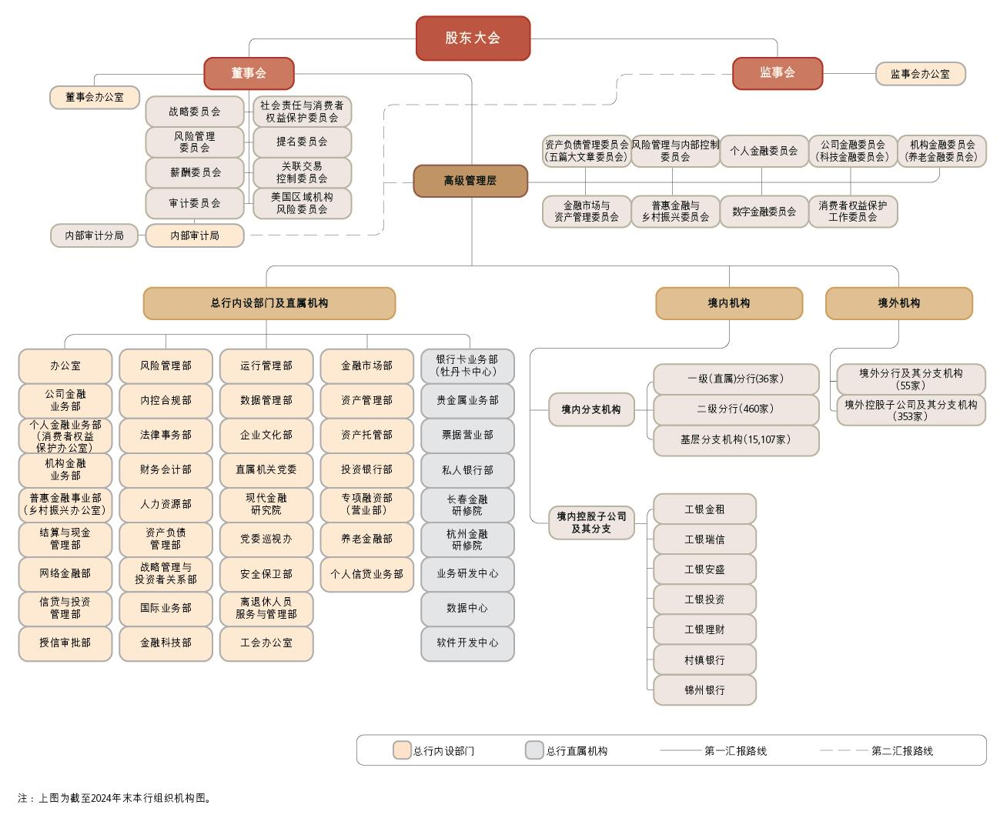

# 16 组织机构图

> 来源：《中国工商银行股份有限公司2024年度报告（A股）》，印刷页 177–177
> 本文由 build_kb.py 自动生成

16.
组织机构图

**组织结构（mermaid 转写）**（由图片识别转写，节点汇报路线细节以原图为准）：

```mermaid
flowchart TD
    A[股东大会] --> B[董事会]
    A --> J[监事会]
    J --> J0[监事会办公室]
    B --> B0[董事会办公室]
    B --> B1[战略委员会]
    B --> B2[风险管理委员会]
    B --> B3[薪酬委员会]
    B --> B4[审计委员会]
    B --> B5[提名委员会]
    B --> B6[关联交易控制委员会]
    B --> B7[社会责任与消费者权益保护委员会]
    B --> B8[美国区域机构风险委员会]
    B --> B9[内部审计局]
    B9 --> B10[内部审计分局]
    B --> M[高级管理层]
    M --> C1["资产负债管理委员会（五篇大文章委员会）"]
    M --> C2[风险管理与内部控制委员会]
    M --> C3[个人金融委员会]
    M --> C4["公司金融委员会（科技金融委员会）"]
    M --> C5["机构金融委员会（养老金融委员会）"]
    M --> C6[金融市场与资产管理委员会]
    M --> C7[普惠金融与乡村振兴委员会]
    M --> C8[数字金融委员会]
    M --> C9[消费者权益保护工作委员会]
    M --> D[总行内设部门及直属机构]
    D --> DI[总行内设部门]
    D --> DO[总行直属机构]
    DI --> d1[办公室]
    DI --> d2[公司金融业务部]
    DI --> d3["个人金融业务部（消费者权益保护办公室）"]
    DI --> d4[机构金融业务部]
    DI --> d5["普惠金融事业部（乡村振兴办公室）"]
    DI --> d6[结算与现金管理部]
    DI --> d7[网络金融部]
    DI --> d8[信贷与投资管理部]
    DI --> d9[授信审批部]
    DI --> d10[风险管理部]
    DI --> d11[内控合规部]
    DI --> d12[法律事务部]
    DI --> d13[财务会计部]
    DI --> d14[人力资源部]
    DI --> d15[资产负债管理部]
    DI --> d16[战略管理与投资者关系部]
    DI --> d17[国际业务部]
    DI --> d18[金融科技部]
    DI --> d19[运行管理部]
    DI --> d20[数据管理部]
    DI --> d21[企业文化部]
    DI --> d22[直属机关党委]
    DI --> d23[现代金融研究院]
    DI --> d24[党委巡视办]
    DI --> d25[安全保卫部]
    DI --> d26[离退休人员服务与管理部]
    DI --> d27[工会办公室]
    DI --> d28[金融市场部]
    DI --> d29[资产管理部]
    DI --> d30[资产托管部]
    DI --> d31[投资银行部]
    DI --> d32["专项融资部（营业部）"]
    DI --> d33[养老金融部]
    DI --> d34[个人信贷业务部]
    DO --> o1["银行卡业务部（牡丹卡中心）"]
    DO --> o2[贵金属业务部]
    DO --> o3[票据营业部]
    DO --> o4[私人银行部]
    DO --> o5[长春金融研修院]
    DO --> o6[杭州金融研修院]
    DO --> o7[业务研发中心]
    DO --> o8[数据中心]
    DO --> o9[软件开发中心]
    M --> E[境内机构]
    E --> E1[境内分支机构]
    E1 --> E11["一级（直属）分行（36家）"]
    E11 --> E12["二级分行（460家）"]
    E12 --> E13["基层分支机构（15,107家）"]
    E --> E2[境内控股子公司及其分支]
    E2 --> s1[工银金租]
    E2 --> s2[工银瑞信]
    E2 --> s3[工银安盛]
    E2 --> s4[工银投资]
    E2 --> s5[工银理财]
    E2 --> s6[村镇银行]
    E2 --> s7[锦州银行]
    M --> F[境外机构]
    F --> F1["境外分行及其分支机构（55家）"]
    F --> F2["境外控股子公司及其分支机构（353家）"]
```

> 注：原图为截至 2024 年末本行组织机构图；图例中总行内设部门（橙色）、总行直属机构（灰色）、第一汇报路线（实线）、第二汇报路线（虚线）。
