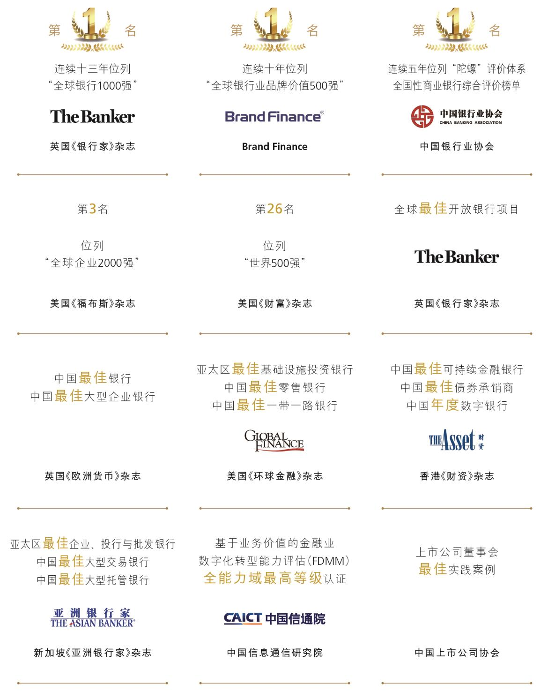

# 2 2025 年主要排名与奖项

> 来源：《中国工商银行股份有限公司2025年度报告（A股）》，印刷页 7–7
> 本文由 build_kb.py 自动生成

2. 2025 年主要排名与奖项



**排名与奖项（JSON 转写）**（由图片识别转写，数据以原图为准）：

```json
{
  "image": "assets/p007_1.jpeg",
  "type": "list",
  "title": "2025年主要排名与奖项",
  "groups": [
    {"source": "英国《银行家》杂志", "items": ["第一名：连续十三年位列“全球银行1000强”", "全球最佳开放银行项目"]},
    {"source": "Brand Finance", "items": ["第一名：连续十年位列“全球银行业品牌价值500强”"]},
    {"source": "中国银行业协会", "items": ["第一名：连续五年位列“陀螺”评价体系全国性商业银行综合评价榜单"]},
    {"source": "美国《福布斯》杂志", "items": ["第3名：“全球企业2000强”"]},
    {"source": "美国《财富》杂志", "items": ["第26名：“世界500强”"]},
    {"source": "英国《欧洲货币》杂志", "items": ["中国最佳银行", "中国最佳大型企业银行"]},
    {"source": "美国《环球金融》杂志", "items": ["亚太区最佳基础设施投资银行", "中国最佳零售银行", "中国最佳一带一路银行"]},
    {"source": "香港《财资》杂志", "items": ["中国最佳可持续金融银行", "中国最佳债券承销商", "中国年度数字银行"]},
    {"source": "新加坡《亚洲银行家》杂志", "items": ["亚太区最佳企业、投行与批发银行", "中国最佳大型交易银行", "中国最佳大型托管银行"]},
    {"source": "中国信息通信研究院", "items": ["基于业务价值的金融业数字化转型能力评估（FDMM）全能力域最高等级认证"]},
    {"source": "中国上市公司协会", "items": ["上市公司董事会最佳实践案例"]}
  ]
}
```
