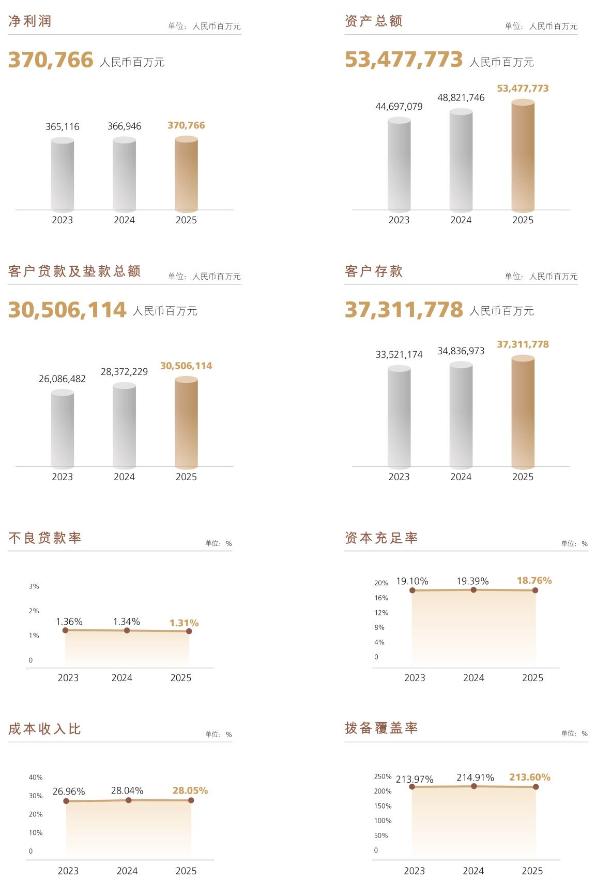
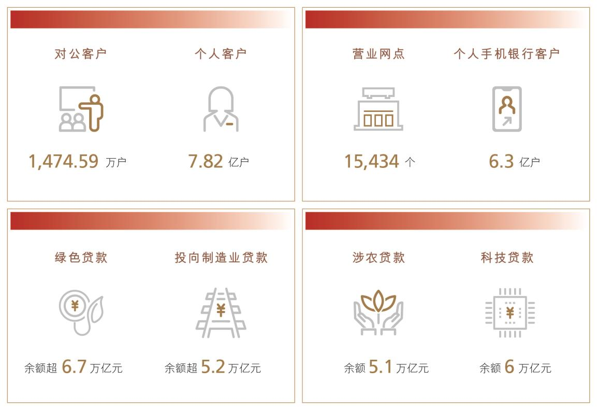

# 5 财务概要

> 来源：《中国工商银行股份有限公司2025年度报告（A股）》，印刷页 12–16
> 本文由 build_kb.py 自动生成

5. 财务概要



**图表数据（JSON 转写）**（由图片识别转写，数据以原图为准）：

```json
{
  "image": "assets/p012_1.jpeg",
  "note": "主要财务指标三年对比（2023-2025）",
  "charts": [
    {"type": "bar", "title": "净利润", "unit": "人民币百万元", "labels": ["2023", "2024", "2025"], "series": [{"name": "净利润", "data": [365116, 366946, 370766]}]},
    {"type": "bar", "title": "资产总额", "unit": "人民币百万元", "labels": ["2023", "2024", "2025"], "series": [{"name": "资产总额", "data": [44697079, 48821746, 53477773]}]},
    {"type": "bar", "title": "客户贷款及垫款总额", "unit": "人民币百万元", "labels": ["2023", "2024", "2025"], "series": [{"name": "客户贷款及垫款总额", "data": [26086482, 28372229, 30506114]}]},
    {"type": "bar", "title": "客户存款", "unit": "人民币百万元", "labels": ["2023", "2024", "2025"], "series": [{"name": "客户存款", "data": [33521174, 34836973, 37311778]}]},
    {"type": "line", "title": "不良贷款率", "unit": "%", "labels": ["2023", "2024", "2025"], "series": [{"name": "不良贷款率", "data": [1.36, 1.34, 1.31]}]},
    {"type": "line", "title": "资本充足率", "unit": "%", "labels": ["2023", "2024", "2025"], "series": [{"name": "资本充足率", "data": [19.10, 19.39, 18.76]}]},
    {"type": "line", "title": "成本收入比", "unit": "%", "labels": ["2023", "2024", "2025"], "series": [{"name": "成本收入比", "data": [26.96, 28.04, 28.05]}]},
    {"type": "line", "title": "拨备覆盖率", "unit": "%", "labels": ["2023", "2024", "2025"], "series": [{"name": "拨备覆盖率", "data": [213.97, 214.91, 213.60]}]}
  ]
}
```

本年度报告所载财务数据及指标按照中国会计准则编制，除特别说明外，为
本行及其子公司合并数据，以人民币列示。
财务数据

2025
2024
2023
全年经营成果（人民币百万元）

利息净收入
635,126
637,405
655,013
手续费及佣金净收入
111,171
109,397
119,357
营业收入
838,270
821,803
843,070
业务及管理费
235,173
230,460
227,266
资产减值损失
（1）
134,860
126,663
150,816
营业利润
424,111
420,885
420,760
税前利润
424,435
421,827
421,966
净利润
370,766
366,946
365,116
归属于母公司股东的净利润
368,562
365,863
363,993
扣除非经常性损益后归属于母公司股东的净利润
（2）
368,126
364,277
361,411
经营活动产生的现金流量净额
1,890,530
579,194
1,417,002
于报告期末（人民币百万元）

资产总额
53,477,773
48,821,746
44,697,079
客户贷款及垫款总额
30,506,114
28,372,229
26,086,482
  公司类贷款
18,841,671
17,482,223
16,145,204
  个人贷款
9,002,636
8,957,720
8,653,621



**图表数据（JSON 转写）**（由图片识别转写，数据以原图为准）：

```json
{
  "image": "assets/p013_1.jpeg",
  "type": "kpi",
  "title": "经营概况指标卡",
  "items": [
    {"label": "对公客户", "value": 1474.59, "unit": "万户"},
    {"label": "个人客户", "value": 7.82, "unit": "亿户"},
    {"label": "营业网点", "value": 15434, "unit": "个"},
    {"label": "个人手机银行客户", "value": 6.3, "unit": "亿户"},
    {"label": "绿色贷款", "value": 6.7, "unit": "万亿元", "qualifier": "余额超"},
    {"label": "投向制造业贷款", "value": 5.2, "unit": "万亿元", "qualifier": "余额超"},
    {"label": "涉农贷款", "value": 5.1, "unit": "万亿元", "qualifier": "余额"},
    {"label": "科技贷款", "value": 6, "unit": "万亿元", "qualifier": "余额"}
  ]
}
```
  票据贴现
2,661,807
1,932,286
1,287,657
贷款减值准备
（3）
852,274
815,497
756,391
投资
16,907,415
14,153,576
11,849,668
负债总额
49,205,749
44,834,480
40,920,491
客户存款
37,311,778
34,836,973
33,521,174
公司存款
16,350,593
15,507,405
16,209,928
个人存款
20,204,619
18,541,510
16,565,568
其他存款
251,921
228,721
210,185
应计利息
504,645
559,337
535,493
同业及其他金融机构存放款项
4,568,696
4,020,537
2,841,385
拆入资金
534,551
570,428
528,473
归属于母公司股东的权益
4,244,259
3,969,841
3,756,887
股本
356,407
356,407
356,407
核心一级资本净额
（4）
3,837,149
3,624,342
3,381,941
一级资本净额
（4）
4,222,676
3,949,453
3,736,919
总资本净额
（4）
5,302,796
4,986,531
4,707,100
风险加权资产
（4）
28,269,948
25,710,855
24,641,631
每股计（人民币元）

每股净资产
（5）
10.83
10.23
9.55
基本每股收益
（6）
1.00
0.98
0.98
稀释每股收益
（6）
1.00
0.98
0.98
扣除非经常性损益后的基本每股收益
（6）
1.00
0.98
0.97

2025
2024
2023
信用评级

标普(S&P)
（7）
A
A
A
穆迪(Moody’s)
（7）
A1
A1
A1
注：（1）为信用减值损失和其他资产减值损失之和。
（2）有关报告期内非经常性损益的项目及金额请参见“财务报表补充资料－1.非经常性损益明细表”。
（3）为以摊余成本计量的客户贷款及垫款和以公允价值计量且其变动计入其他综合收益的客户贷款及
垫款的减值准备之和。
（4）2025 年和2024 年比较期根据《资本办法》计算。2023 年比较期根据《资本办法（试行）》计算。
（5）为期末扣除其他权益工具后的归属于母公司股东的权益除以期末普通股股本总数。
（6）根据中国证监会《公开发行证券的公司信息披露编报规则第9 号－净资产收益率和每股收益的计
算及披露》(2010 年修订)的规定计算。
（7）评级结果为长期外币存款评级。

财务指标

2025
2024
2023
盈利能力指标（%）

平均总资产回报率
（1）
0.72
0.78
0.87
加权平均净资产收益率
（2）
9.45
9.88
10.66
扣除非经常性损益后加权平均净资产收益率
（2）
9.43
9.83
10.58
净利息差
（3）
1.15
1.23
1.41
净利息收益率
（4）
1.28
1.42
1.61
风险加权资产收益率
（5）
1.37
1.46
1.56
手续费及佣金净收入比营业收入
13.26
13.31
14.16
成本收入比
（6）
28.05
28.04
26.96
资产质量指标（%）

不良贷款率
（7）
1.31
1.34
1.36
拨备覆盖率
（8）
213.60
214.91
213.97
贷款拨备率
（9）
2.79
2.87
2.90
资本充足率指标（%）

核心一级资本充足率
（10）
13.57
14.10
13.72
一级资本充足率
（10）
14.94
15.36
15.17
资本充足率
（10）
18.76
19.39
19.10
总权益对总资产比率
7.99
8.17
8.45
风险加权资产占总资产比率
52.86
52.66
55.13
注：（1）净利润除以期初和期末总资产余额的平均数。
（2）根据中国证监会《公开发行证券的公司信息披露编报规则第9 号－净资产收益率和每股收益的
计算及披露》(2010 年修订)的规定计算。
（3）平均生息资产收益率减平均计息负债付息率。
（4）利息净收入除以平均生息资产。
（5）净利润除以期初及期末风险加权资产的平均数。
（6）业务及管理费除以营业收入。
（7）不良贷款余额除以客户贷款及垫款总额。
（8）贷款减值准备余额除以不良贷款余额。
（9）贷款减值准备余额除以客户贷款及垫款总额。
（10）2025 年和2024 年比较期根据《资本办法》计算。2023 年比较期根据《资本办法（试行）》计
算。

分季度财务数据

2025

一季度
二季度
三季度
四季度
（人民币百万元）

营业收入
212,774
214,318
212,936
198,242
归属于母公司股东的净利润
84,156
83,947
101,805
98,654
扣除非经常性损益后归属于母公司股
东的净利润
83,868
83,848
101,688
98,722
经营活动产生的现金流量净额
942,479
(156,162)
762,890
341,323

2024

一季度
二季度
三季度
四季度
（人民币百万元）

营业收入
219,843
200,656
205,923
195,381
归属于母公司股东的净利润
87,653
82,814
98,558
96,838
扣除非经常性损益后归属于母公司股
东的净利润
87,084
82,131
98,402
96,660
经营活动产生的现金流量净额
1,367,252
(1,340,269)
1,050,265
(498,054)
