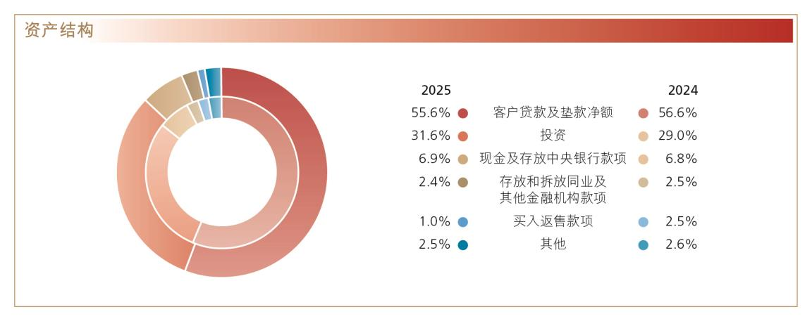
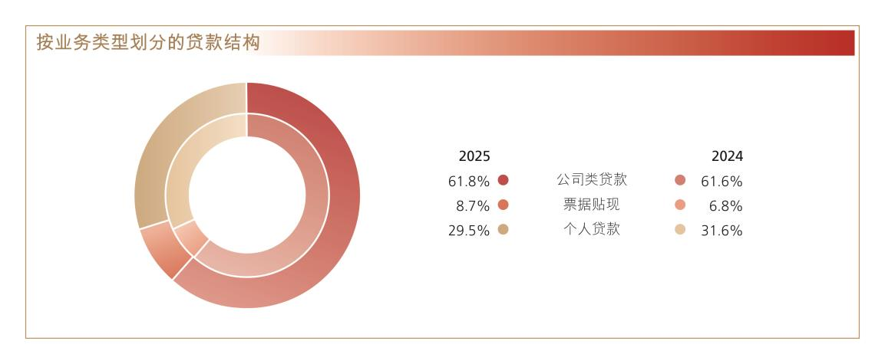
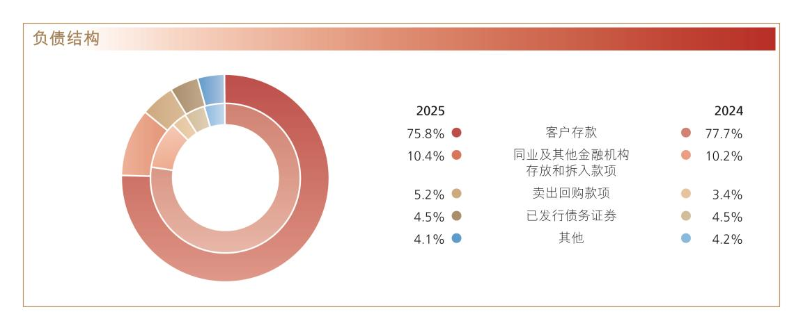
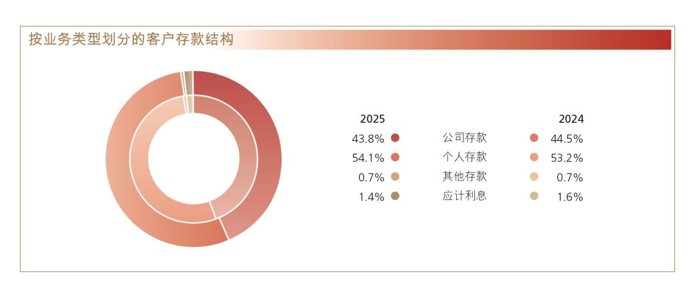

# 8.2 财务报表分析

> 来源：《中国工商银行股份有限公司2025年度报告（A股）》，印刷页 25–41
> 本文由 build_kb.py 自动生成

8.2 财务报表分析
8.2.1
利润表项目分析
2025 年，本行坚持稳中求进工作总基调，完整准确全面贯彻新发展理念，围
绕“防风险、强监管、促高质量发展”金融工作主线，在服务经济持续回升向好
中推进自身高质量发展。年度实现净利润3,707.66 亿元，比上年增加38.20 亿元，
增长1.0%，平均总资产回报率0.72%，加权平均净资产收益率9.45%。营业收入
8,382.70 亿元，增长2.0%。其中，利息净收入6,351.26 亿元，下降0.4%；非利
息收入2,031.44 亿元，增长10.2%。营业支出4,141.59 亿元，增长3.3%。其中，
业务及管理费2,351.73 亿元，增长2.0%，成本收入比28.05%；计提资产减值损
失1,348.60 亿元，增长6.5%。所得税费用536.69 亿元，下降2.2%。

利润表主要项目变动
人民币百万元，百分比除外
项目
2025 年
2024 年
增减额
增长率(%)
利息净收入
635,126
637,405
(2,279)
(0.4)
非利息收入
203,144
184,398
18,746
10.2
营业收入
838,270
821,803
16,467
2.0
减：营业支出
414,159
400,918
13,241
3.3
其中：税金及附加
10,658
10,765
(107)
(1.0)
业务及管理费
235,173
230,460
4,713
2.0
信用减值损失
132,973
125,739
7,234
5.8
其他资产减值损失
1,887
924
963
104.2
其他业务成本
33,468
33,030
438
1.3
营业利润
424,111
420,885
3,226
0.8
加：营业外收支净额
324
942
(618)
(65.6)
税前利润
424,435
421,827
2,608
0.6
减：所得税费用
53,669
54,881
(1,212)
(2.2)
净利润
370,766
366,946
3,820
1.0
归属于：母公司股东
368,562
365,863
2,699
0.7
少数股东
2,204
1,083
1,121
103.5

利息净收入
2025 年，利息净收入6,351.26 亿元，比上年减少22.79 亿元，下降0.4%，
占营业收入的75.8%。利息收入13,318.31 亿元，减少961.17 亿元，下降6.7%；
利息支出6,967.05 亿元，减少938.38 亿元，下降11.9%。受贷款市场报价利率
（LPR）下调、存款期限结构变动等因素影响，净利息差和净利息收益率分别为
1.15%和1.28%，比上年分别下降8 个基点和14 个基点。
生息资产平均收益率和计息负债平均付息率
人民币百万元，百分比除外
项目
2025 年
2024 年
平均余额
利息收入
/支出
平均收益
率/付息率
(%)
平均余额
利息收入
/支出
平均收益
率/付息率
(%)
资产

客户贷款及垫款
29,873,346
838,983
2.81
27,599,928
937,938
3.40
投资
14,366,029
387,636
2.70
11,723,126
365,208
3.12
存放中央银行款项(2)
3,079,744
50,580
1.64
3,161,419
54,174
1.71
存放和拆放同业及其他
金融机构款项(3)
2,411,394
54,632
2.27
2,496,488
70,628
2.83
总生息资产
49,730,513
1,331,831
2.68
44,980,961
1,427,948
3.17
非生息资产
3,067,850

2,757,010

资产减值准备
(900,467)

(853,348)

总资产
51,897,896

46,884,623

负债

存款
34,957,515
474,363
1.36
32,745,057
564,039
1.72
同业及其他金融机构存
放和拆入款项(3)
7,618,551
146,721
1.93
5,937,956
156,622
2.64
已发行债务证券和存款
证
2,843,375
75,621
2.66
2,070,321
69,882
3.38
总计息负债
45,419,441
696,705
1.53
40,753,334
790,543
1.94
非计息负债
2,344,036

2,168,164

总负债
47,763,477

42,921,498

利息净收入

635,126

637,405

净利息差

1.15

1.23
净利息收益率

1.28

1.42
注：（1）生息资产和计息负债的平均余额为每日余额的平均数，非生息资产、非计息负债及资产减值准备
的平均余额为年初和年末余额的平均数。
（2）存放中央银行款项主要包括法定存款准备金和超额存款准备金。
（3）存放和拆放同业及其他金融机构款项包含买入返售款项；同业及其他金融机构存放和拆入款项包
含卖出回购款项。

利息收入和支出变动分析
人民币百万元
项目
2025 年与2024 年对比
增／（减）原因
净增／（减）
规模
利率
资产

客户贷款及垫款
63,885
(162,840)
(98,955)
投资
71,665
(49,237)
22,428
存放中央银行款项
(1,381)
(2,213)
(3,594)
存放和拆放同业及其他金融机
构款项
(2,016)
(13,980)
(15,996)
利息收入变化
132,153
(228,270)
(96,117)
负债

存款
28,206
(117,882)
(89,676)
同业及其他金融机构存放和拆
入款项
32,258
(42,159)
(9,901)
已发行债务证券和存款证
20,645
(14,906)
5,739
利息支出变化
81,109
(174,947)
(93,838)
利息净收入变化
51,044
(53,323)
(2,279)
注：规模的变化根据平均余额的变化衡量，利率的变化根据平均利率的变化衡量。由规模和利率共同引起
的变化分配在规模变化中。

利息收入

客户贷款及垫款利息收入
客户贷款及垫款利息收入8,389.83 亿元，比上年减少989.55 亿元，下降10.6%，
主要是客户贷款及垫款平均收益率下降59 个基点所致，平均余额增长8.2%部分
抵消了收益率下降的影响。
按期限结构划分的客户贷款及垫款平均收益分析
人民币百万元，百分比除外
项目
2025 年
2024 年
平均余额
利息收入
平均收益
率（%）
平均余额
利息收入
平均收益
率（%）
短期贷款
7,784,541
168,358
2.16
6,553,251
178,067
2.72
中长期贷款
22,088,805
670,625
3.04
21,046,677
759,871
3.61
客户贷款及垫款总额
29,873,346
838,983
2.81
27,599,928
937,938
3.40

按业务类型划分的客户贷款及垫款平均收益分析
人民币百万元，百分比除外
项目
2025 年
2024 年
平均余额
利息收入
平均收益
率（%）
平均余额
利息收入
平均收益
率（%）
公司类贷款
17,455,247
491,203
2.81
16,213,330
528,356
3.26
票据贴现
2,296,619
20,404
0.89
1,516,543
18,516
1.22
个人贷款
8,839,052
264,693
2.99
8,597,971
314,074
3.65
境外业务
1,282,428
62,683
4.89
1,272,084
76,992
6.05
客户贷款及垫款总额
29,873,346
838,983
2.81
27,599,928
937,938
3.40


投资利息收入
投资利息收入3,876.36 亿元，比上年增加224.28 亿元，增长6.1%，主要是
投资平均余额增长22.5%所致，平均收益率下降42 个基点部分抵消了规模增长
的影响。


存放中央银行款项利息收入
存放中央银行款项利息收入505.80 亿元，比上年减少35.94 亿元，下降6.6%。


存放和拆放同业及其他金融机构款项利息收入
存放和拆放同业及其他金融机构款项利息收入546.32 亿元，比上年减少
159.96 亿元，下降22.6%，主要是融出资金平均收益率下降所致。
利息支出

存款利息支出
存款利息支出4,743.63 亿元，比上年减少896.76 亿元，下降15.9%，主要是
存款平均付息率下降36 个基点所致。本行持续规范利息支出管理，提升自律倡
议落实成效，根据政策利率变动调整存款利率，推动付息成本持续下行。

按产品类型划分的存款平均成本分析
人民币百万元，百分比除外
项目
2025 年
2024 年
平均余额
利息支出
平均付息
率（%）
平均余额
利息支出
平均付息
率（%）
公司存款

定期
7,956,467
142,987
1.80
7,836,374
181,905
2.32
活期
6,774,157
38,225
0.56
6,762,187
60,071
0.89
小计
14,730,624
181,212
1.23
14,598,561
241,976
1.66
个人存款

定期
12,522,289
251,399
2.01
10,994,438
261,960
2.38
活期
6,449,510
4,038
0.06
6,004,057
10,333
0.17
小计
18,971,799
255,437
1.35
16,998,495
272,293
1.60
境外业务
1,255,092
37,714
3.00
1,148,001
49,770
4.34
存款总额
34,957,515
474,363
1.36
32,745,057
564,039
1.72


同业及其他金融机构存放和拆入款项利息支出
同业及其他金融机构存放和拆入款项利息支出1,467.21 亿元，比上年减少
99.01 亿元，下降6.3%，主要是融入资金平均付息率下降所致。


已发行债务证券和存款证利息支出
已发行债务证券和存款证利息支出756.21 亿元，比上年增加57.39 亿元，增
长8.2%，主要是同业存单发行规模增加所致。

非利息收入
2025年实现非利息收入2,031.44亿元，比上年增加187.46亿元，增长10.2%，
占营业收入的比重为24.2%。其中，手续费及佣金净收入1,111.71 亿元，增加
17.74 亿元，增长1.6%；其他非利息收益919.73 亿元，增加169.72 亿元，增长
22.6%。

手续费及佣金净收入
人民币百万元，百分比除外
项目
2025 年
2024 年
增减额
增长率(%)
结算、清算及现金管理
42,376
42,755
(379)
(0.9)
个人理财及私人银行
19,176
17,880
1,296
7.2
投资银行
18,815
19,724
(909)
(4.6)
银行卡
16,557
17,853
(1,296)
(7.3)
对公理财
12,955
10,850
2,105
19.4
资产托管
8,180
8,045
135
1.7
担保及承诺
3,173
4,185
(1,012)
(24.2)
代理收付及委托
2,008
2,019
(11)
(0.5)
其他
3,482
2,866
616
21.5
手续费及佣金收入
126,722
126,177
545
0.4
减：手续费及佣金支出
15,551
16,780
(1,229)
(7.3)
手续费及佣金净收入
111,171
109,397
1,774
1.6

手续费及佣金净收入1,111.71 亿元，比上年增加17.74 亿元，增长1.6%。对
公理财、个人理财及私人银行业务收入增加主要是积极把握市场机遇，代理贵金
属、代理基金、代理理财、代理证券等相关业务收入增加所致；资产托管业务收
入增加主要是加大业务拓展，托管规模增长较好；其他收入增加主要是养老金业
务增长较好。受市场环境变化等外部因素影响，银行卡、投资银行等业务收入有
所减少；主动下调担保承诺费率，相关产品收入减少。手续费及佣金支出减少
12.29 亿元，主要是收单业务手续费支出减少所致。

其他非利息收益
人民币百万元，百分比除外
项目
2025 年
2024 年
增减额
增长率(%)
投资收益
63,286
40,930
22,356
54.6
公允价值变动净收益
511
12,220
(11,709)
(95.8)
汇兑及汇率产品净损失
(490)
(6,911)
6,421
不适用
其他业务收入
28,666
28,762
(96)
(0.3)
合计
91,973
75,001
16,972
22.6

其他非利息收益919.73 亿元，比上年增加169.72 亿元，增长22.6%。其中，
投资收益增加主要是债券及权益类投资已实现收益增加所致，公允价值变动净收

益减少主要是债券投资未实现收益减少所致，汇兑及汇率产品净损失减少主要是
受汇率波动等外部因素影响所致。
营业支出

业务及管理费
人民币百万元，百分比除外
项目
2025 年
2024 年
增减额
增长率(%)
职工费用
146,449
144,554
1,895
1.3
固定资产折旧
14,330
14,472
(142)
(1.0)
资产摊销
6,231
5,934
297
5.0
业务费用
68,163
65,500
2,663
4.1
合计
235,173
230,460
4,713
2.0


减值损失
计提信用减值损失1,329.73 亿元，比上年增加72.34 亿元，增长5.8%，其
中，贷款减值损失1,496.20 亿元，增加271.41 亿元，增长22.2%。其他资产减值
损失18.87 亿元，增加9.63 亿元，增长104.2%。请参见“财务报表附注四、38.
信用减值损失；13.资产减值准备”。


其他业务成本
其他业务成本334.68 亿元，比上年增加4.38 亿元，增长1.3%。

所得税费用
所得税费用536.69 亿元，比上年减少12.12 亿元，下降2.2%。实际税率
12.64%，低于25%的法定税率，主要是由于持有的中国国债、地方政府债利息收
入按税法规定为免税收益。

地理区域信息概要
人民币百万元，百分比除外
项目
2025 年
2024 年
金额
占比（%）
金额
占比（%）
营业收入
838,270
100.0
821,803
100.0
总行
49,431
5.9
23,999
2.9
长江三角洲
151,689
18.1
152,225
18.5
珠江三角洲
98,902
11.8
106,723
13.0
环渤海地区
168,835
20.1
164,580
20.0
中部地区
107,712
12.9
111,994
13.7
西部地区
120,748
14.4
125,967
15.4
东北地区
27,860
3.3
29,801
3.6
境外及其他
114,415
13.7
107,848
13.1
抵销
(1,322)
(0.2)
(1,334)
(0.2)
税前利润
424,435
100.0
421,827
100.0
总行
64,559
15.2
32,139
7.6
长江三角洲
83,829
19.7
80,715
19.1
珠江三角洲
24,439
5.8
43,876
10.4
环渤海地区
103,411
24.4
102,730
24.4
中部地区
47,750
11.2
49,374
11.7
西部地区
54,131
12.8
55,680
13.2
东北地区
8,745
2.1
11,054
2.6
境外及其他
37,571
8.8
46,259
11.0
抵销
-
-
-
-
注：请参见“财务报表附注五、分部信息”。

8.2.2
资产负债表项目分析
2025 年，本行认真落实宏观经济金融政策和监管要求，通过动态优化资产
负债总量和结构摆布策略，致力于打造干净、健康的资产负债表，推进“五化”
转型，努力实现价值创造、市场地位、风险管控和资本约束的动态平衡。
坚持投融资一体化发展策略，围绕布局现代化，助力经济高质量发展，做精
做深金融“五篇大文章”，加力支持实体经济重点领域和薄弱环节。提升负债多
元化发展能力，持续推进GBC+基础性工程，夯实客户存款增长基础，存款延续
高质量发展态势。健全多渠道的资金来源机制，推动资金来源与资金运用相匹配，
优化资产负债管理效能。

资产运用
2025年末，总资产534,777.73亿元，比上年末增加46,560.27亿元，增长9.5%。
其中，客户贷款及垫款总额（简称“各项贷款”）305,061.14亿元，增加21,338.85
亿元，增长7.5%；投资169,074.15亿元，增加27,538.39亿元，增长19.5%；现金及
存放中央银行款项36,745.58亿元，增加3,516.47亿元，增长10.6%。

    人民币百万元，百分比除外
项目
2025 年12 月31 日
2024 年12 月31 日
金额
占比(%)
金额
占比(%)
客户贷款及垫款总额
30,506,114
—
28,372,229
—
加：应计利息
57,995
—
56,624
—
减：以摊余成本计量的客户贷
款及垫款的减值准备
851,750
—
815,072
—
客户贷款及垫款净额(1)
29,712,359
55.6
27,613,781
56.6
投资
16,907,415
31.6
14,153,576
29.0
现金及存放中央银行款项
3,674,558
6.9
3,322,911
6.8
存放和拆放同业及其他金融
机构款项
1,264,019
2.4
1,219,876
2.5
买入返售款项
530,737
1.0
1,210,217
2.5
其他
1,388,685
2.5
1,301,385
2.6
资产合计
53,477,773
100.0
48,821,746
100.0
注：（1）请参见“财务报表附注四、6.客户贷款及垫款”。


贷款
本行认真贯彻国家战略部署，靠前落实一揽子存量和增量政策，聚焦现代化
产业体系建设金融需求，赋能新质生产力发展，不断提升信贷结构与区域经济结
构的匹配性。稳步推进个人住房贷款均衡发展，加强个人消费、经营重点领域产
品供给与场景创新，助力扩内需、促消费。2025年末，各项贷款305,061.14亿元，



**图表数据（JSON 转写）**（由图片识别转写，数据以原图为准）：

```json
{
  "image": "../assets/p033_1.jpeg",
  "type": "pie",
  "title": "资产结构",
  "unit": "%",
  "labels": ["客户贷款及垫款净额", "投资", "现金及存放中央银行款项", "存放和拆放同业及其他金融机构款项", "买入返售款项", "其他"],
  "series": [
    {"name": "2025", "data": [55.6, 31.6, 6.9, 2.4, 1.0, 2.5]},
    {"name": "2024", "data": [56.6, 29.0, 6.8, 2.5, 2.5, 2.6]}
  ]
}
```
比上年末增加21,338.85亿元，增长7.5%。其中，境内分行人民币贷款288,694.90
亿元，增加21,739.09亿元，增长8.1%。

按业务类型划分的贷款结构
人民币百万元，百分比除外
项目
2025 年12 月31 日
2024 年12 月31 日
金额
占比(%)
金额
占比(%)
公司类贷款
18,841,671
61.8
17,482,223
61.6
短期公司类贷款
 4,280,312
14.0
 3,819,683
13.5
中长期公司类贷款
14,561,359
47.8
 13,662,540
48.1
票据贴现
2,661,807
8.7
1,932,286
6.8
个人贷款
  9,002,636
29.5
8,957,720
31.6
个人住房贷款
5,875,868
19.3
6,083,180
21.5
个人消费贷款
 499,014
1.6
421,195
1.5
个人经营性贷款
 1,930,219
6.3
1,677,981
5.9
信用卡透支
 697,535
2.3
775,364
2.7
合计
  30,506,114
100.0
28,372,229
100.0

加大“两重”“两新”“五篇大文章”等重点领域、重大战略和薄弱环节的信
贷支持力度，制造业、科技创新、绿色金融、普惠金融等重点领域贷款实现较快
增长。公司类贷款比上年末增加13,594.48亿元，增长7.8%。其中短期贷款增加
4,606.29亿元，中长期贷款增加8,988.19亿元。
深入研判房地产市场发展新形势，加快推进个人住房贷款转型发展。增加消
费金融供给，形成覆盖多类目标客群、适配多元消费场景的产品体系，有序推进
个人消费贷款财政贴息工作，将政策红利精准送达百姓。聚焦小微企业主、个体
工商户等重点客群的生产经营和消费需求，通过产品优化创新，不断提升服务质
量，做大做优个人经营性贷款。个人贷款比上年末增加449.16亿元，增长0.5%。



**图表数据（JSON 转写）**（由图片识别转写，数据以原图为准）：

```json
{
  "image": "../assets/p034_1.jpeg",
  "type": "pie",
  "title": "按业务类型划分的贷款结构",
  "unit": "%",
  "labels": ["公司类贷款", "票据贴现", "个人贷款"],
  "series": [
    {"name": "2025", "data": [61.8, 8.7, 29.5]},
    {"name": "2024", "data": [61.6, 6.8, 31.6]}
  ]
}
```
其中，个人消费贷款增加778.19亿元，增长18.5%，个人经营性贷款增加2,522.38
亿元，增长15.0%。

有关本行贷款和贷款质量的进一步分析，请参见“讨论与分析—风险管理”。


投资
2025 年，本行积极支持国家发展战略实施，加大支持实体经济力度，积极开
展债券投资，统筹债券投资价值和利率风险防控，合理摆布债券品种和期限结构。
2025 年末，投资169,074.15 亿元，比上年末增加27,538.39 亿元，增长19.5%。
其中，债券163,127.09 亿元，增加26,677.87 亿元，增长19.6%。

人民币百万元，百分比除外
项目
2025 年12 月31 日
2024 年12 月31 日
金额
占比(%)
金额
占比(%)
债券
16,312,709
96.5
13,644,922
96.4
权益工具
234,886
1.4
 196,993
1.4
基金及其他
221,154
1.3
 178,941
1.3
应计利息
138,666
0.8
132,720
0.9
合计
16,907,415
100.0
14,153,576
100.0

按发行主体划分的债券结构
人民币百万元，百分比除外
项目
2025 年12 月31 日
2024 年12 月31 日
金额
占比(%)
金额
占比(%)
政府及中央银行债券
12,565,387
77.0
 10,422,907
76.4
政策性银行债券
1,370,230
8.4
 1,097,125
8.0
银行同业及其他金融机构债券
1,459,991
9.0
 1,398,606
10.3
企业债券
917,101
5.6
 726,284
5.3
合计
16,312,709
100.0
13,644,922
100.0

从发行主体结构上看，政府及中央银行债券比上年末增加21,424.80 亿元，
增长20.6%；政策性银行债券增加2,731.05 亿元，增长24.9%；银行同业及其他
金融机构债券增加613.85 亿元，增长4.4%；企业债券增加1,908.17 亿元，增长
26.3%。

按剩余期限划分的债券结构
人民币百万元，百分比除外
剩余期限
2025 年12 月31 日
2024 年12 月31 日
金额
占比(%)
金额
占比(%)
无期限
（1）
107
0.0
 83
0.0
3 个月以内
1,136,887
7.0
 750,923
5.5
3 至12 个月
2,217,214
13.6
 2,337,828
17.1
1 至5 年
6,624,654
40.6
4,992,268
36.6
5 年以上
6,333,847
38.8
5,563,820
40.8
合计
16,312,709
100.0
13,644,922
100.0
注：（1）为已逾期部分。

按币种划分的债券结构
人民币百万元，百分比除外
项目
2025 年12 月31 日
2024 年12 月31 日
金额
占比(%)
金额
占比(%)
人民币债券
15,213,730
93.3
12,703,351
93.1
美元债券
697,570
4.3
619,013
4.5
其他外币债券
401,409
2.4
322,558
2.4
合计
16,312,709
100.0
13,644,922
100.0

从币种结构上看，人民币债券比上年末增加25,103.79 亿元，增长19.8%；
美元债券折合人民币增加785.57 亿元，增长12.7%；其他外币债券折合人民币增
加788.51 亿元，增长24.4%。本行综合考虑债券流动性、安全性、收益性，结合
市场利率变动及外币资金头寸情况，合理摆布币种结构，提升外币资金使用效率。

按计量方式划分的投资结构
人民币百万元，百分比除外
项目
2025 年12 月31 日
2024 年12 月31 日
金额
占比(%)
金额
占比(%)
以公允价值计量且其变动计入
当期损益的金融投资
943,953
5.6
 1,010,439
7.1
以公允价值计量且其变动计入
其他综合收益的金融投资
3,823,279
22.6
 3,291,152
23.3
以摊余成本计量的金融投资
12,140,183
71.8
9,851,985
69.6
合计
16,907,415
100.0
14,153,576
100.0

2025 年末，本集团持有金融债券127,399.12 亿元，包括政策性银行债券
13,702.30 亿元和同业及非银行金融机构债券13,696.82 亿元。
本行持有的最大十只金融债券
人民币百万元，百分比除外
债券名称
面值
年利率
（1）(%)
到期日
减值准备
（2）
2025 年政策性银行债券
54,927
1.47
2028 年2 月14 日
-
2025 年政策性银行债券
48,869
1.59
2028 年4 月15 日
-
2025 年政策性银行债券
30,789
1.32
2028 年1 月7 日
-
2024 年政策性银行债券
28,392
1.80
2027 年9 月2 日
-
2024 年政策性银行债券
28,122
1.67
2027 年9 月13 日
-
2024 年政策性银行债券
27,384
1.80
2027 年7 月23 日
-
2020 年政策性银行债券
19,905
3.23
2030 年3 月23 日
-
2020 年政策性银行债券
19,690
2.96
2030 年4 月17 日
-
2019 年政策性银行债券
19,207
3.45
2029 年9 月20 日
-
2024 年政策性银行债券
19,010
1.66
2026 年9 月4 日
-
注：（1）年利率为该债券票面利率。
（2）未包含按预期信用损失模型要求计提的第一阶段减值准备。


买入返售款项
买入返售款项5,307.37 亿元，比上年末减少6,794.80 亿元，下降56.1%，主
要是本行持续加大实体经济支持力度，适度减少短期同业融出资金规模所致。
负债
本行注重提升负债多元化发展能力，建立与负债规模和复杂程度相适应的负
债质量管理体系，明确与经营战略、风险偏好和总体业务特征相适应的负债质量
管理策略及政策，负债业务保持稳健发展。2025 年末，总负债492,057.49 亿元，
比上年末增加43,712.69 亿元，增长9.7%。

1金融债券指金融机构法人在债券市场发行的有价债券，包括政策性银行发行的债券、同业及非银行金融
机构发行的债券，但不包括重组债券及中央银行债券。

人民币百万元，百分比除外
项目
2025 年12 月31 日
2024 年12 月31 日
金额
占比(%)
金额
占比(%)
客户存款
37,311,778
75.8
34,836,973
77.7
同业及其他金融机构存放和拆
入款项
5,103,247
10.4
4,590,965
10.2
卖出回购款项
2,536,376
5.2
1,523,555
3.4
已发行债务证券
2,216,807
4.5
2,028,722
4.5
其他
2,037,541
4.1
1,854,265
4.2
负债合计
49,205,749
100.0
44,834,480
100.0


客户存款
客户存款是本行资金的主要来源。2025 年末，客户存款373,117.78 亿元，
比上年末增加24,748.05亿元，增长7.1%。从客户结构上看，公司存款增加8,431.88
亿元，增长5.4%；个人存款增加16,631.09 亿元，增长9.0%。从期限结构上看，
定期存款增加16,743.29 亿元，增长8.2%；活期存款增加8,319.68 亿元，增长
6.1%。从币种结构上看，人民币存款355,032.69 亿元，增加23,568.40 亿元，增
长7.1%；外币存款折合人民币18,085.09 亿元，增加1,179.65 亿元，增长7.0%。



**图表数据（JSON 转写）**（由图片识别转写，数据以原图为准）：

```json
{
  "image": "../assets/p038_1.jpeg",
  "type": "pie",
  "title": "负债结构",
  "unit": "%",
  "labels": ["客户存款", "同业及其他金融机构存放和拆入款项", "卖出回购款项", "已发行债务证券", "其他"],
  "series": [
    {"name": "2025", "data": [75.8, 10.4, 5.2, 4.5, 4.1]},
    {"name": "2024", "data": [77.7, 10.2, 3.4, 4.5, 4.2]}
  ]
}
```

按业务类型划分的客户存款结构
人民币百万元，百分比除外
项目
2025 年12 月31 日
2024 年12 月31 日
金额
占比(%)
金额
占比(%)
公司存款

定期
8,831,506
23.6
8,349,110
24.0
活期
7,519,087
20.2
7,158,295
20.5
小计
16,350,593
43.8
15,507,405
44.5
个人存款

定期
13,269,598
35.5
12,077,665
34.7
活期
6,935,021
18.6
6,463,845
18.5
小计
20,204,619
54.1
18,541,510
53.2
其他存款
（1）
251,921
0.7
228,721
0.7
应计利息
504,645
1.4
559,337
1.6
合计
37,311,778
100.0
34,836,973
100.0
注：（1）包含汇出汇款和应解汇款。

按地域划分的客户存款结构
人民币百万元，百分比除外
项目
2025 年12 月31 日
2024 年12 月31 日
金额
占比(%)
金额
占比(%)
总行
32,459
0.1
31,864
0.1
长江三角洲
6,981,254
18.7
6,661,782
19.1
珠江三角洲
4,648,119
12.5
4,472,710
12.8
环渤海地区
10,422,009
27.9
9,496,212
27.3
中部地区
5,646,032
15.1
5,159,595
14.8
西部地区
5,830,068
15.6
5,430,660
15.6
东北地区
2,451,230
6.6
1,953,728
5.6
境外及其他
1,300,607
3.5
1,630,422
4.7
合计
37,311,778
100.0
34,836,973
100.0



**图表数据（JSON 转写）**（由图片识别转写，数据以原图为准）：

```json
{
  "image": "../assets/p039_1.jpeg",
  "type": "pie",
  "title": "按业务类型划分的客户存款结构",
  "unit": "%",
  "labels": ["公司存款", "个人存款", "其他存款", "应计利息"],
  "series": [
    {"name": "2025", "data": [43.8, 54.1, 0.7, 1.4]},
    {"name": "2024", "data": [44.5, 53.2, 0.7, 1.6]}
  ]
}
```

卖出回购款项
卖出回购款项25,363.76 亿元，比上年末增加10,128.21 亿元，增长66.5%，
主要是本行进一步拓展多渠道资金来源，合理增加融入资金规模。
股东权益
2025 年末，股东权益合计42,720.24 亿元，比上年末增加2,847.58 亿元，增
长7.1%。归属于母公司股东的权益42,442.59 亿元，增加2,744.18 亿元，增长
6.9%。请参见“合并股东权益变动表”。
表外项目
本行资产负债表表外项目主要包括衍生金融工具、或有事项及承诺。衍生金
融工具的名义金额及公允价值请参见“财务报表附注四、4.衍生金融工具”。或有
事项及承诺请参见“财务报表附注六、或有事项、承诺及主要表外事项”。
8.2.3
现金流量表项目分析
经营活动产生的现金净流入18,905.30 亿元，比上年增加13,113.36 亿元，主
要是客户存款净增额增加所致。其中，现金流入57,800.22 亿元，增加14,013.01
亿元；现金流出38,894.92 亿元，增加899.65 亿元。
投资活动产生的现金净流出24,175.82 亿元。其中，现金流入56,643.32 亿
元，比上年增加5,852.17 亿元，主要是收回金融投资所收到的现金增加；现金流
出80,819.14 亿元，增加15,313.31 亿元，主要是金融投资所支付的现金增加。
筹资活动产生的现金净流入350.05 亿元。其中，现金流入25,953.80 亿元，
比上年增加4,519.20 亿元，主要是发行债务证券所收到的现金增加；现金流出
25,603.75 亿元，增加8,325.98 亿元，主要是偿还债务证券所支付的现金增加。

8.2.4
主要会计政策变更
报告期内主要会计政策变更，请参见“财务报表附注三、38.会计政策变更”。

8.2.5
重要会计估计说明
报告期内重要会计估计说明，请参见“财务报表附注三、37.重大会计判断和
会计估计”。
8.2.6
按境内外会计准则编制的财务报表差异说明
本行按中国会计准则和按国际财务报告准则编制的财务报表中，截至2025
年12 月31 日止报告期归属于母公司股东的净利润和报告期末归属于母公司股
东的权益并无差异。
