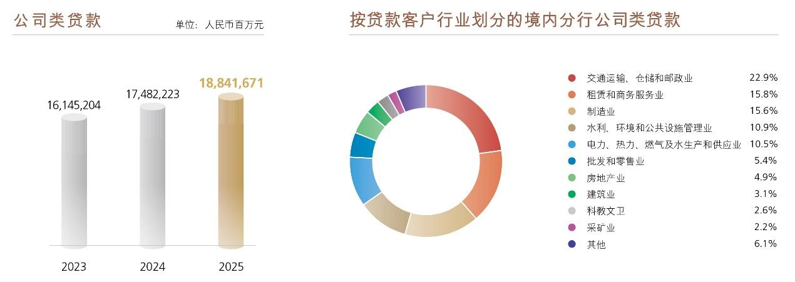

# 8.3.1 公司金融业务

> 来源：《中国工商银行股份有限公司2025年度报告（A股）》，印刷页 43–48
> 本文由 build_kb.py 自动生成

经营分部信息概要
人民币百万元，百分比除外
项目
2025 年
2024 年
金额
占比（%）
金额
占比（%）
营业收入
838,270
100.0
821,803
100.0
公司金融业务
410,676
49.0
393,953
47.9
个人金融业务
327,739
39.1
324,882
39.5
资金业务
93,990
11.2
95,967
11.7
其他
5,865
0.7
7,001
0.9
税前利润
424,435
100.0
421,827
100.0
公司金融业务
206,924
48.7
244,892
58.1
个人金融业务
141,764
33.4
98,710
23.4
资金业务
71,134
16.8
75,270
17.8
其他
4,613
1.1
 2,955
0.7
注：请参见“财务报表附注五、分部信息”。

8.3.1
公司金融业务
公司金融业务突出以客户为中心、以市场为导向，探索板块化运作，打造全
面金融解决方案（CFS），推动价值创造力、市场竞争力、市场影响力、风险管控
力不断增强。2025年末，公司类贷款188,416.71亿元，比上年末增加13,594.48亿
元，增长7.8%；公司存款163,505.93亿元，增加8,431.88亿元，增长5.4%；对公客
户1,474.59万户，增加139.73万户。获评《欧洲货币》“中国最佳大型企业银行”，
连续五年蝉联《环球金融》“最佳一带一路银行”与《财资》“中国最佳项目融资
银行”，获《亚洲银行家》“最佳一带一路人民币项目融资”奖项。
 稳中求进，为实体经济提供充足活水。加大优质公司信贷靠前投放力度，
强化跨期平稳衔接。聚焦现代化产业体系建设金融需求，实施现代公司
信贷布局，不断提升信贷结构与区域经济结构的匹配性，投向“两重一
薄”的公司贷款保持较快增长。深化与国家发展改革委投贷联动合作工
作机制，积极对接“两重”项目和新型政策性金融工具项目配套融资，
公司贷款全年累计投放超10万亿元。
 聚焦主业，助力现代化产业体系建设。做专“工”的主责主业，统筹服
务传统产业升级、新兴产业壮大、未来产业布局，制定金融支持新型工
业化专门方案，积极服务大规模设备更新，联合工业和信息化部启动“工

银惠群”行动。2025年末，投向制造业贷款余额5.24万亿元。完善科技金
融“五专（专业机构、专项行动、专属产品、专门风控、专属保障）”服
务体系，前瞻性制定未来三年科技金融发展规划，举办“工银科创伙伴
行”品牌营销活动，联合多方成立科技金融生态联盟。做强“商”的专
业特色，围绕服务建设强大国内市场，加强对境内外大宗、商贸、物流、
电子商务、服务消费等重点场景金融服务，深化与平台、商超合作，落
地全市场首笔服务消费与养老再贷款，再贷款投放、申报金额均同业领
先。
 担当作为，服务“两重一薄”重点领域。助力粮食安全，与中华全国供
销合作总社合作打造“供销+金融”服务模式，做好关键农时金融服务。
助力能源安全，支持能源保供，支持加快建设国家新型能源体系。用好
碳减排支持工具，支持绿色转型发展。推动房地产高质量发展，做好城
市房地产融资协调机制、收购存量房用作保障性住房等重点工作金融支
持，支持“好房子”建设，助力构建房地产发展新模式。
 转型变革，打造全面金融解决方案（CFS）体系。聚焦企业核心需求，持
续提升体系化、数字化、专业化、生态化服务能力，依托融资、融智、
融技、融通“四融”路径，推动产品客户对位，为广大企业提供更优质
的金融服务。完善央企服务，与多家央企加强战略合作，持续打造“央
企服务主力银行”。发布跨国公司综合金融服务方案，持续开展“全球行
•全球盈”系列银企对接活动，助力企业“引进来”“走出去”，高质量共
建“一带一路”成果丰硕，以领军银行姿态服务国家战略与经贸外交大
局。携手全国工商联举办金融赋能民营企业高质量发展推进会，推出赋
能民营企业高质量发展十大举措，联合开展优质民营企业融资支持工作，
将“两个毫不动摇”要求落到实处。

普惠金融
做好普惠金融大文章，持续提升普惠金融服务的覆盖面、可得性和满意度，
更好满足小微企业、涉农经营主体及重点帮扶群体多样化的金融需求，提升小微
企业金融服务质效。2025年末，普惠型小微企业贷款35,518.63亿元，比年初增加
6,585.48亿元，增长22.8%；普惠型小微企业贷款客户258.13万户，增加49.79万户；
全年新发放普惠型小微企业贷款平均利率2.96%。
 加力实体经济投放。落实普惠金融大文章政策要求，加力推进普惠信贷
投放支持。深入推进小微融资协调机制，深入开展“千企万户大走访”
行动，加强走访对接，积极解决小微企业诉求。做好一揽子增量、存量
政策落实，持续做好续贷和贴息服务。
 加强重点客群服务。聚焦商户农户，针对性满足服务需求。聚焦外贸小
微企业，强化综合服务与融资供给；针对科创企业，发布科技金融“领
航”行动方案，持续创新产品，优化政策制度和业务流程，协同做深综
合金融服务，精准适配企业需求。
 完善数字普惠产品库。围绕小微客户多样化融资需求，聚焦“工”“商”
主责主业，加强数据引入，深化细分客群融资策略研究，持续完善推广
“制造e贷”“商户e贷”等产品，加大制造、商户等客群服务力度。丰富
押品类型和评估策略，完善优化“e抵快贷”“e企快贷”“e扩快贷”等产
品。为核心企业上下游多级客户提供优质高效的数字供应链融资服务。
结合区域特色，发挥分行资源禀赋，因地制宜创新特色产品、拓展服务
场景，提升区域市场适配性。



**图表数据（JSON 转写）**（由图片识别转写，数据以原图为准）：

```json
{
  "image": "../../assets/p045_1.jpeg",
  "charts": [
    {
      "type": "bar",
      "title": "公司类贷款",
      "unit": "人民币百万元",
      "labels": ["2023", "2024", "2025"],
      "series": [{"name": "公司类贷款", "data": [16145204, 17482223, 18841671]}]
    },
    {
      "type": "pie",
      "title": "按贷款客户行业划分的境内分行公司类贷款（2025）",
      "unit": "%",
      "labels": ["交通运输、仓储和邮政业", "租赁和商务服务业", "制造业", "水利、环境和公共设施管理业", "电力、热力、燃气及水生产和供应业", "批发和零售业", "房地产业", "建筑业", "科教文卫", "采矿业", "其他"],
      "series": [{"name": "2025", "data": [22.9, 15.8, 15.6, 10.9, 10.5, 5.4, 4.9, 3.1, 2.6, 2.2, 6.1]}]
    }
  ]
}
```
 强化运营支撑。依托个人手机银行普惠专版，为普惠客群提供包含贷前
咨询、业务申办、贷后关怀、增值服务的旅程式服务，持续提升用户体
验。以全行超1.5万家网点为支点，充分发挥网点开展普惠金融服务的能
力，更好服务周边客户，延伸普惠金融服务边界。
 完善综合服务体系。融入全面金融解决方案（CFS）体系，围绕小微主体
多元需求，完善“信贷+”服务，全面满足客户多元化需求。依托自主研
发的“环球撮合荟”平台，为全球企业提供产品展示、需求发布、供需
对接、政策资讯、跨境金融等一站式、智能化跨境撮合综合服务。
 夯实风险管理基础。打造“数据驱动、智能预警、动态管理、持续运营”
的全流程风险管理。注重“活情况”“实信息”搜集，强化线上线下交叉
验证，实现专家经验与模型数据的方法互补，提高风险防范的针对性和
有效性。
机构金融业务
 固本培元，政务金融长板持续拉长。扎实服务代理财政资金流转，全年
代理国库集中支付业务金额市场占比第一，连续七年在财政部中央财政
国库集中支付代理银行考评中获直接支付、授权支付“双优”评级。持
续提升社银服务质效，圆满完成养老保险全国统筹项目。同业首批上线
医保电子钱包、首家完成跨省共济支付，医保移动支付清算合作、医保
共济钱包合作均居同业首位。创新民生金融服务，持续推广“工银云医”
“智慧住建”“智慧教育”“数字乡村”等服务平台，为教育强国、科技
强国、健康中国建设、乡村全面振兴提供配套金融服务。加强GBC 联动
营销，推进生态化体系建设，搭建代理财政支付、政府债资金承接、社
保医保生态建设等政务场景解决方案，全面满足政府部门、产业公司、
居民个人相关需求，提升GBC 全生态综合服务质效。
 守正创新，同业金融动能持续增强。提升同业业务服务质效，举办“银
证合力做好五篇大文章 助力资本市场高质量发展”推进会，市场首家发
布证券行业专项服务方案“工银证智通”，健全金融科技一揽子输出方
案，助力金融行业数字化转型，协助金融基础设施客户共同推进业务创

新合作。联动服务实体经济发展，票据经纪业务实现具有持票客户的二
级机构服务全覆盖，累计服务企业超2.2 万户，其中小微企业占比超85%。
加强对公保险场景化营销，完善“十大行业风险管理输出方案”，助力
企业防范风险。扎实服务资本市场，积极响应增强资本市场投融资综合
化改革的政策导向，巩固证券资金第三方存管等结算业务合作基础。
结算与现金管理业务
 聚焦财资，强化司库领航创效。以“工银全球司库”品牌为核心，推动
客户结构、价值贡献与客群规模同步提升。重点围绕多银行互联、跨境
资金管理、票据管理等场景，深度挖掘客户财资管理需求迭代服务。重
构云端司库结算、票据、跨境等核心功能，延展服务生态，扩大场景覆
盖。司库服务1.55 万家企业集团，覆盖央企、省级国企和头部民企集团
成员单位超30 万家。
 聚焦跨境，深化全球付服务领先。深耕央国企、民营、外资和金融机构
四大客群开展全球财资管理合作，纵深推进“工银全球付”系统建设，
拓展“工银全球付”在亚太区、欧洲区的直联直通，海外连接140 多个
国家和地区，直通覆盖至44 个国家、56 个币种，“工银全球付”客户数
超1.29 万户，比上年末增长23%。完善安全、高效、便捷的全球结算金
融基础设施建设，探索构建全球交易结算新体系。
 聚焦供应链，上下游生态赋能。围绕供应链客户产品服务规划，统筹推
进供应链金融服务平台建设，借助第三届中国国际供应链促进博览会等
国际展会多渠道立体化宣传，提升平台影响力。深耕客户痛点，创新服
务场景，下游场景围绕客户需求，开发供应链项下银票业务线上化、智
能化服务；上游场景推出“采购云+账户管控”组合方案，拓展专项资金
监管领域；融资场景落地对接央企生态，实现供应商融资业务全流程线
上化闭环运行。
 创新为擎，数智转型向新而行。基础设施底座实现新突破，对客产品力
实现新提升，深入开展“工银全球付”“工银e 企付”“工银e 缴费”
“工银活钱通”等产品创新，“工银e 缴费”“工银e 企付”交易金额

超2.5 万亿元，通过“活钱通”收管付融综合能力维护底尾客群，引流融
资投贷，服务中小企业客户107 万户。践行结算金融流量变现发展思路，
通过代销理财基金、创新存款产品，沉淀企业客户资金，以做强产品力
赋能结算金融业务高质量发展。扎实推进全行“领航AI+”行动计划，
以新质生产力赋能结算金融业务高质量发展，“天枢智能体”“天枢百
问”结算金融AI 顾问等系列产品全面升级，“天枢智数”结现数据助手
应用AI 大模型，支持800 余项指标多维度查询。
 安全为基，基础设施向稳致远。深化构筑全面风险管理体系，聚力机制
共商，压实风险防线，培育风险文化。强化反洗钱与涉诈治理，系统梳
理自查重点产品及特色产品反洗钱、反电诈风险，加强高风险产品提级
硬控。数字化风控能力加速突破，针对重点产品7 大场景部署33 项风控
模型，建成结算金融风控平台，多维度打造可视化风险视图。
 2025 年末，对公结算账户1,679.9 万户，现金管理客户247.3 万户，全球
现金管理客户13,652 户。2025 年对公结算业务量12,248 万亿元。
投资银行业务
 聚焦战略新兴、科技创新、绿色产业发展，通过“并购+”全流程服务积
极支持国家重点战略。落实一揽子增量政策，加快推动股票回购增持贷
款服务，助力提振资本市场信心，服务上市公司高质量发展。本行牵头
完成的并购交易数量继续位列路孚特“中国参与交易财务顾问榜单”中
国区首位。
 推出“工银科创金融—股权金服”服务品牌，以适配产品满足科技型企
业全周期权益性服务需求，推动AIC 股权试点业务有序落地，持续完善
与推进股权投资基金全流程顾问服务，以专精服务为创业投资企业提供
差异化解决方案，提升综合金融服务水平。
 全力推进企业资产证券化及公募REITs 全场景服务，赋能实体企业有效
盘活存量资产，推动形成存量资产和新增投资的良性循环。拓展重组顾
问模式，支持企业债务风险化解和脱困转型。

1对公结算业务量为人民币单位结算账户借贷发生额合计。
