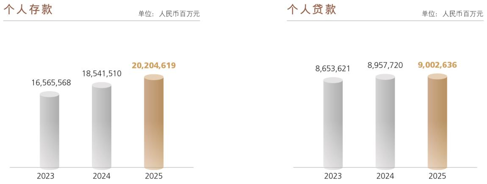

# 8.3.2 个人金融业务

> 来源：《中国工商银行股份有限公司2025年度报告（A股）》，印刷页 49–52
> 本文由 build_kb.py 自动生成

 债券承销业务持续巩固规模领先优势，全年境内主承销债券项目3,249
个，主承销规模合计2.26 万亿元。推动高水平科技自立自强，引导资金
支持重点领域，承销“科创债”130 只，承销规模1,142 亿元；助力新质
生产力发展，承销各类ESG 债券298 只，承销规模3,815 亿元；服务高
水平对外开放，完成牵头主承销首单美资发行人熊猫债、承销首单非洲
地区国际开发机构熊猫债、首单英资发行人熊猫债、多单“一带一路”
主权熊猫债等多个标杆项目发行，全年共为28 家发行人承销熊猫债46
只，承销规模255 亿元。
票据业务
 有效服务“五篇大文章”，深耕供应链金融、布局线上化全渠道，强化
重点领域支持，形成“工银享贴系列”“工银e 贴系列”“票聚链通系
列”“票据慧眼系列”四大票据创新产品体系。深化数字化转型，投产
“票据慧眼2.0”合同智审系统，升级推出“稳价秒贴2.0”“工银e 贴
2.0”和“票据营销一点通”等项目，成功落地全市场首单供应链财票有
限追索贴现业务和票交所综服平台贴现业务。
 2025 年，票据贴现业务量4.9 万亿元，比上年增长32.8%，连续九年保
持市场首位。连续五年获评上海票据交易所“优秀综合业务机构”“优
秀贴现机构”“优秀交易机构”等多个奖项，2025 年实现综合类、专项
类奖项全覆盖。

8.3.2
个人金融业务
2025年，本行以打造人民满意的现代化零售领军银行为目标，遵循“五化”
转型发展路径，推动个人金融业务风险防控、产品供给、数智赋能、服务体系、
生态基础建设取得新成效。
 提升智能化风控，促进风险防控与业务发展深度融合。严防操作风险，
常态化开展制度重检与评估，风险管理和内部控制体系日趋完善。推动
客户洗钱风险管理体系建设，反洗钱履职能力持续提升。推进精准反诈

和便捷解控，帮助客户避免损失约77 亿元，切实保护好人民群众“钱袋
子”。优化代销产品集体评审准入工作机制，进一步提升代销业务决策和
风控水平。完善代销业务集约化回访机制，持续提升销售适当性管理水
平。
 完善现代化布局，围绕经营“资金流”，做优做强储蓄、支付等核心业务。
加强代发、社保、商户等源头资金拓展，创新推出节气存单产品，焕新
升级“智存宝”协议，做好“备付、备还、备投”场景服务，实现储蓄
存款快速增长，存款付息率稳步下降，为服务实体经济提供充足的低成
本资金。强化个人支付业务统筹管理，境内首推万事达“10+1”多币种
借记卡，推出生肖卡、AI 悦选卡新系列等产品。
 培育数智化动能，通过实施数字基建、智慧营销、AI 赋能和系统整合等
重点项目，促进提升全要素生产率。推进建设个人客户认证数据集，建
立数据共用、策略共商的协同机制。持续提升“智慧大脑”核心能力，
围绕产品客户对位推进营销策略建模，面向个人客户提供个性化产品推
荐服务方案。推出本行首款营销智能体“工小财”，打造人机协同营销维
客模式。加快推进系统整合，完善优化“数字个金智慧经营平台”，打造
敏捷智能的数据服务体系。
 推进综合化服务，全面整合营销活动、回馈权益和境内外资源，为客户
提供高品质服务。打造多渠道、立体化拓客新模式。线下构建行商营销
模式，投产营销PAD，打造流动银行销售单元，满足外拓营销需要。线
上围绕智慧食堂、智慧校园、积存金、光伏等项目加强复制推广，推动
平台客户引流转化。首家推出统一的客户回馈载体“工银i 豆”，客户体
验和营销成效明显提升。以服务第十五届全运会为契机，加速“跨境支
付通”产品推广。
 拓展生态化体系，纵深推进GBC+基础性工程，重点客群经营能力不断
增强。启动代发“5+N”焕新工程，全面整合代发产品，迭代推广“工银
薪管家2.0”，提升代发市场竞争力。构建个人商户新经营模式，开展产
品客户精准对位和成本精细化管理。深化打造“工银爱相伴”长辈客群
服务品牌，首批实现三代社保卡发卡资格地市级全覆盖，持续扩大社保

卡服务覆盖面。持续丰富个人养老金投资品货架，不断升级投资理财服
务，个人养老金缴存率不断提升。围绕重点场景提高年轻客群拓维能力，
年轻客户占比进一步提升。
 获评《环球金融》“中国最佳零售银行”，《亚洲银行家》“亚太区最佳数
字开户服务”“亚太区最佳数字化财富管理平台项目”“中国最佳数字储
蓄创新项目”“中国最佳反欺诈消费者保护项目”，《零售银行》“最
佳养老金融大奖”“财富中收奖”等奖项。2025年末，服务个人客户7.82
亿户。个人存款202,046.19亿元，增加16,631.09亿元，增长9.0%。个人贷
款90,026.36亿元，增加449.16亿元，增长0.5%。

个人信贷业务
 深入研判房地产市场发展新形势，稳步推进一、二手房贷款均衡发展。
推动公积金委贷业务高质量发展，公积金中心合作关系覆盖率达91%。
 创新金融服务模式，围绕客户群体与场景需求，强化消费信贷产品供给，
提升产品与客群对位精准度。推出面向新毕业大学生群体、在职深造群
体的“优学贷”、服务飞行员培训的“飞行员e 贷”、适配养老群体的“如
意借”“年金闪借”等细分产品，形成覆盖多类目标客群、适配多元消费
场景的产品体系，有效释放差异化消费潜力。有序推进个人消费贷款财
政贴息工作，累计签订贴息服务协议客户约190 万户，为符合贴息条件
的超3,000 万笔消费支出办理了贴息，切实降低了居民融资成本，有效
释放消费需求。



**图表数据（JSON 转写）**（由图片识别转写，数据以原图为准）：

```json
{
  "image": "../../assets/p051_1.jpeg",
  "charts": [
    {
      "type": "bar",
      "title": "个人存款",
      "unit": "人民币百万元",
      "labels": ["2023", "2024", "2025"],
      "series": [{"name": "个人存款", "data": [16565568, 18541510, 20204619]}]
    },
    {
      "type": "bar",
      "title": "个人贷款",
      "unit": "人民币百万元",
      "labels": ["2023", "2024", "2025"],
      "series": [{"name": "个人贷款", "data": [8653621, 8957720, 9002636]}]
    }
  ]
}
```
 加强个人经营贷款重点领域产品供给与场景创新。推动房抵组合贷高质
量发展，全面推广续贷服务，采取丰富还款方式等产品策略，提升产品
市场竞争力。面向个体工商户客群创新推出的“助商组合贷”产品，满
足客户经营和消费融资需求。围绕县域特色经济集群，依托“链、圈、
台”数字金融新模式，通过与外部产业平台数据对接，积极推广“棉农
贷”、“农担直连”等信贷创新产品，打造涉农领域“产品—场景”服务
矩阵。
 蝉联《环球金融》“中国最佳消费者信贷银行”奖项。
财富管理业务
 坚持以人民为中心的价值取向，积极履行大行责任，以优质财富管理满
足人民美好生活需要，财富管理实现市场引领。按照“宽进、严选”策
略，丰富基金产品谱系，年内上架公募基金产品同比大幅增加。深化与
头部保险公司合作，按季度滚动开展精准营销，创新推出代销商业养老
金产品。加强“天天盈”“智享还”“理财定投”等场景类创新产品推
广，理财产品持仓客户突破千万户。2025年末，个人金融资产达25.37万
亿元，保持全市场领先。
 在私人银行业务方面，以全面金融解决方案为抓手打通客户服务链、价
值链，以AI 赋能专业数智化转型。推动科学家、科创企业家客群服务体
系建设。推出科学家“星熠”服务体系，升级科创企业家“权益体验包”，
与科协、高校、实验室、院士中心等组织机构开展科技金融、公益慈善、
科普教育主题合作。推出手机银行慈善账户，打造慈善金融数字化载体，
实现客户在本行慈善行为的全方位展示、全渠道整合、全旅程记录。推
动养老金融与家业传承深度互嵌，正式发布“工银传诚家”服务品牌，
常态化举办“君子伙伴·善行致远”慈善系列主题沙龙。以“青山”品
牌为引领，打造绿色产品体系，重点配置绿色债券、碳中和债券等ESG
资产，引导社会资本向绿色产业集聚。
 获评联合智评“优秀财富管理银行”“优秀理财销售银行”金蟾奖，普
益标准“卓越财富管理银行”“卓越银行财富品牌”金誉奖，中国证券
