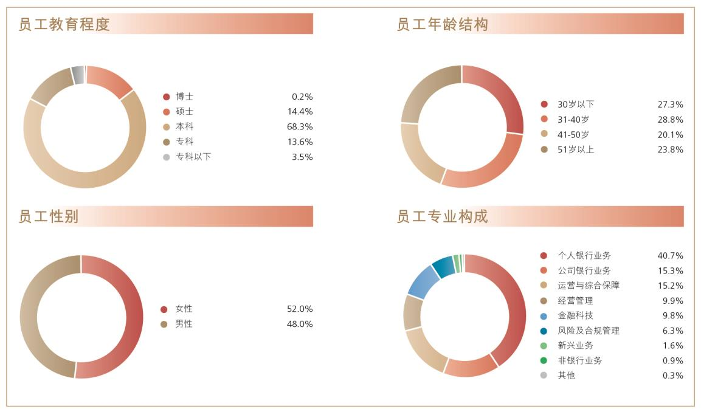

# 8.3.8 人力资源管理与员工机构情况

> 来源：《中国工商银行股份有限公司2025年度报告（A股）》，印刷页 65–67
> 本文由 build_kb.py 自动生成

 持续提升客户服务与体验。加强客户体验数字化管理，通过“双声”系
统强化服务问题监测，开展客户满意度评价，迭代优化产品服务，促进
服务质效提升。推进远程银行集约化、数智化客诉处置新模式，强化问
题在线解决、投诉在线化解、工单集中处理，持续提高客户诉求在线一
站式解决能力，有效提升服务水平。
 深化全渠道融合发展。坚持以客户为中心，持续完善自有与开放并重、
线上与线下融合的全渠道服务矩阵，以手机银行、开放银行、远程银行
等对客服务平台为核心，以企业微信、公众号、小程序、云网点等数字
化服务工具为补充，推动线上与线下渠道优势互补、融合互促，深化“一
点接入、全渠道响应、数字化协同”的服务体系。依托渠道融合和系统
打通，促进运营能力集成和服务策略统筹，提升客户精准服务能力。
 全面统筹集团业务连续性管理。持续优化集团业务连续性管理体系，增
加引入外部评估管理要求，优化重要信息系统灾备恢复能力及集团应急
处置流程。强化监测预警与应急能力，构建涵盖网点运行监测等重点板
块的监测预警体系，实现对业务连续性运作的立体化监测。完善业务连
续性管理体系评估改进机制，定期开展业务连续性管理体系评估改进与
审计检查。
8.3.8
人力资源管理与员工机构情况
人力资源管理
 聚焦高质量发展，着眼经营发展与市场竞争关键领域，统筹做好人力资
源配置，以人力资源提质增效支撑经营能力提升。聚焦做深做细“五篇
大文章”，强化前台营销、信贷风控、科技数据、新型业务等专业队伍
建设，持续完善人才培养、激励、使用等机制，提升人才履职能力，着
力打造适应金融强国建设要求的强大金融人才队伍。推动科技、数据、
业务人才深度融合，提升科技数据赋能业务发展水平。
 积极培育践行中国特色金融文化，加强新时代廉洁文化建设，为本行高
质量发展提供文化支撑。召开中国特色金融文化工作座谈会，系统总结

全行经验做法。开发中国特色金融文化课程，开展丰富多样的文化实践，
引导干部员工树牢正确的经营观、业绩观和风险观。推进廉洁文化教育
基地体系建设，制作系列警示教育片，开发廉洁文化课程，抓好分层分
类廉洁教育，增强全体干部员工廉洁自律意识和拒腐防变能力。
 围绕新时期干部教育培训规划落地，着力打造系列重点培训项目，带动
各级各类培训提质增效，全面提升干部员工综合素质与履职能力。紧扣
“五化”转型核心任务，构建专项培训体系，实施分层级、系统化、实
战化培训，聚焦“五篇大文章”核心人才库建设深化培训，有效服务全
行转型发展大局。深化清廉工行专项培训，面向各级机构“关键少数”
开展系列培训，提升各级领导班子“一岗双责”能力，强化关键岗位、
重点领域人员群体的廉洁自律意识，锻造清廉干部队伍。围绕人才成长
全周期，构建全链条、系统化培训体系，实施国际化人才培训、“工银
繁星计划”新员工培训、网点负责人轮训等，推进“砺剑计划”“菁英
计划”、境外机构本地员工行情研修培训等项目，助力干部员工成长成
才。优化专业资格认证体系，精简二级分行考试科目，为基层减负赋能。
推进培训数字化转型，加快优质培训资源开发共享，持续提升教育培训
工作的规范性和实效性。
薪酬政策
 本行实行与公司治理要求相统一、与高质量发展目标相结合、与风险管
理体系相适应、与人才发展战略相协调以及与员工价值贡献相匹配的薪
酬政策，以促进全行稳健经营和高质量发展。本行薪酬管理政策严格按
照国家有关规定、监管要求和公司治理程序制定及调整。本行不断优化
以价值创造为核心的薪酬资源配置机制，坚持维护公平和激励约束相统
一的分配理念，传导集团经营管理战略目标，加强薪酬资源向基层员工
倾斜，调动和激发各级各类机构的经营活力。
 本行员工薪酬由基本薪酬、绩效薪酬和福利性收入构成。其中，基本薪
酬水平取决于员工价值贡献及履职能力，绩效薪酬水平取决于本行整体、
员工所在机构或部门以及员工个人业绩衡量结果，同时高级管理人员和

对风险有重要影响岗位的员工绩效薪酬实行延期支付及追索扣回机制，
促进风险与激励相平衡。对发生违规违纪行为或出现职责内风险损失超
常暴露等情形的员工，本行视严重程度扣减、止付及追回相应期限的绩
效薪酬。报告期内，本行按照相关办法对因违规违纪行为或出现职责内
风险损失超常暴露等情形受到纪律处分或其他处理的员工，均进行了相
应绩效薪酬的扣减、止付或追索。
 本行2025 年度薪酬方案经行内决策流程制定实施，年度工资总额执行
情况按国家规定向主管部门备案。报告期内本行高级管理层经济、风险
和社会责任指标完成情况良好，最终结果待董事会审议后确定。
员工机构情况
 2025 年末，本行共有员工409,758 人，其中，境内控股子公司员工6,559
人，境外机构员工15,439 人。本行员工性别比例、年龄分布保持均衡，
教育程度、专业经验呈现多元构成，较上年末未发生明显变化。本行尊
重人才个体差异，重视员工队伍结构的合理性与包容性。未来，本行将
持续关注员工在性别、年龄、教育背景及专业经验等方面的构成情况，
在人员退出与招聘等工作中加强跟踪监测，采取有效措施保持员工队伍
结构的总体平衡。



**图表数据（JSON 转写）**（由图片识别转写，数据以原图为准）：

```json
{
  "image": "../../assets/p067_1.jpeg",
  "charts": [
    {
      "type": "pie", "title": "员工教育程度", "unit": "%",
      "labels": ["博士", "硕士", "本科", "专科", "专科以下"],
      "series": [{"name": "员工教育程度", "data": [0.2, 14.4, 68.3, 13.6, 3.5]}]
    },
    {
      "type": "pie", "title": "员工年龄结构", "unit": "%",
      "labels": ["30岁以下", "31-40岁", "41-50岁", "51岁以上"],
      "series": [{"name": "员工年龄结构", "data": [27.3, 28.8, 20.1, 23.8]}]
    },
    {
      "type": "pie", "title": "员工性别", "unit": "%",
      "labels": ["女性", "男性"],
      "series": [{"name": "员工性别", "data": [52.0, 48.0]}]
    },
    {
      "type": "pie", "title": "员工专业构成", "unit": "%",
      "labels": ["个人银行业务", "公司银行业务", "运营与综合保障", "经营管理", "金融科技", "风险及合规管理", "新兴业务", "非银行业务", "其他"],
      "series": [{"name": "员工专业构成", "data": [40.7, 15.3, 15.2, 9.9, 9.8, 6.3, 1.6, 0.9, 0.3]}]
    }
  ]
}
```
