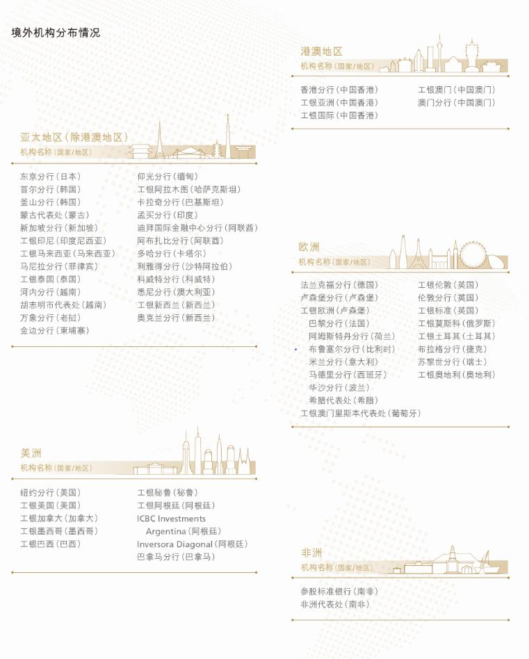

# 8.3.9 国际化经营

> 来源：《中国工商银行股份有限公司2025年度报告（A股）》，印刷页 68–71
> 本文由 build_kb.py 自动生成

 2025 年末，本行机构总数16,246 个，比上年末减少137 个。其中，境
内机构15,836 个，境外机构410 个。境内机构包括总行、37 个一级分
行及直属分行、463 个省会城市行及二级分行、15,179 个基层分支机构，
22 个总行直属机构及其分支机构，以及134 个控股子公司及其分支。

2025 年末资产、分支机构和员工的地区分布情况
项目
资产
（人民币
百万元）
资产占比
(%)
机构
（个）
机构
占比
(%)
员工
（人）
员工
占比
(%)
总行
6,422,934
12.0
23
0.1
22,407
5.5
长江三角洲
14,825,133
27.7
2,491
15.3
60,440
14.8
珠江三角洲
9,125,421
17.1
1,919
11.8
46,891
11.4
环渤海地区
8,087,272
15.1
2,629
16.2
64,178
15.7
中部地区
6,184,419
11.6
3,355
20.7
73,535
17.9
西部地区
6,909,241
12.9
3,552
21.9
81,615
19.9
东北地区
1,836,510
3.4
1,733
10.7
38,694
9.4
境外及其他
4,870,964
9.1
544
3.3
21,998
5.4
抵销及未分配资产
(4,784,121)
(8.9)

合计
53,477,773
100.0
16,246
100.0
409,758
100.0
注：境外及其他资产包含对联营及合营公司的投资。

8.3.9
国际化经营
坚持“国际视野，全球经营”，完善境内外、本外币一体化经营体系，充分
发挥全球经营优势，着力提升跨境金融服务水平，助力高质量共建“一带一路”，
服务国家高水平对外开放大局。
 深入服务国家高水平对外开放。优化跨境电商等新业态综合金融服务，
发布“春融行动2025”“工银e 贸”外贸新业态服务体系，领先同业推
出服务小微企业跨境电商收款的内外联动解决方案，投产“跨境e 电通”
海外版系统，打造“自主、可控、安全、高效”的跨境支付体系。持续
推广海关“单一窗口”金融服务，促进贸易便利化，2025 年办理跨境汇
款64.81 亿美元。全面服务外汇客户跨境金融综合服务需求，推动外资
外贸客户结构多元化，做好外商投资企业全资金链条、全金融场景、全
球化联动的综合服务，助力吸引更多长期资本来华展业兴业。持续完善

国际业务风险管理联防联控机制，扎实推进产品客户风险对位管理，有
效促进外汇业务在安全稳健中实现高质量发展。
 服务构建新发展格局，推进人民币国际化。持续推进“春煦行动”，全
力支持全球市场主体跨境结算、投融资、风险管理等领域跨境人民币业
务需求。创新服务跨国公司贸易结算、资金管理等业务需求，助力更大
力度吸引和利用外资。获授权担任土耳其人民币清算行，人民币清算行
拓展至12 家。充分发挥人民币清算行培育离岸人民币市场的积极作用，
持续加强清算基础设施建设，提升清算服务能力，支持离岸人民币市场
稳步发展。积极服务自贸区高质量发展，成为首家实现上海、海南、广
东、深圳、天津五大自由贸易试验区FT 账户体系全覆盖的银行。2025
年跨境人民币业务量突破10 万亿元。
 持续深化国际合作。高质量履行金砖国家工商理事会中方主席单位职责，
服务金砖国家多边合作。依托中欧企业联盟，助力中欧经贸关系提质升
级。完善“一带一路”银行间合作机制（BRBR），助力高质量共建“一
带一路”。举办东盟—中日韩产业链供应链对接大会，推动区域协同和
产业链供应链可持续发展。积极服务中国国际进口博览会、中国进出口
商品交易会、中国国际服务贸易交易会、中国国际供应链促进博览会等
国际展会，助力高水平对外开放。
 完善全球网络布局，持续健全跨境金融服务体系。2025 年末，本行已在
49 个国家和地区建立了410 家境外机构，通过参股标准银行集团间接覆
盖21 个非洲国家，在“一带一路”共建国中的30 个国家设立250 家分
支机构，与144 个国家和地区的1,400 余家外资银行建立了业务关系，
服务网络覆盖六大洲和全球重要国际金融中心。
 境外机构稳妥应对复杂挑战，扎实推进“五化”转型，保持稳中有进经
营态势。持续提升公司贷款、投行资管、金融市场、结算清算、资产托
管、零售金融等全球金融服务能力，加强境内外、本外币一体化联动营
销，完善客户全球金融服务体系。

境外机构主要指标
项目
资产(百万美元)
税前利润（百万美元）
机构（个）
2025 年末
2024 年末
2025 年
2024 年
2025 年末
2024 年末
港澳地区
214,772
206,670
759
1,126
105
96
亚太地区（除港澳）
164,240
144,381
1,803
1,700
87
88
欧洲
105,933
87,152
1,025
771
64
70
美洲
56,436
40,157
261
349
153
153
非洲代表处
-
-
-
-
1
1
抵销调整
(54,139)
(44,509)

小计
487,242
433,851
3,848
3,946
410
408
对标准银行投资
（1）
4,373
3,692
558
456

合计
491,615
437,543
4,406
4,402
410
408
注：（1）列示资产为本行对标准银行的投资余额，税前利润为本行报告期对其确认的投资收益。

 2025 年末，本行境外机构（含境外分行、境外子公司及对标准银行投资）
总资产4,916.15 亿美元，占集团总资产的6.4%。其中，各项贷款1,876.31
亿美元，客户存款1,841.35 亿美元。报告期税前利润44.06 亿美元，占
集团税前利润的7.3%。



**境外机构分布（JSON 转写）**（由图片识别转写，数据以原图为准）：

```json
{
  "image": "../../assets/p071_1.jpeg",
  "type": "list",
  "title": "境外机构分布情况",
  "groups": [
    {
      "region": "港澳地区",
      "items": ["香港分行（中国香港）", "工银亚洲（中国香港）", "工银国际（中国香港）", "工银澳门（中国澳门）", "澳门分行（中国澳门）"]
    },
    {
      "region": "亚太地区（除港澳地区）",
      "items": ["东京分行（日本）", "首尔分行（韩国）", "釜山分行（韩国）", "蒙古代表处（蒙古）", "新加坡分行（新加坡）", "工银印尼（印度尼西亚）", "工银马来西亚（马来西亚）", "马尼拉分行（菲律宾）", "工银泰国（泰国）", "河内分行（越南）", "胡志明市代表处（越南）", "万象分行（老挝）", "金边分行（柬埔寨）", "仰光分行（缅甸）", "工银阿拉木图（哈萨克斯坦）", "卡拉奇分行（巴基斯坦）", "孟买分行（印度）", "迪拜国际金融中心分行（阿联酋）", "阿布扎比分行（阿联酋）", "多哈分行（卡塔尔）", "利雅得分行（沙特阿拉伯）", "科威特分行（科威特）", "悉尼分行（澳大利亚）", "工银新西兰（新西兰）", "奥克兰分行（新西兰）"]
    },
    {
      "region": "欧洲",
      "items": ["法兰克福分行（德国）", "卢森堡分行（卢森堡）", "工银欧洲（卢森堡）", "巴黎分行（法国）", "阿姆斯特丹分行（荷兰）", "布鲁塞尔分行（比利时）", "米兰分行（意大利）", "马德里分行（西班牙）", "华沙分行（波兰）", "希腊代表处（希腊）", "工银澳门里斯本代表处（葡萄牙）", "工银伦敦（英国）", "伦敦分行（英国）", "工银标准（英国）", "工银莫斯科（俄罗斯）", "工银土耳其（土耳其）", "布拉格分行（捷克）", "苏黎世分行（瑞士）", "工银奥地利（奥地利）"]
    },
    {
      "region": "美洲",
      "items": ["纽约分行（美国）", "工银美国（美国）", "工银加拿大（加拿大）", "工银墨西哥（墨西哥）", "工银巴西（巴西）", "工银秘鲁（秘鲁）", "工银阿根廷（阿根廷）", "ICBC Investments Argentina（阿根廷）", "Inversora Diagonal（阿根廷）", "巴拿马分行（巴拿马）"]
    },
    {
      "region": "非洲",
      "items": ["参股标准银行（南非）", "非洲代表处（南非）"]
    }
  ]
}
```
