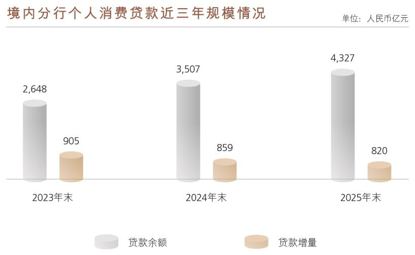

# 8.7 资本市场关注热点问题

> 来源：《中国工商银行股份有限公司2025年度报告（A股）》，印刷页 107–114
> 本文由 build_kb.py 自动生成

8.7 资本市场关注热点问题
热点问题一：集团“十四五”战略规划圆满收官
2025 年是“十四五”规划收官之年。本行坚持以习近平新时代中国特色社会
主义思想为指导，将自身发展充分融入中国式现代化进程，坚持党建引领，扎实
推进“扬长补短固本强基”四大布局，圆满完成集团“十四五”规划目标任务，
交出一份高质量发展和高水平安全协同并进的良好答卷。
“扬长”巩固优势版图，提升服务能力。巩固拓展公司金融、机构金融、政
务金融、结算金融等传统优势，围绕国家重大战略、重大工程和重点产业链，做
深做透一批标志性客群和重点项目，形成对高质量发展的有力支撑。2025 年末，
全行机构存款、公司贷款分别较2021 年初增长2.4 万亿元和7.74 万亿元，对公
结算账户数增至1,680 万户，集团债券投资规模超过16 万亿元，行业领先地位
更加巩固。
“补短”聚焦关键领域，打造新增长点。零售业务实现新跃升，AUM 余额
年复合增长率超9%，居可比同业首位。完善“本外币一体、境内外一体”经营
格局，境外机构总资产规划期内增长超16%。推动城市金融优势向县域拓展，创
新构建GBC 联动服务体系，打造数字普惠新模式，不断扩大客户基础，协同提
升金融服务的精准性、便捷性和直达性。2025 年末，全行涉农贷款余额超5 万
亿元，普惠贷款五年翻两番，工农互促、城乡联动的发展格局加快形成。
“固本”夯实经营根本，增强内生动力。实施个金领域业务板块化运作、利
润中心改革等一系列改革，在科创、普惠、绿色、养老、数字等重点领域优化机
构职能和条线职责，系统提高总部决策能力、条线管理水平和基层运行效率。加
快建设数字工行、科技强行，自主研发的金融业首个千亿级AI 大模型领跑行业
创新应用，同业首家获得数字化转型能力（FDMM）和数据管理能力（DCMM）
最高评级，ECOS 获金融科技发展奖特等奖，专利公开量和累计授权量同业第一，
蝉联《银行家》（中国）“年度金融创新卓越机构”。
“强基”筑牢发展根基，释放经营活力。客户基础方面，全行个人客户数较
2021 年初增长超1 亿户，总量超7.8 亿户；对公客户数增长71%，总量超1,400
万户。服务基础方面，网均存款较2021 年初增长超50%，个人手机银行客户总

数率先突破6 亿户、移动端月活突破2.9 亿户。人才基础方面，干部员工结构持
续优化，“五篇大文章”等核心人才库超2,000 人、骨干人才库超1 万人，科技
数据人才队伍超4 万人，形成3,200 余人的国际化人才储备团队。
经过“十四五”的努力，工商银行“强优大稳”特征更加彰显。主业更强，
投向制造业贷款突破5 万亿元，贸易融资超1 万亿元，科技贷款6 万亿元；质态
更优，2025 年营收、净利润实现“双正增”，净利润创历史新高，成本收入比同
业较优。贡献更大，总资产、存款、贷款、资本等核心指标稳居全球第1，年均
向实体经济投放增量资金约4 万亿元，“两重一薄”领域贷款累计增长超40%；
经营更稳，资本充足率、拨备覆盖率较2021 年初分别上升1.9 和32.9 个百分点，
不良贷款率下降27 个BP，各类风险总体可控。
热点问题二：推动“五化转型”走深走实
2025 年，面对外部形势和竞争格局变化，本行坚持通过改革转型提升应变
适变能力，围绕防风险、强监管、促高质量发展的金融工作主线，推动“五化转
型”进一步向深发力，在复杂经营环境中实现向新向优发展。
智能化风控有效加强，夯实安全基础
深化横向协同联动、纵向贯通发力的全面风险管理体系，强化风控委、风险
官、风控部门三位一体履职，风控委牵头抓总，风险官压实责任，风控部门提升
能力，凝聚齐抓共管合力。一道防线风控责任持续强化，内控、审批、审计新规
深化落地，三道防线联防联控局面进一步形成。加快企业级智能风控平台的建设
推广，“4E 中心”全面覆盖总行和分支机构，带动全行不良贷款率较上年末下降
3 个BP。
现代化布局不断完善，做强核心功能
积极支持国家重大战略、重点领域和薄弱环节，靠前服务“两重”“两新”，
深入开展提振消费专项行动，全年信贷投放和债券投资增量合计4.8 万亿元，保
持市场领先。扎实做好金融“五篇大文章”，相关投融资余额保持市场领先、增
速高于全行均值，对银行业的增量贡献稳步提升。坚持“四板”联动推进自身现
代化，主板更加突出，投向制造业贷款、科技贷款余额保持同业首位，在全行贷
款中占比较上年末分别提升1.7 个、2.0 个百分点；长板优势扩大，绿色贷款余

额、境内ESG 债券承销额等稳居同业第一，城市金融优势加快向县域拓展；底
板更加扎实，境内境外主要区域发展支撑更加有力；新板加速培育，资产托管规
模同业首家突破32 万亿元，投行顾问与财富代销收入居可比同业首位，技术改
造和设备更新贷款增长近三倍，服务新质生产力发展成效显著。
数智化动能加快培育，打造新质生产力
创新实施“领航AI+”行动，在30 余个业务领域落地超500 个AI 应用，应
用广度和深度同业领先，AI 数字员工承担工作量5.5 万人年。紧跟科技发展步
伐，基于工银智涌探索建立“一超多专”智能体协同体系。打造企业级数据空间，
统一全行指标口径和指标库，数据高时效入湖，为业务发展赋能提效。深入推进
平台智能化，以“一客一顾问”为目标做强对客平台，手机银行客户规模、月均
活跃客户保持可比同业第一，开放银行合作方数7.9 万户，工银e 生活月均活跃
客户2,217 万户。以“一岗一助手”为导向做优对内平台，柜面通网点覆盖率达
100%，投产对公营销智能体，推出个人营销智能体“工小财”，全面赋能客户经
理营销和员工办公。
综合化服务持续拓展，与客户共同成长
以客户为中心打造全面金融解决方案，围绕客户全生命周期需求，一体提供
融资、融智、融技、融通等服务。加快打造全球一体化经营新格局，用好国内国
际两个市场、两种资源，以全球工行服务全球客户。2025 年境外机构营业收入占
比稳中有升，境内综合化子公司营收同比增长22.1%。强化产品客户对位，构建
全量客户地图和全量产品清单，中型有贷户3.8 万户，日均资产1 万元（含）以
上个人客户达1.3 亿户，个人长尾与对公底尾客户资产增量占同期全量个人、对
公客户资产增量的61.8%、26.5%。
生态化体系稳步构建，强化平衡稳健发展
GBC+基础性工程深入推进，客户链、资金链、服务链、价值链更加协同，
对公客户增至1,475 万户，个人客户达7.82 亿户，代发资金突破6 万亿元、总量
和增量实现可比同业“双第一”。以长期价值为导向，打造干净健康的资产负债
表、平衡协调可持续的利润表，动态平衡价值创造、市场地位、风险管控和资本
约束，2025 年本行净利润、拨备前利润、营业收入、手佣净收入规模继续领跑可
比同业，负债成本处于可比同业较优水平，资产质量稳中向好，价值创造力、市

场竞争力、市场影响力、风险管控力持续提升。
热点问题三：提质聚力存款发展 量稳价优领跑同业
2025 年，本行统筹推进GBC+基础性工程，各项存款总量稳健增长，结构持
续优化，成本有效压降，日均显著提升，存款高质量发展特征更加鲜明，为服务
实体经济提供了更加稳定可持续的资金支持。
一、总量持续领跑同业，板块条线协同联动
面对复杂多变的市场竞争环境，本行前瞻研判社会资金流转规律，存款市场
竞争力进一步提升。2025 年，集团客户存款较年初增加2.5 万亿元至37.3 万亿
元，同比多增1.2 万亿元，增幅7.1%。聚焦客户多元化、场景化储蓄需求，创新
智存宝、节气存单等产品服务，境内分行人民币个人存款余额突破19 万亿元，
增量超2.0 万亿元，创历史新高；积极拓展财政、社保、教育、医疗等服务场景，
以及专精特新“小巨人”、公司商户等重点客群，境内分行人民币对公存款较年
初增加8,400 亿元至15.0 万亿元，总量保持同业领先。
二、成本管控成效显著，量价协调优势突出
本行持续坚持量价协调发展理念，积极响应利率自律倡议，在存款规模增长
的同时，付息成本稳步下行。2025 年，集团存款付息率较上年下降36BP，同比
多降19BP，付息水平和降幅均处于同业较优水平。通过不断优化存款产品结构
及投放节奏，新吸收存款利率低于行业平均水平，彰显出本行在定价管理方面的
专业能力。依托在托管、结算、存管等领域的深厚基础和强大服务能力，强化低
成本活期资金沉淀，活期存款占比降幅较上年明显收窄，成为管控整体负债成本
的重要支撑。
三、日均增长平稳均衡，资金匹配效能优化
本行高度重视存款日均积累，通过抢先抓早争揽源头资金、畅通资金循环链
路等方式，持续提升存款日均管理水平。2025 年，境内分行人民币客户存款日均
增量1.7 万亿元，运行曲线平稳向上，增长均衡性显著提升。主动提升资产负债
管理的前瞻性和主动性，存贷款日均增量的匹配程度明显优于可比同业，彰显出
存款对信贷投放的坚实支撑力。

未来，本行将持续坚持存款高质量发展，量质并举、量价协调，以更坚实的
负债支撑、更优质的金融服务，为经济社会高质量发展提供更稳定、可持续的资
金支持，为广大投资者创造长期稳定的价值回报。
热点问题四：围绕“扩内需、促消费”，持续扩大消费金
融供给
2025 年，本行立足领军银行职责，紧扣中国式现代化战略方向，围绕“扩内
需、促消费”，强化资源统筹与科技赋能，优化消费金融供给，拓宽服务覆盖面、
提升服务精准度，助力消费市场提质扩容。
一、规模稳步增长，金融支撑作用显著
坚持靠前发力、精准施策，加大消费信贷投放力度，全力满足居民合理消费
融资需求。2025 年末，境内分行个人消费贷款余额达4,300 亿元以上，较年初新
增超800 亿元，年增速达23%，显著高于全行贷款平均增速，近三年复合增长率
保持在35%以上，金融支持效能持续增强。

二、产品多元布局，加强“客户—场景—产品”对位
坚持“投资于人”与“投资于物”紧密结合，构建覆盖全客群、贯通多场景
的消费金融产品体系，更好满足个性化、多样化的金融需求。聚焦新市民、高校
毕业生、养老群体、飞行学员等重点人群，创新推出适配不同消费场景与需求的
特色产品，覆盖教育、养老等多元领域，有效激发重点群体消费意愿与潜力。截



**图表数据（JSON 转写）**（由图片识别转写，数据以原图为准）：

```json
{
  "image": "../assets/p111_1.jpeg",
  "type": "bar",
  "title": "境内分行个人消费贷款近三年规模情况",
  "unit": "人民币亿元",
  "labels": ["2023年末", "2024年末", "2025年末"],
  "series": [
    {"name": "贷款余额", "data": [2648, 3507, 4327]},
    {"name": "贷款增量", "data": [905, 859, 820]}
  ]
}
```
至2025 年末，针对养老群体的“年金闪借”及针对新市民、高校毕业生的“优
学贷”等业务贷款余额近30 亿元，惠及客户超2.2 万人。
三、政策高效落地，惠民红利精准直达
秉持惠民生宗旨，积极响应消费贷款财政贴息等惠民政策，高效完成系统升
级与贴息专区建设，率先构建“系统自动识别为主+人工审核为辅”的双轨识别
机制。政策实施以来，累计签订贴息服务协议客户约190 万户，为符合贴息条件
的超3 千万笔消费支出办理了贴息，确保政策红利精准触达千家万户。积极对接
“以旧换新”、提振大宗消费等政策部署，联合头部车企推进报废更新、置换更
新合作，构建“车企直连+场景嵌入”模式，提升汽车金融服务效率与体验。全
年个人汽车金融投放超1,600 亿元，有力支撑扩内需战略。
四、渠道融合优化，服务便捷度全面提升
强化数字赋能，打通线上线下服务断点，构建全渠道协同服务体系。深化与
政务数据源的联动，实现“贷款申请—授信—提款”全流程线上化，让“秒级响
应”成为常态，打造“即申即贷、高效便捷”的融资体验。线下推出营销PAD 等
轻量化办理渠道，完善“线上申请、线下联动”服务模式，大幅提升消费金融服
务可得性与便捷度。
五、风控合规并重，发展质效稳步增强
围绕“防风险、强监管、促高质量发展”的金融工作主线，落实“三道口”
“七彩池”全流程管理，提升个贷风险监测预警能力，做到早识别、早处置。优
化客户准入机制，强化多头共债识别，严把“入口”质量。推进数字风控建设，
运用机器学习迭代反欺诈模型，构建信用风险监测体系，实施“线上模型+线下
人工”双轨监测排查机制，形成“监测—反馈—优化”的闭环管理。加强不良贷
款管理，推进催收、证券化与核销工作，提升“出口”处置效能，筑牢业务发展
安全屏障。

热点问题五：工商银行持续增强数智化动能，打造“工
银智涌”大模型技术体系
2025 年，工商银行深入贯彻落实国家“人工智能+”行动，在集团层面实施
“领航AI+行动”计划，打造自主可控、业界领先的“工银智涌”大模型技术体
系，支撑业务应用取得阶段性成效。
一、技术底座：筑牢自主可控的金融级AI 基础设施
构建以国产算力为主的大模型弹性算力池与多模型融合的智能引擎，实现训
练模式和推理模式分钟级切换和“昼推夜训”高效模式。集成十余款业界主流模
型，并在行内进行二次训练，打造更懂金融、更懂工行的企业级底座模型矩阵。
二、知识工程：打造驱动数智转型的企业级认知中枢
建设“1+4+X”人工智能知识工程体系（1 个企业知识库+4 类训练数据集+X
个专业RAG 库），提出贴源层—语义层—萃取层三级建模方法论，建立全员共享
共建的知识工程运作机制，打通知识采集、加工、治理、训练与应用的全链路工
程流水线，实现全行知识资产的规模化、标准化、智能化管理，为信贷风控、投
资决策等复杂场景提供精准推理支持。
三、智能体协同：探索AI 原生的金融生产力范式
建设支持多层次智能体协同框架与低代码开发能力的智能体创作平台，支持
多种任务编排模式，为科技与业务人员提供可视化智能体创作工具，实现智能体
快速构建和灵活组装。构建覆盖基础设施安全、数据安全、模型安全、应用安全
等AI 应用全链路安全防护体系。
四、业务赋能：打造专业+普惠的金融级应用
在30 余个业务领域规模化落地500 余个AI 应用，AI 数字员工年承担工作
量5.5 万人年，深度赋能四大核心场景：
投资交易：打造智能投研助手，提供市场洞察、策略研究、投资管理等能力，
辅助交易员快速感知市场变化，形成更优的投资方案与交易策略；
营销拓客：建设个人客户经理营销助手，提供财富管理、投资陪伴等服务，
形成人机协同营销新模式，提升客户服务质效；

风险防控：打造信贷智能助手，提供客户分析、政策解读、风险预警、融资
推荐等全流程风控支持；
运营提效：完善集约运营助手、远程银行坐席助手，提供智能审核、智能质
检、智能问答等服务，提升业务办理效率，降低操作风险。
五、生态演进：构建持续进化的AI 原生体系
以“领航AI+行动”为牵引，通过多层次智能体协同框架与研发运维一体化
体系，推动技术底座、知识工程与业务场景的闭环迭代，确保生态体系自主可控、
持续演进。
