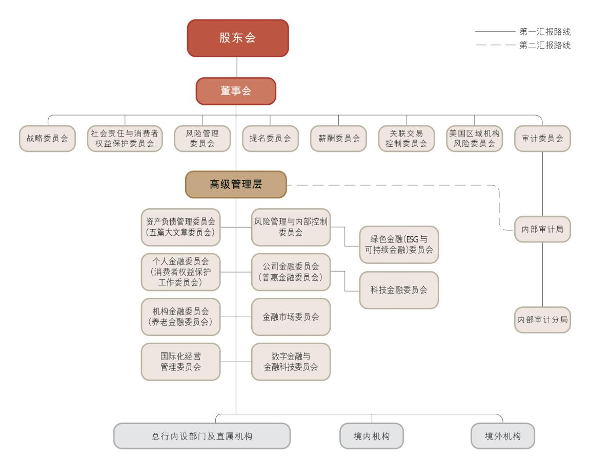
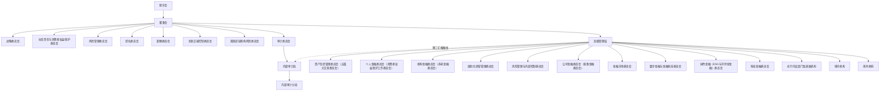
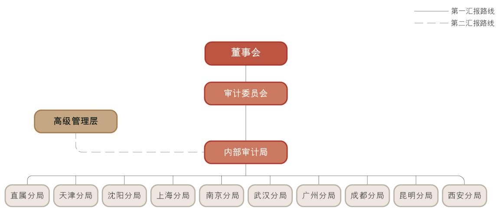
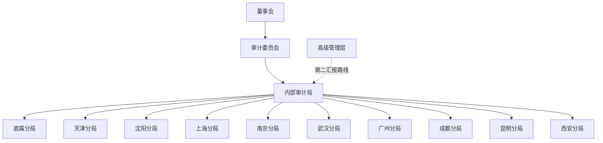

# 10.1 公司治理报告

> 来源：《中国工商银行股份有限公司2025年度报告（A股）》，印刷页 125–147
> 本文由 build_kb.py 自动生成

10. 公司治理、环境和社会
10.1 公司治理报告
10.1.1 公司治理概述
报告期内，本行锚定建设中国特色世界一流现代金融机构目标，持续优化“权
责分明、各司其职、相互协调、有效制衡”的公司治理制衡机制，有效增强“决
策科学、监督有效、运行稳健”的公司治理运作机制，统筹做好公司治理制度、
架构、机制完善。
建立“两会一层”治理架构。根据《中华人民共和国公司法》等法律法规和
监管要求，结合本行治理实践，修订形成《中国工商银行股份有限公司章程（2025
年版）》，取消监事会，由董事会审计委员会承接相关职权，完成向“股东会、董
事会、高级管理层”治理模式的转变。关于本行监事会及监事依法撤销的相关情
况，请参见本行在上交所网站、香港交易所“披露易”网站和本行网站发布的相
关公告。
治理制度及时完善。同步做好公司治理配套制度的梳理和更新工作，修订形
成《股东会议事规则（2025 年版）》《董事会议事规则（2025 年版）》《董事会秘
书工作制度（2025 年版）》及董事会专门委员会工作规则等，公司治理稳健性和
有效性得到显著提升。
治理效能持续提升。2025 年为“十四五”规划收官之年，本行董事会深入贯
彻落实国家决策部署和金融监管要求，紧扣金融工作主线，完整、准确、全面贯
彻新发展理念，切实履行国有大行责任担当，以高质量金融服务助力经济社会高
质量发展，充分彰显金融工作的政治性和人民性。围绕金融“五篇大文章”，纵
深推进“五化”转型，切实履行战略决策与风险防控职责，持续优化风险管控、
薪酬激励、社会责任等治理机制，强化信息披露与透明度建设，依法保障股东权
益，着力提升金融服务的适应性、竞争力和普惠性，为各利益相关方创造更大价
值。
本行公司治理的实际情况与法律、行政法规和中国证监会关于上市公司治理

的规定不存在重大差异。

公司治理架构

注：上图为截至2025 年末本行公司治理架构图。
高级管理层下设委员会明确“五篇大文章”整体统筹职责，以及科技金融、
绿色金融、普惠金融、养老金融、数字金融对应委员会专门推进职责，建立起服
务“五篇大文章”一体化决策落实机制，形成“一二三道防线”有机协同、齐抓
共管的工作闭环。
企业管治守则
报告期内，本行遵守香港《上市规则》附录C1《企业管治守则》所载适用
于本报告的原则、守则条文及建议最佳常规。

**公司治理架构（mermaid 转写）**（由图片识别转写，汇报路线细节以原图为准）：

公司章程修订
报告期内，本行于2025 年6 月27 日召开的2024 年度股东年会审议批准了
《关于审议<中国工商银行股份有限公司章程（2025 年版）>及撤销监事会相关
事项的议案》。2025 年9 月23 日，根据《国家金融监督管理总局关于工商银行
修改公司章程的批复》（金复〔2025〕564 号），金融监管总局已核准本行修订
后的公司章程。

10.1.2 股东会
股东会的职责
股东会是本行的权力机构，由全体股东组成。股东会负责审议批准本行的年
度财务预算、决算方案、利润分配方案和弥补亏损方案，选举、更换和罢免有关
董事，审议批准或授权董事会批准本行重大对外投资等事项，审议批准董事会的
工作报告，对本行合并、分立、解散、清算、变更公司形式、增加或者减少注册
资本、发行公司债券或其他有价证券及上市的方案、收购本行股份、发行优先股、
修订公司章程等作出决议。
10.1.3 董事会及专门委员会
董事会的职责
董事会是本行的决策机构，向股东会负责并报告工作。董事会负责召集股东
会；执行股东会的决议；决定本行的经营计划、投资方案，制定发展战略并监督
战略实施；制订本行的年度财务预算方案、决算方案、利润分配方案和弥补亏损
方案、增加或者减少注册资本的方案、财务重组方案；制订合并、分立、解散或
者变更公司形式的方案、重大收购及收购本行股份的方案、股权激励计划和员工
持股计划；制定本行的风险容忍度、风险管理和内部控制等政策和基本管理制度，
并监督制度的执行情况，承担全面风险管理的最终责任；决定或授权董事会审计

委员会决定审计预算和主要负责人任免；制定并在全行贯彻执行条线清晰的责任
制和问责制，定期评估并完善本行的公司治理；负责本行信息披露，并对财务会
计报告的真实性、准确性、完整性和及时性承担最终责任；审议本行在可持续发
展、环境、社会与治理等方面的政策目标及相关事项；审议本行绿色金融战略、
气候风险管理的政策目标及相关事项；审议本行普惠金融业务的发展战略规划、
基本管理制度、普惠金融业务年度经营计划、考核评价办法等事项；确定本行消
费者权益保护工作战略、政策和目标，维护金融消费者和其他利益相关者合法权
益；建立本行与股东特别是主要股东之间利益冲突的识别、审查和管理机制；承
担股东事务的管理责任；建立并执行高级管理层履职问责制度，明确对失职和不
当履职行为追究责任的具体方式；承担并表管理的最终责任，负责制定本行并表
管理的总体战略方针，审批并表管理基本制度和办法，建立并表管理定期审查和
评价机制等。
董事会对股东会决议的执行情况
本行董事会认真、全面执行了报告期内股东会审议通过的有关决议。
董事会的组成
本行形成了较为完善的董事遴选、提名及选举程序。本行董事会成员多元，
具有知识结构、专业素质、职业经验、地域及性别等多方面的互补性，保障了董
事会决策的科学性。截至业绩披露日，本行董事会共有董事13 名，包括：执行
董事4 名，分别是廖林先生、刘珺先生、段红涛先生和王景武先生；非执行董事
3 名，分别是曹利群女士、董阳先生和钟蔓桃女士；独立非执行董事6 名，分别
是陈德霖先生、赫伯特•沃特先生、莫里•洪恩先生、陈关亭先生、李伟平先生和
李金鸿先生。董事会已检视本行董事会多元化政策的实施情况及有效性，董事会
成员中现已包括2 名女性董事，2 名女性董事均以女性独有视角为董事会科学高
效决策贡献力量。未来，本行将根据董事会多元化的相关政策要求，在董事遴选
工作中，充分考虑董事候选人的性别构成，以进一步提升董事会成员性别多元化
比例。

本行执行董事长期从事银行经营管理工作，具有丰富的银行专业知识和经营
管理经验，熟悉行内经营管理情况；非执行董事均在财政、经济、金融、治理等
领域工作多年，具有丰富的实践经验和较高的政策理论水平；独立非执行董事均
为境内外经济、金融监管、金融、审计、法律等领域的知名专家，熟悉境内外监
管规则，通晓公司治理、财务和银行经营管理。本行独立非执行董事人数在董事
会成员总数中占比超过1/3，符合有关监管要求。
董事长及行长
根据香港《上市规则》附录C1《企业管治守则》第C.2.1条及本行公司章程
规定，本行董事长和行长由两人分别担任，且董事长不由控股股东的法定代表
人或主要负责人兼任。本行行长由董事会聘任，对董事会负责，按照公司章程
的规定及本行董事会的授权履行职责。
截至报告期末，廖林先生为本行的法定代表人和董事长，负责组织董事会
研究确定本行的经营发展战略、风险管理和内部控制等重大事项；刘珺先生为
本行的行长，负责本行业务运作的日常管理事宜。
董事会会议
董事会深入践行金融工作的政治性、人民性，积极服务国家重点战略和实体
经济，做深做精金融“五篇大文章”，着力推进“五化”转型，推动本行在领军
银行建设上迈出新步伐、高质量发展取得新成效。持续优化资本管理，统筹资本
工具及债券发行，不断夯实本行稳健发展基础。董事会审议了关于固定资产投资
预算、资本充足率管理及内部资本充足评估报告等议案，听取了关于本行年度、
半年度、季度经营情况以及“十四五”时期发展战略规划执行情况等汇报，督促
管理层推动提升经营发展质效。
董事会按照“防风险、强监管、促高质量发展”金融工作主线，统筹发展与
安全，修订了《全面风险管理规定》《合规管理基本规定》《内部控制基本规定》
《数据安全管理办法》等制度，审议了关于风险偏好评估情况、风险管理报告、
并表管理情况、合规管理与反洗钱管理情况、内部控制评价报告等议案，听取了

关于年度信息科技风险管理情况、内部审计工作等汇报，督导管理层不断提升风
险防控、合规管理与稳健经营能力。
董事会推进可持续发展。本行发布可持续发展报告，制定估值提升暨提质增
效重回报计划，修订消费者权益保护工作管理办法，审议近两年绿色金融实施情
况、普惠金融业务年度经营计划、年度对外捐赠额度以及香港大埔火灾事件专项
捐赠等议案，不断增进社会及利益相关者福祉。完善公司治理顶层设计和加强制
度机制建设，推动完成公司章程、股东会议事规则、董事会议事规则和董事会各
专门委员会工作规则等一系列公司治理基本制度的修订工作，稳步推进审计委员
会承接监事会相关职权各项工作，走好中国特色公司治理发展之路。
董事会审议的主要议案请参见本行在上交所网站、香港交易所“披露易”网
站和本行网站发布的公告。
本行董事在报告期内出席股东会、董事会及董事会专门委员会会议的情况如
下：
亲自出席次数/任职期间会议次数
董事
股东
会
董事
会
董事会下设专门委员会
战略
委员
会
社会
责任
与消
费者
权益
保护
委员
会
审计
委员
会
风险
管理
委员
会
提名
委员
会
薪酬
委员
会
关联
交易
控制
委员
会
美国
区域
机构
风险
委员
会
执行董事
廖林
3/3
10/10
7/7
-
-
-
-
-
-
-
刘珺
3/3
9/10
6/7
3/4
-
-
4/5
-
-
-
段红涛
1/1
2/3
1/2
-
-
-
-
1/1
-
-
王景武
2/3
9/10
-
-
-
3/6
-
-
1/4
2/4
非执行董事
曹利群
3/3
10/10
-
4/4
7/7
6/6
-
-
-
4/4
董阳
3/3
10/10
7/7
-
-
6/6
-
-
-
4/4
钟蔓桃
3/3
10/10
7/7
4/4
7/7
-
-
-
4/4
-
独立非执行董事
陈德霖
3/3
10/10
7/7
-
5/5
6/6
5/5
4/4
1/1
4/4
赫伯特•沃特
3/3
10/10
7/7
4/4
7/7
-
-
4/4
4/4
-
莫里•洪恩
3/3
10/10
7/7
-
-
6/6
5/5
4/4
4/4
4/4

陈关亭
3/3
10/10
-
-
7/7
6/6
-
-
4/4
4/4
李伟平
3/3
9/9
6/6
-
6/6
-
4/4
3/3
4/4
-
李金鸿
-
-
-
-
-
-
-
-
-
-
离任董事
卢永真
2/2
8/8
6/6
-
-
5/5
-
3/3
-
3/3
冯卫东
0/0
3/3
-
-
3/3
3/3
2/2
-
-
1/1
陈怡芳
0/0
3/3
3/3
2/2
-
-
-
2/2
-
-
胡祖六
0/0
3/3
3/3
-
1/3
-
2/2
0/2
-
-
注：（1）“亲自出席次数”包括现场出席和通过电话、视频参加会议。
  （2）未能亲自出席董事会及专门委员会会议的董事，均已委托其他董事出席并代为行使表决权。
  （3）董事变动情况请参见“董事及高级管理人员情况—新聘、离任情况”。

董事会专门委员会

董事会专门委员会
本行董事会下设战略委员会、社会责任与消费者权益保护委员会、审计委员
会、风险管理委员会、提名委员会、薪酬委员会、关联交易控制委员会和美国区
域机构风险委员会共8 个专门委员会。除战略委员会和社会责任与消费者权益保
护委员会外，其余各专门委员会均由独立非执行董事担任主席。审计委员会、提
名委员会、薪酬委员会和关联交易控制委员会中，独立非执行董事占半数以上。
截至业绩披露日，本行董事会各专门委员会构成如下：
董事
董事会下设专门委员会
战略
委员会
社会责
任与消
费者权
益保护
委员会
审计
委员会
风险
管理
委员会
提名
委员会
薪酬
委员会
关联
交易
控制
委员会
美国区
域机构
风险委
员会
廖林
主席

刘珺
委员
主席

委员

段红涛
委员

委员

王景武

委员

委员
委员
曹利群

委员
委员
委员

委员
董阳
委员

副主席
委员

委员
钟蔓桃
委员
委员
委员

委员

委员

陈德霖
委员

主席
委员
委员
委员
主席
赫伯特•沃特
委员
委员
委员

主席
委员

莫里•洪恩
委员

委员
主席
委员
委员
委员
陈关亭

主席
委员

委员
委员

报告期内，本行董事会各专门委员会履职情况如下：

战略委员会
战略委员会主要职责  审议战略发展规划、重大全局性战略风险事项，年度
财务预算、决算，战略性资本配置（资本结构、资本充足率等）以及资产负债管
理目标，各类金融业务的总体发展规划，重大机构重组和调整方案，重大投融资
方案，兼并、收购方案，境内外分支机构战略发展规划，人力资源战略发展规划，
数字金融、数字化信息化发展及其他专项战略发展规划，可持续发展战略安排，
并向董事会提出建议。对公司治理结构是否健全进行审查和评估，以保证财务会
计报告、风险管理和内部控制符合本行的公司治理标准。
战略委员会履职情况  报告期内，战略委员会于2025年2月14日、3月28日、
4月29日、6月27日、8月29日、10月30日、12月23日共召开7次会议，审议28项议
案，听取2项汇报。战略委员会关注战略性重大事项，审议了关于本行年度固定
资产投资预算、财务决算方案、利润分配方案、可持续发展报告、资本充足率管
理及内部资本充足评估报告、金融债券发行计划，以及市值管理办法、估值提升
暨提质增效重回报计划等议案，听取了关于本行“十四五”时期发展战略规划执
行情况等汇报，推动本行高质量发展。


社会责任与消费者权益保护委员会
社会责任与消费者权益保护委员会主要职责  听取并审议本行在可持续金
融、服务乡村振兴、企业文化建设以及环境、社会与治理等方面的政策目标及相
关事项，了解本行社会责任执行情况，审议年度可持续发展报告。研究本行消费
者权益保护重大问题和重要政策，指导和督促消费者权益保护工作管理制度体系
建立和完善，对本行消费者权益保护工作战略、政策、目标执行情况和工作报告
进行审议及督促整改。审议本行绿色金融战略、气候风险管理、绿色银行建设等
政策目标，以及普惠金融业务的发展战略规划、基本管理制度、普惠金融业务年
度经营计划、考核评价办法等事项。
社会责任与消费者权益保护委员会履职情况  报告期内，社会责任与消费者
李伟平
委员

委员

委员
委员
主席

李金鸿

委员
委员
委员

委员

权益保护委员会于2025 年2 月14 日、4 月28 日、8 月28 日、12 月23 日共召
开4 次会议，审议6 项议案，听取1 项汇报。社会责任与消费者权益保护委员会
积极推动本行履行社会责任，审议了2025 年度对外捐赠额度等议案，持续助力
慈善公益事业；推进绿色金融和普惠金融业务发展，审议了关于本行近两年绿色
金融实施情况和普惠金融业务2025 年度经营计划等议案；关注消费者权益保护，
审议了关于消费者权益保护工作管理办法、消费者权益保护2024 年工作情况与
2025 年工作计划等议案，听取了消费者权益保护2025 年上半年工作情况等汇报。


审计委员会
审计委员会主要职责  持续监督本行内部控制体系，对财务信息和内部审计
等进行监督、检查和评价，提议聘请或更换外部审计师，审查外部审计师的报告，
协调内部审计部门与外部审计师之间的沟通。监督本行董事、高级管理人员执行
职务的行为。评估本行员工举报财务报告、内部监控或其他不正当行为的机制，
以及本行对举报事项作出独立公平调查并采取适当行动的机制。
审计委员会履职情况  报告期内，审计委员会于2025 年2 月14 日、3 月27
日、4 月28 日、6 月26 日、8 月28 日、10 月29 日、12 月23 日共召开7 次会
议，审议15 项议案，听取16 项汇报。审计委员会督导本行不断完善内部控制体
系，审议了关于年度内部控制评价报告的议案，听取了关于年度内部控制审计结
果的汇报，推动集团持续提升合规经营水平；督导本行有序开展内外部审计工作，
审议了关于年度报告、半年度报告、季度报告、资本管理第三支柱信息披露报告、
聘请会计师事务所、内部审计项目计划、聘任首席财务官等议案，听取了关于年
度内部审计工作、外部审计师履职情况评价等汇报，通过加强内外部审计监督，
推动提升本行经营发展质效；承接原监事会相关职权，审议2024 年度监事薪酬
清算方案等议案，并开展对董事会和高级管理层及其成员2025 年度履职评价工
作。审计委员会对报告期内监督事项无异议。
 审阅定期报告
审计委员会定期审阅本行财务报告，对年度报告、半年度报告和季度报告
均进行审议并将审议意见报告董事会；遵循相关监管要求，组织开展集团年度
内部控制评价工作，聘请外部审计师对本行财务报告内部控制的有效性进行审

计；加强与外部审计师的沟通交流及对其工作的督导，听取外部审计师审计结
果、管理建议等多项汇报。
在2025年度财务报告编制及审计过程中，审计委员会听取管理层关于经营
情况的汇报，与外部审计师协商确定审计工作时间和进度安排等事项，审计委
员会委员与外部审计师进行单独沟通，及时了解相关工作开展情况，督促工作
有序推进。审计委员会于2026年3月26日召开会议，认为2025年度财务报告真实、
准确、完整地反映了本行财务状况。
 审查内部控制体系
审计委员会负责持续监督并审查本行内部控制体系，至少每年审查一次本
行内部控制体系的有效性。审计委员会通过多种方式履行审查内部控制体系的
职责，包括审核本行的管理规章制度及其执行情况，检查和评估本行重大经营
活动的合规性和有效性等。
按照企业内部控制规范体系的规定，本行董事会负责建立健全和有效实施
内部控制，评价其有效性，并如实披露内部控制评价报告。董事会及审计委员
会已审议通过本行年度内部控制评价报告，关于内部控制的详情请参见“公司
治理报告—内部控制”。
 内部审计功能的有效性
本行已设立向董事会负责并报告的垂直独立的内部审计管理体系。董事会
定期审议内部审计计划，听取涵盖内部审计活动、审计保障措施、内审队伍建
设等方面的内部审计工作报告，有效履行风险管理相关职责。审计委员会检查、
监督和评价本行内部审计工作，监督本行内部审计制度及其实施，对内部审计
部门的工作程序和工作效果进行评价。督促本行确保内部审计部门有足够资源
运作，并协调内部审计部门与外部审计师之间的沟通。关于内部审计的详情请
参见“公司治理报告—内部审计”。


风险管理委员会
风险管理委员会主要职责  审核和修订本行风险战略、风险管理政策、风险
偏好、全面风险管理架构和内部控制流程，对其实施情况及效果进行监督和评价。
持续监督本行的风险管理体系，监督和评价风险管理部门的设置、组织方式、工
作程序和效果，监督和评价高级管理人员在战略、信用、市场、操作（案防）、

流动性、合规、声誉、信息科技与网络安全、银行账簿利率、国别以及其他方面
的风险控制情况，提出完善本行风险管理和内部控制的意见；明确对风险数据和
报告的要求，确定风险报告与本行业务模式、风险状况和内部管理需要等相适应，
当风险数据和报告不能满足要求时对高级管理层提出改进要求。
风险管理委员会履职情况  报告期内，风险管理委员会于2025 年2 月14
日、3 月27 日、4 月28 日、8 月28 日、10 月29 日、12 月23 日共召开6 次会
议，审议21 项议案，听取6 项汇报。风险管理委员会持续加强全面风险管理，
深入推进集团合规建设，审议了关于风险偏好评估情况、风险管理报告、并表管
理情况、合规管理与反洗钱管理情况等议案，听取了关于预期信用损失法实施情
况、信息科技风险管理情况等汇报，积极推进全面风险管理规定、有效风险数据
加总和风险报告管理办法、合规管理基本规定、数据安全管理办法等规章制度的
修订工作，督促管理层切实防风险、强合规。
 审查风险管理体系
风险管理委员会负责持续监督并审查本行风险管理体系，至少每年审查一
次风险管理体系的有效性。在全面风险管理体系架构下，风险管理委员会通过
多种方式履行审查风险管理体系的职责。关于风险管理的详情请参见“讨论与
分析－风险管理”。


提名委员会
提名委员会主要职责  拟订董事和高级管理人员的选任标准和审核程序，对
董事和高级管理人员的人选及其任职资格进行遴选、审核；就提名或者任免董事、
聘任或者解聘高级管理人员，提名董事会下设各专门委员会主席和委员人选，向
董事会提出建议；听取高级管理人员及关键后备人才的培养计划；结合本行发展
战略，每年评估一次董事会的架构、人数及组成，向董事会提出建议。
本行公司章程规定了董事提名的程序和方式，详情请参阅公司章程第一百一
十五条等相关内容。报告期内，本行严格执行公司章程的相关规定聘任或续聘本
行董事。提名委员会在审查董事候选人资格时，主要审查其是否符合法律、行政
法规、规章及本行公司章程相关要求。本行重视董事来源和背景等方面的多元化，
持续提升董事会的专业性，为董事会的高效运作和科学决策奠定基础。根据本行

《推荐与提名董事候选人规则》关于董事会多元化的政策要求，提名委员会还关
注董事候选人在知识结构、专业素质及经验、文化及教育背景、性别等方面的互
补性，以确保董事会成员具备适当的才能、经验及多样的视角和观点。提名委员
会每年评估董事会架构、人数及组成时，根据具体情况讨论及设定可计量的目标，
评估董事会多元化改善情况，以执行多元化政策。截至业绩披露日，本行董事会
共有独立非执行董事6 名，在董事会成员总数中占比超过1/3。

提名委员会履职情况  报告期内，提名委员会于2025 年2 月14 日、4 月28
日、8 月28 日、10 月30 日、12 月23 日共召开5 次会议，审议了建议提名董事
候选人，建议调整部分董事会专门委员会主席及委员，建议聘任副行长、首席财
务官、董事会秘书等12 项议案，协助董事会根据治理需要有序推进董事换届、
董事会专门委员会人员调整，以及有关高级管理人员等聘任工作。


薪酬委员会
薪酬委员会主要职责  拟订和审查本行董事的考核办法并进行考核，拟订薪
酬方案，提出对董事薪酬分配的建议。拟订和审查本行高级管理人员的考核办法
并进行考核，拟订薪酬方案，提出对高级管理人员薪酬分配的建议。
薪酬委员会履职情况  报告期内，薪酬委员会于2025 年2 月14 日、3 月27
日、8 月28 日、12 月23 日共召开4 次会议，审议了关于2024 年度董事和高级
管理人员薪酬清算方案，2025 年度高级管理人员业绩考核方案，2025-2026 年度
董事、监事及高级管理人员责任险续保方案等7 项议案，听取了关于2024 年度
董事会对董事履职评价报告的汇报。薪酬委员会结合监管要求，就董事、高级管
理人员年度薪酬清算方案向董事会提出建议，推动本行不断优化高级管理人员业
绩考核工作，进一步完善激励约束机制。


关联交易控制委员会
关联交易控制委员会主要职责  制订关联交易管理基本制度，并监督实施；
在董事会授权范围内，审批关联交易及与关联交易有关的其他事项，接受关联交
易统计信息的备案；对应当由董事会或股东会批准的关联交易进行审核；就关联

交易管理制度的执行情况以及关联交易情况向董事会进行汇报。
关联交易控制委员会履职情况  报告期内，关联交易控制委员会于2025 年
4 月28 日、6 月26 日、8 月28 日、10 月29 日共召开4 次会议，审议通过了关
于确认本行关联方，关于董事、监事、高级管理人员及其关联方与本行开展日常
金融产品、服务等关联交易等6 项议案，听取了关于2024 年度关联交易专项报
告的汇报。关联交易控制委员会督促本行强化关联方和关联交易管理，协助董事
会确保关联方和关联交易管理工作依法合规开展。


美国区域机构风险委员会
美国区域机构风险委员会主要职责  主要负责定期审议和批准美国区域机
构业务的风险管理政策，监督美国区域机构业务的风险管理框架及相关政策的实
施。
美国区域机构风险委员会履职情况  报告期内，美国区域机构风险委员会于
2025 年3 月27 日、6 月26 日、8 月28 日、12 月23 日共召开4 次会议，审议了
关于美国区域风险管理框架、风险偏好修订及风险管理情况，美国区域流动性压
力测试、资金应急计划、重要业务线和产品流动性风险情况等3 项议案，听取了
关于美国区域风险管理情况、流动性风险管理情况等11 项汇报，协助董事会深
化有关区域风险管理，推动本行在国际化经营中不断提升风险防控和合规管理水
平。
董事的任期
根据本行公司章程，董事由股东会选举产生，任期3年，任职资格自金融监
管总局核准之日起或按照金融监管总局的要求履行相关程序后生效。董事任期届
满后可由股东会重新选举，连选可以连任。
董事就财务报表所承担的责任
本行董事承认其对本行财务报表的编制承担责任。报告期内，本行严格遵循
有关规定，按时发布2024年度报告、2025年第一季度报告、2025半年度报告和2025

年第三季度报告。
董事的调研和培训情况
报告期内，本行董事积极开展调研，调研访问机构包括本行内设部门、分支
机构及附属机构；调研主题包括商业银行风险官制度体系建设、绿色金融领域风
险防控实践与探索、支持消费信贷情况、人工智能创新应用成效与展望、助力乡
村振兴、高质量共建“一带一路”、境外机构应对风险挑战、服务国家高水平对
外开放，以及本行分支机构及附属机构经营管理等。调研以调研报告的形式提出
建设性意见和建议。
报告期内，本行统筹推进董事培训工作，持续加大董事培训投入力度，积极
拓展董事参训渠道和形式，协助董事不断提高履职能力。本行董事均根据工作需
要参加了有关培训。报告期内，本行董事参加的主要培训如下：
行外培训
北京上市公司协会：
信息披露管理办法专题培训
深化并购重组改革专题培训
强化投资者关系管理专题培训
市值管理专题培训
上市公司章程指引专题培训
上市公司股份变动规则专题培训
上市公司独立董事履职实践专题培训
从内控合规到市场信任专题培训
网络舆情专题培训
ESG 管治与实践专题培训
AI 技术应用专题培训
董事长（总经理）、财务总监、董事会秘书专题培训

上海证券交易所：
2025 年第3 期上市公司独立董事后续培训
2025 年第1 期上市公司董事、监事和高管初任培训
行内培训
反洗钱专题培训
公司法专题培训

董事会秘书的培训情况
本行董事会秘书于报告期内参加了相关专业培训，培训时间超过15个学时，
符合有关监管要求。
独立非执行董事的独立性及履职情况
本行严格按照有关监管制度、本行公司章程等规定，开展独立非执行董事选
聘工作。本行独立非执行董事的资格、人数和比例符合监管机构的规定。
独立非执行董事在本行及本行子公司不拥有任何业务或财务利益，也不担任
本行的任何管理职务。本行已收到每名独立非执行董事就其独立性所作的年度确
认函，并对他们的独立性表示认同。
报告期内，本行独立非执行董事认真参加董事会及各专门委员会会议，对审
议事项发表独立意见，就做好金融“五篇大文章”、服务实体经济、推进“五化”
转型、加强风险防控和合规管理等事项提出意见建议。根据香港《上市规则》附
录C1《企业管治守则》，独立非执行董事与董事长举行了没有其他董事参加的专
题座谈，围绕本行“十四五”发展战略规划执行情况与“十五五”发展战略谋划
进行了深入交流。同时，本行独立非执行董事积极参加行内各类会议、座谈、调
研、培训等活动，深入了解本行人工智能创新应用、境外机构风险管理、数字化
转型、普惠与零售等业务发展与风险防控、中间业务转型发展、境内外分支机构
经营管理等情况。独立非执行董事在各项履职活动中提出一系列宝贵建议，得到
本行高度重视并结合实际落实。
报告期内，本行独立非执行董事未对董事会和董事会各专门委员会议案提出
异议。
关于报告期内本行独立非执行董事的履职情况，请参见本行于2026年3月27
日发布的《2025年度独立董事述职报告》。

10.1.4 董事的证券交易
本行已就董事的证券交易采纳一套不低于香港《上市规则》附录C3《上市发

行人董事进行证券交易的标准守则》所规定标准的行为守则。经查询确认，在报
告期内，本行各位董事均遵守了上述守则。
10.1.5 高级管理层
高级管理层的职责
高级管理层是本行的执行机构，对董事会负责。高级管理层负责本行的经营
管理，组织实施经董事会批准后的经营计划和投资方案，制定本行的具体规章，
制定本行内设部门和分支机构负责人的薪酬方案和绩效考核方案，向董事会或者
审计委员会如实报告本行经营业绩，拟订本行的年度财务预算方案、决算方案，
利润分配方案和弥补亏损方案，增加或者减少注册资本、发行债券或者其他债券
上市方案，并向董事会提出建议等。
高级管理层职权行使情况
董事会与高级管理层权限划分严格按照本行公司章程等治理文件执行。报告
期内，本行对董事会对行长授权方案执行情况进行了统计分析，未发现行长超越
权限审批的事项。
10.1.6 股东权利
股东提请召开临时股东会的权利
单独或者合计持有本行10%以上有表决权股份的股东书面请求时，应在2 个
月内召开临时股东会。提议股东有权向董事会请求召开临时股东会，并应当以书
面形式向董事会提出。董事会应当根据法律、行政法规、规章和本行公司章程的
规定，在收到请求后10 日内提出同意或不同意召开临时股东会的书面反馈意见。
股东因董事会未应相关要求举行会议而自行召集并举行会议的，其所发生的合理
费用，应当由本行承担，并从本行欠付失职董事的款项中扣除。

股东提出股东会临时提案的权利
根据本行公司章程，有权提案的股东可以在股东会召开10 日前提出临时提
案并书面提交董事会；董事会应当在收到提案后2 日内发出股东会补充通知，并
将该临时提案提交股东会审议。
股东建议权和查询权
股东有权对本行的业务经营活动进行监督管理，提出建议或者质询。股东有
权查阅本行公司章程、股东名册、股本状况、股东会会议记录等信息。
优先股股东权利特别规定
出现以下情形时，本行优先股股东有权出席股东会并享有表决权：（1）修改
公司章程中与优先股相关的内容；（2）一次或累计减少本行注册资本超过百分之
十；（3）本行合并、分立、解散或变更本行公司形式；（4）发行优先股；（5）公
司章程规定的其他变更或者废除优先股股东权利等情形。出现上述情况之一的，
本行召开股东会会议应通知优先股股东，并遵循公司章程通知普通股股东的规定
程序。
在以下情形发生时，优先股股东在股东会批准当年不按约定分配利润的方案
次日起，有权出席股东会与普通股股东共同表决：本行累计三个会计年度或连续
两个会计年度未按约定支付优先股股息。对于股息不可累积的优先股，优先股股
东表决权恢复直至本行全额支付当年股息。
其他权利
本行普通股股东有权依照其所持有的股份份额领取股利和其他形式的利益
分配；本行优先股股东有权优先于普通股股东分配股息。股东享有法律、行政法
规、规章及本行公司章程所赋予的其他权利。

10.1.7 内幕信息管理
本行按照上市地监管要求及本行制度规定开展内幕信息及知情人管理工作，
依法合规收集、传递、整理、编制和披露相关信息。报告期内，本行持续加强内
幕信息管理，及时组织内幕信息知情人登记备案，定期开展内幕交易自查。
10.1.8 投资者关系
与股东之间的有效沟通及投资者关系活动回顾
本行按照上市地监管要求开展投资者关系管理工作，始终以投资者为中心，
坚持全面、主动、精准、协同、有效的工作原则，与投资者建立有效沟通机制，
依托定期业绩说明会、境内外非交易性路演、反向路演、投资者热线、投资者关
系邮箱、投资者关系网站和“上证e 互动”网络平台等多种沟通渠道，与全体投
资者和分析师持续、广泛交流并按相关监管要求进行记录，努力提升投资者关系
的工作精度和服务水平。
报告期内，本行以“现场会议+全网直播”形式在香港和北京两地同步举办
年度业绩发布会，综合运用“线上+线下”“一对一+一对多”“境内+境外路演”
等形式，高频开展多渠道立体化交流，以市场化、国际化、专业化语言回应投资
者关切。召开“深耕主业 智造强基”专题反向路演活动，充分展现本行做优做
强的价值创造能力。切实保障中小投资者合法权益，积极回应“上证e 互动”、
投资者热线、投关邮箱等平台和渠道的问题咨询。2025 年，本行获中国上市公司
协会“上市公司年报业绩说明会最佳实践”
“上市公司投资者关系管理最佳实践”、
凤凰卫视“最佳股东回报上市公司”、财联社“优秀投资者关系金融机构‘拓扑
奖’”、《中国基金报》中国上市公司英华奖A 股“价值示范案例”“投关示范案
例”等奖项。
2026 年，本行将进一步主动深化与投资者的沟通交流，增进投资者对本行
的了解和认可，持续保护投资者合法权益，同时也期望得到投资者更多的关注和
支持。经实施并审视上述措施，本行认为现有股东沟通政策充足及有效。

投资者查询
投资者如需查询本行经营业绩相关问题可联络：
电话：86-10-66108608
传真：86-10-66107420
电邮地址：ir@icbc.com.cn
通讯地址：中国北京市西城区复兴门内大街55号中国工商银行股份有限公
司战略管理与投资者关系部
邮政编码：100140
10.1.9 内部控制
本行董事会负责内部控制基本制度的制定，并监督制度的执行；董事会下设
审计委员会，监督内部控制体系建设，评估本行重大经营管理活动的合规性和有
效性。本行设有垂直管理的内部审计局和内部审计分局，向董事会负责并报告工
作。本行高级管理层负责制定系统化的制度、流程和方法，采取风险控制措施；
高级管理层下设风险管理与内部控制委员会，履行内部控制相关职责，评价内部
控制的充分性与有效性。总行及各级分行分别设有内控合规部门，负责内部控制
的组织、推动和协调工作。
报告期内，本行根据外部风险形势变化和内部经营管理战略实施需要，前瞻
性推进内控体系建设，着力提升内控管理的适配性和有效性。实施《2025 年内控
体系建设工作措施》，开展以“质量蓄能年”为主题的合规文化活动，持续涵养
优良内控生态；以全面风险管理体系为牵引，深入推进风控智能化转型，有效提
升“9+X”类风险识别的前瞻性、精准性、持续性；针对性完善重点领域、关键
环节与薄弱事项内部控制机制，稳步提升全机构、全流程、全产品内控水平；严
密“监督、整改、问责”闭环，落稳落实“问严、问精、问准、问关键”，推动纪
委监察、内审内控等各类监督集约资源、高效互动，不断健全大监督格局。
内部控制评价报告及内部控制审计情况
按照财政部、中国证监会和上交所要求，本行在披露本年度报告的同时披露

《中国工商银行股份有限公司2025 年度内部控制评价报告》。报告认为，于2025
年12 月31 日（基准日），本行已按照企业内部控制规范体系和相关规定的要求
在所有重大方面保持了有效的财务报告内部控制。安永华明会计师事务所（特殊
普通合伙）已根据相关规定对本行2025 年12 月31 日的财务报告内部控制的有
效性进行了审计，并出具了标准无保留意见的内部控制审计报告。具体内容请参
见本行于上交所网站、香港交易所“披露易”网站及本行网站发布的公告。
内部控制评价及缺陷情况
本行董事会根据财政部等五部委发布的《企业内部控制基本规范》及其配套
指引、财政部和中国证监会联合发布的《关于进一步提升上市公司财务报告内部
控制有效性的通知》、上交所《上市公司自律监管指引第1 号——规范运作》以
及金融监管总局的相关监管要求，对报告期内集团内部控制有效性进行了评价。
评价未发现本行内部控制体系存在重大缺陷和重要缺陷，一般缺陷可能产生的风
险均在可控范围之内，并已经和正在认真落实整改，对本行内部控制目标的实现
不构成实质性影响。本行已按照企业内部控制规范体系和相关规定要求在所有重
大方面保持了有效的内部控制。
自内部控制评价报告基准日至内部控制评价报告发出日之间未发生影响内
部控制有效性评价结论的因素。
10.1.10 内部审计
本行设立由内部审计局和10 家内审分局组成的垂直独立的内部审计体系，
内部审计部门向董事会负责并报告工作，接受董事会审计委员会的检查、监督、
评价和指导，向高级管理层通报审计工作情况。内审分局作为内部审计局的派出
机构，向内部审计局负责并报告工作。下图显示了内部审计管理架构及报告路径：

报告期内，本行围绕发展战略和改革转型中心工作，实施以风险为导向的审
计活动，开展对主要业务、重点机构、各类风险、关键少数的审计监督，重点关
注本行在贯彻国家政策、落实监管要求、推进战略实施、加强风险防控等方面的
情况，涉及信贷业务、财务管理、新兴业务、合规管理、金融科技、运营管理、
资本管理等领域。本行高度重视审计发现，研究落实审计建议，以审计监督促进
全行经营管理、风险防控、内部控制水平持续提升，防风险、强合规能力显著增
强，全行高质量发展基础进一步夯实。
报告期内，本行主动应对宏观形势变化、积极响应监管要求，科学制定年度
审计计划，优化完善审计模块化运作，建立健全审计全流程质量控制，加力推进
数智审计工程实施，提升数字赋能审计成效，高质高效完成计划内审计项目。推
动研究型审计，提升审计价值贡献。强化审计人员队伍建设，加大培训与交流力
度，提高审计队伍专业能力。健全完善审计整改长效机制与责任体系，深化纪巡
审监督贯通协作，合力推动审计整改的落实，有效提升审计监督效果。
10.1.11 审计师聘用情况
安永华明会计师事务所（特殊普通合伙）1为本行2025 年度财务报表审计的
国内会计师事务所，安永会计师事务所1 为本行2025 年度财务报表审计的国际
会计师事务所，安永华明会计师事务所（特殊普通合伙）为本行2025 年度内部
控制审计的会计师事务所。安永华明会计师事务所（特殊普通合伙）、安永会计

1安永华明会计师事务所（特殊普通合伙）为香港《会计及财务汇报局条例》下的认可公众利益实体核数
师。安永会计师事务所为香港《会计及财务汇报局条例》下的注册公众利益实体核数师。

**内部审计架构（mermaid 转写）**（由图片识别转写，汇报路线细节以原图为准）：

师事务所、项目合伙人及签字注册会计师严盛炜（A 股）、项目合伙人及签字注
册会计师张明益（H 股）、签字注册会计师师宇轩（A 股）已连续2 年为本行提
供审计服务（2024 至2025 年度）。德勤华永会计师事务所（特殊普通合伙）、德
勤•关黄陈方会计师行于2021-2023 年度为本行提供审计服务。
报告期内，本集团就财务报表审计（包括子公司及境外分行财务报表审计）
支付的审计专业服务费用共计人民币1.91 亿元。其中由本行统一支付的审计费
用为1.02 亿元（包括内部控制审计费用615.27 万元）。
报告期内，会计师事务所向本集团提供的非审计服务包括为资产证券化及债
券发行项目等提供的专业服务，收取的非审计专业服务费用共计人民币0.04 亿
元。
10.1.12 对子公司的管理
对子公司的管理控制情况，请参见“讨论与分析—业务综述—综合化经营及
子公司管理、主要控股子公司和参股公司情况”。
10.1.13 违规事项举报制度
针对本行机构或员工存在违反内部规章制度行为的举报，本行制定《违规事
项举报处理工作办法》，遵循“实事求是、依法合规、保障合法权利、分级负责”
的原则，明确受理举报范围，确定办理程序，建立了属地管理、分级负责处置，
以及保护举报人权益及保密的工作机制等。
10.1.14 反贪污政策
本行坚持深化标本兼治、系统治理，一体推进不敢腐、不能腐、不想腐。在
不敢腐上持续加压，加大案件查办力度，推进风腐同查同治，强化严的氛围。在
不能腐上深化拓展，做实以案促改、以案促治，组织开展“四风”和违反中央八
项规定精神问题专项治理、虚列支出套取经费问题专项治理，深化廉洁风险排查，
健全廉洁风险防控长效机制。在不想腐上巩固提升，坚持党性党风党纪一起抓，
扎实开展深入贯彻中央八项规定精神学习教育，分层分类开展警示教育，深入推

进清廉银行建设。
